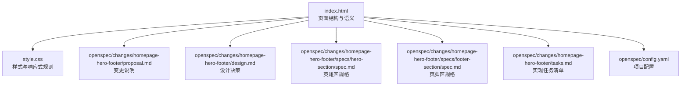
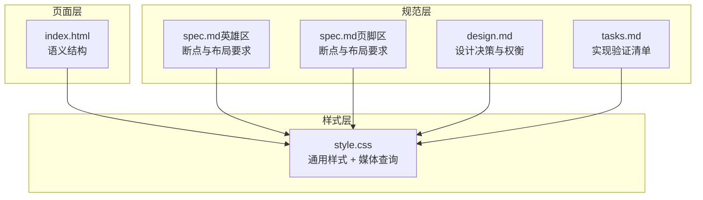
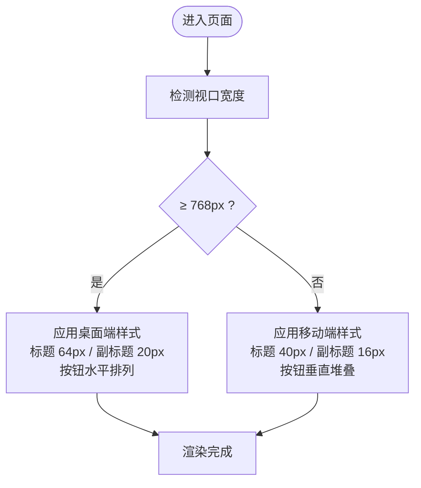
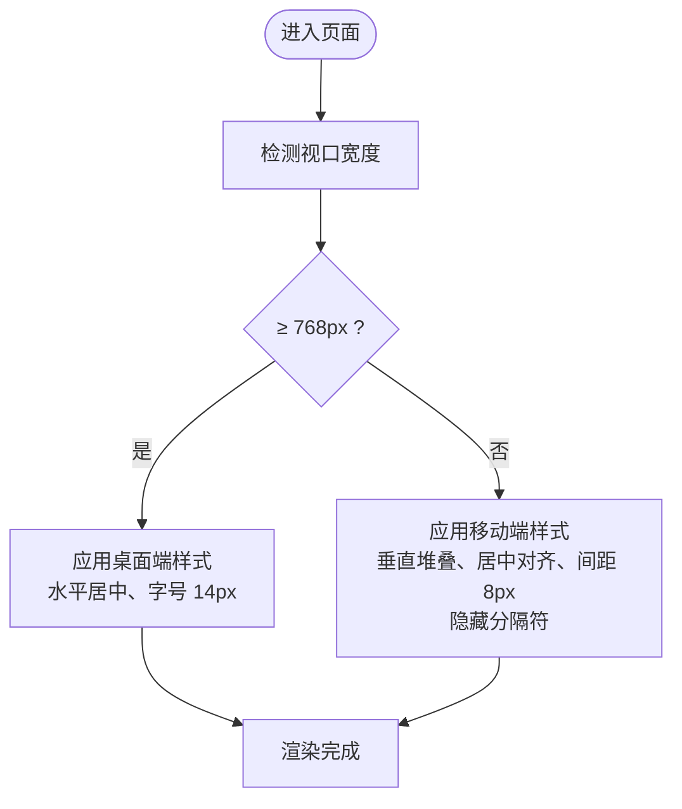
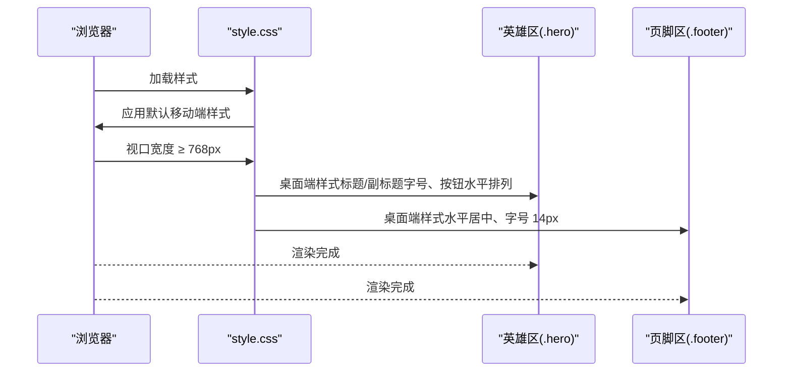
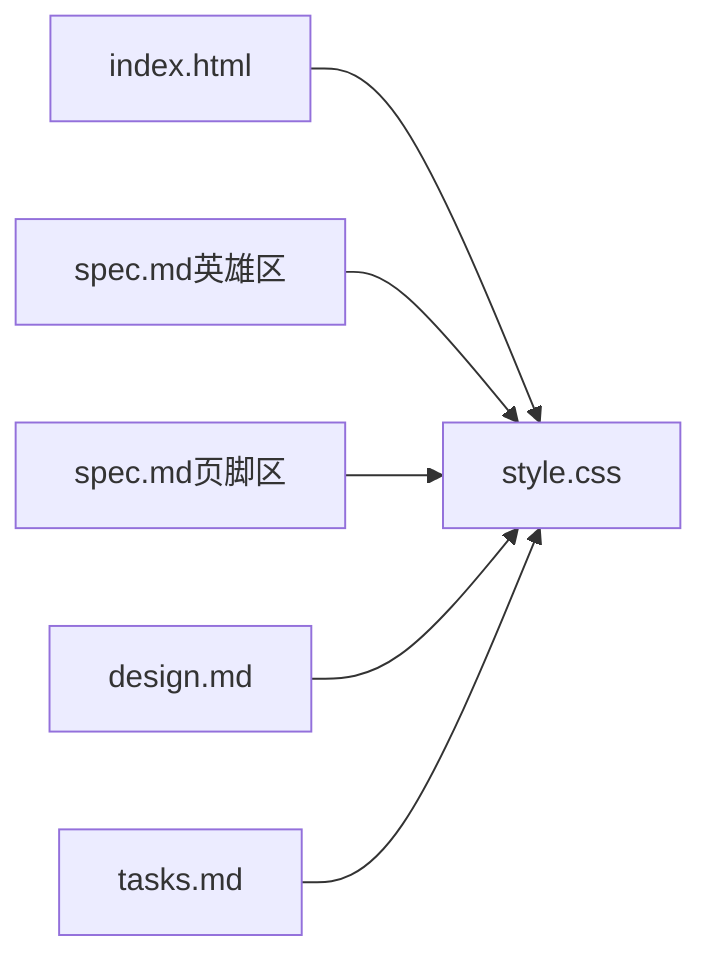

# 响应式设计实现

<cite>
**本文档引用的文件**
- [index.html](file://index.html)
- [style.css](file://style.css)
- [proposal.md](file://openspec/changes/homepage-hero-footer/proposal.md)
- [design.md](file://openspec/changes/homepage-hero-footer/design.md)
- [spec.md（英雄区）](file://openspec/changes/homepage-hero-footer/specs/hero-section/spec.md)
- [spec.md（页脚区）](file://openspec/changes/homepage-hero-footer/specs/footer-section/spec.md)
- [tasks.md](file://openspec/changes/homepage-hero-footer/tasks.md)
- [config.yaml](file://openspec/config.yaml)
</cite>

## 目录
1. [简介](#简介)
2. [项目结构](#项目结构)
3. [核心组件](#核心组件)
4. [架构总览](#架构总览)
5. [详细组件分析](#详细组件分析)
6. [依赖关系分析](#依赖关系分析)
7. [性能考量](#性能考量)
8. [故障排查指南](#故障排查指南)
9. [结论](#结论)
10. [附录](#附录)

## 简介
本项目为 openSpec 的官网首页，采用纯 HTML + CSS 的静态实现，遵循“移动优先”的设计理念，以 768px 为唯一断点，针对不同设备尺寸进行布局与内容优先级的自适应调整。项目强调极简排版与理性技术风格，通过系统字体栈、全屏 Hero 区与一行式 Footer，确保在桌面端与移动端均具备良好的阅读体验与交互效率。

## 项目结构
项目采用“HTML + CSS 分离”的极简文件结构：
- index.html：页面结构与语义标记
- style.css：样式与响应式规则
- openspec/changes/homepage-hero-footer/ 下的规格与设计文档：用于规范与验证响应式行为

图表来源
- [index.html:1-44](file://index.html#L1-L44)
- [style.css:1-194](file://style.css#L1-L194)
- [proposal.md:1-26](file://openspec/changes/homepage-hero-footer/proposal.md#L1-L26)
- [design.md:1-84](file://openspec/changes/homepage-hero-footer/design.md#L1-L84)
- [spec.md（英雄区）:1-49](file://openspec/changes/homepage-hero-footer/specs/hero-section/spec.md#L1-L49)
- [spec.md（页脚区）:1-49](file://openspec/changes/homepage-hero-footer/specs/footer-section/spec.md#L1-L49)
- [tasks.md:1-35](file://openspec/changes/homepage-hero-footer/tasks.md#L1-L35)
- [config.yaml:1-21](file://openspec/config.yaml#L1-L21)

章节来源
- [index.html:1-44](file://index.html#L1-L44)
- [style.css:1-194](file://style.css#L1-L194)
- [proposal.md:1-26](file://openspec/changes/homepage-hero-footer/proposal.md#L1-L26)
- [design.md:1-84](file://openspec/changes/homepage-hero-footer/design.md#L1-L84)
- [spec.md（英雄区）:1-49](file://openspec/changes/homepage-hero-footer/specs/hero-section/spec.md#L1-L49)
- [spec.md（页脚区）:1-49](file://openspec/changes/homepage-hero-footer/specs/footer-section/spec.md#L1-L49)
- [tasks.md:1-35](file://openspec/changes/homepage-hero-footer/tasks.md#L1-L35)
- [config.yaml:1-21](file://openspec/config.yaml#L1-L21)

## 核心组件
- 英雄区（Hero Section）
  - 全屏高度（100vh）+ Flexbox 居中布局，承载品牌主标题、副标题与双 CTA 按钮
  - 桌面端与移动端在字号、内边距与按钮排列上存在差异化
- 页脚区（Footer Section）
  - 一行式布局（导航 · 社交 · 版权），移动端垂直堆叠
  - 顶部分隔线与 hover 交互增强可发现性与可访问性

章节来源
- [index.html:11-40](file://index.html#L11-L40)
- [style.css:39-149](file://style.css#L39-L149)
- [spec.md（英雄区）:3-49](file://openspec/changes/homepage-hero-footer/specs/hero-section/spec.md#L3-L49)
- [spec.md（页脚区）:3-49](file://openspec/changes/homepage-hero-footer/specs/footer-section/spec.md#L3-L49)

## 架构总览
整体采用“结构与样式分离”的前端架构，HTML 负责语义与结构，CSS 负责视觉表现与响应式规则。响应式策略以 768px 为断点，区分桌面端与移动端，通过媒体查询统一管理移动端样式。

图表来源
- [index.html:1-44](file://index.html#L1-L44)
- [style.css:1-194](file://style.css#L1-L194)
- [spec.md（英雄区）:1-49](file://openspec/changes/homepage-hero-footer/specs/hero-section/spec.md#L1-L49)
- [spec.md（页脚区）:1-49](file://openspec/changes/homepage-hero-footer/specs/footer-section/spec.md#L1-L49)
- [design.md:1-84](file://openspec/changes/homepage-hero-footer/design.md#L1-L84)
- [tasks.md:1-35](file://openspec/changes/homepage-hero-footer/tasks.md#L1-L35)

## 详细组件分析

### 英雄区（Hero Section）
- 设计要点
  - 全屏高度与 Flexbox 居中，确保首屏视觉冲击力
  - 主标题与副标题字号在桌面端与移动端存在差异化，保证可读性与层级感
  - CTA 按钮在桌面端水平排列，在移动端垂直堆叠，提升触摸可操作性
- 响应式策略
  - 768px 断点：标题字号、副标题字号、按钮排列与内边距收紧
  - 移动端强调“内容优先级”：按钮与文本居中、减少横向空间占用
- 触摸友好性
  - 按钮具备合适的内边距与宽度，便于点击
  - hover 效果在移动端仍保持一致的视觉反馈

图表来源
- [style.css:155-193](file://style.css#L155-L193)
- [spec.md（英雄区）:6-49](file://openspec/changes/homepage-hero-footer/specs/hero-section/spec.md#L6-L49)

章节来源
- [index.html:11-18](file://index.html#L11-L18)
- [style.css:39-87](file://style.css#L39-L87)
- [style.css:155-193](file://style.css#L155-L193)
- [spec.md（英雄区）:3-49](file://openspec/changes/homepage-hero-footer/specs/hero-section/spec.md#L3-L49)

### 页脚区（Footer Section）
- 设计要点
  - 一行式布局承载导航、社交与法律信息，简洁明确
  - 顶部分隔线强化区域边界，避免与内容区混淆
  - hover 状态统一为近黑文字，提升可发现性
- 响应式策略
  - 768px 断点：由水平排列变为垂直堆叠，居中对齐，间距收紧
  - 移动端隐藏分隔符（·），降低视觉噪音
- 可访问性
  - 所有链接均为语义化 a 标签，具备 hover 状态反馈

图表来源
- [style.css:155-193](file://style.css#L155-L193)
- [spec.md（页脚区）:6-49](file://openspec/changes/homepage-hero-footer/specs/footer-section/spec.md#L6-L49)

章节来源
- [index.html:20-40](file://index.html#L20-L40)
- [style.css:105-149](file://style.css#L105-L149)
- [style.css:155-193](file://style.css#L155-L193)
- [spec.md（页脚区）:3-49](file://openspec/changes/homepage-hero-footer/specs/footer-section/spec.md#L3-L49)

### 断点策略与媒体查询实现
- 断点选择
  - 768px 作为唯一断点，兼顾桌面端与移动端的典型宽度区间
  - 该选择基于页面结构极简、以文字为主的特性，避免多断点带来的复杂性
- 媒体查询组织
  - 使用 max-width: 767px 的媒体查询集中管理移动端样式
  - 通过类名选择器精确控制 Hero 与 Footer 的布局变化
- 移动优先理念
  - 默认样式面向移动端，再在断点处叠加桌面端增强样式
  - 减少冗余样式，提高可维护性

图表来源
- [style.css:155-193](file://style.css#L155-L193)
- [design.md:54-58](file://openspec/changes/homepage-hero-footer/design.md#L54-L58)

章节来源
- [style.css:155-193](file://style.css#L155-L193)
- [design.md:54-58](file://openspec/changes/homepage-hero-footer/design.md#L54-L58)

### 字体大小与自适应调整
- 字体策略
  - 使用系统字体栈，确保跨平台即时渲染与一致性
  - 英雄区主标题在桌面端与移动端分别采用 64px 与 40px，副标题采用 20px 与 16px
- 自适应原则
  - 移动端适度缩小字号与内边距，提升可读性与可触摸性
  - 保持字号比例与行高，维持视觉层级

章节来源
- [style.css:17-28](file://style.css#L17-L28)
- [style.css:49-63](file://style.css#L49-L63)
- [spec.md（英雄区）:6-19](file://openspec/changes/homepage-hero-footer/specs/hero-section/spec.md#L6-L19)

### 图片资源优化策略
- 当前实现
  - 页面为纯文字驱动，未使用图片或插画，避免额外资源加载
- 未来扩展建议
  - 若引入图片，建议采用现代格式（WebP/AVIF）、按设备像素比提供资源、配合懒加载与占位图
  - 使用 srcset 与 sizes 属性，结合媒体查询实现更精细的资源选择

章节来源
- [design.md:38-47](file://openspec/changes/homepage-hero-footer/design.md#L38-L47)

### 性能与可访问性
- 性能
  - 零 JavaScript 依赖，减少运行时开销
  - 系统字体栈避免网络请求，提升首屏渲染速度
- 可访问性
  - 语义化标签与 hover 状态统一，提升交互一致性
  - 移动端按钮具备合适尺寸与间距，便于触摸操作

章节来源
- [proposal.md:9-10](file://openspec/changes/homepage-hero-footer/proposal.md#L9-L10)
- [design.md:38-47](file://openspec/changes/homepage-hero-footer/design.md#L38-L47)
- [style.css:123-133](file://style.css#L123-L133)

## 依赖关系分析
- 外部依赖
  - 无外部 CSS 框架或 JS 框架依赖，纯静态实现
- 内部依赖
  - index.html 通过 link 引入 style.css
  - 规格与设计文档指导样式实现与断点策略

图表来源
- [index.html](file://index.html#L7)
- [style.css:1-194](file://style.css#L1-L194)
- [spec.md（英雄区）:1-49](file://openspec/changes/homepage-hero-footer/specs/hero-section/spec.md#L1-L49)
- [spec.md（页脚区）:1-49](file://openspec/changes/homepage-hero-footer/specs/footer-section/spec.md#L1-L49)
- [design.md:1-84](file://openspec/changes/homepage-hero-footer/design.md#L1-L84)
- [tasks.md:1-35](file://openspec/changes/homepage-hero-footer/tasks.md#L1-L35)

章节来源
- [index.html:7](file://index.html#L7)
- [style.css:1-194](file://style.css#L1-L194)
- [proposal.md:9-10](file://openspec/changes/homepage-hero-footer/proposal.md#L9-L10)

## 性能考量
- 静态资源
  - 无外部依赖，页面可直接在浏览器打开，首屏渲染快
- 样式体积
  - 媒体查询集中在一处，便于缓存与复用
- 可扩展性
  - 若未来引入图片或交互，建议采用现代优化策略（如 WebP、srcset、懒加载）

## 故障排查指南
- 断点未生效
  - 检查 meta viewport 是否正确设置，确保视口宽度与 CSS 断点匹配
  - 确认媒体查询范围是否覆盖目标设备宽度
- 布局错乱
  - 核对 Flexbox 容器与子元素的对齐属性，确保在断点下行为一致
  - 检查移动端样式是否被桌面端样式覆盖
- 交互异常
  - 确保 hover 状态在移动端仍保持一致的视觉反馈
  - 验证链接的语义化标签与可点击区域大小

章节来源
- [index.html:5](file://index.html#L5)
- [style.css:155-193](file://style.css#L155-L193)
- [tasks.md:25-28](file://openspec/changes/homepage-hero-footer/tasks.md#L25-L28)

## 结论
本项目以“移动优先”为核心思想，采用单一断点（768px）与极简排版策略，在桌面端与移动端实现了清晰的布局与内容优先级调整。通过系统字体栈与全屏 Hero 区，确保了良好的阅读体验与品牌传达；通过媒体查询与语义化结构，提供了可维护、可扩展的前端实现。对于初学者，该项目提供了响应式设计的入门范式；对于有经验的开发者，可在保持现有结构的基础上，逐步引入图片优化与交互增强。

## 附录
- 响应式最佳实践
  - 使用移动优先的媒体查询组织方式
  - 控制断点数量，避免过度细分
  - 保持字号比例与行高，提升可读性
  - 为触摸交互预留足够的点击区域
- 测试方法
  - 使用浏览器开发者工具模拟不同设备尺寸
  - 在真实设备上验证布局与交互
  - 关注首屏渲染时间与可访问性指标