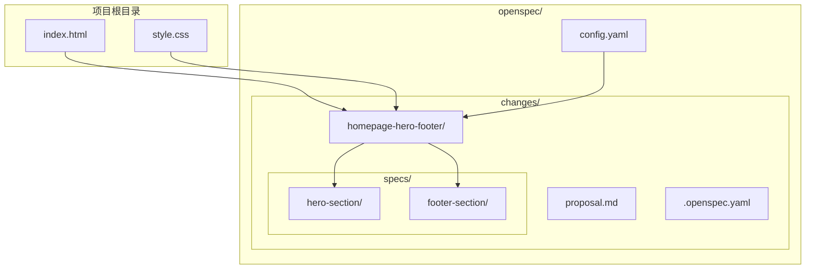
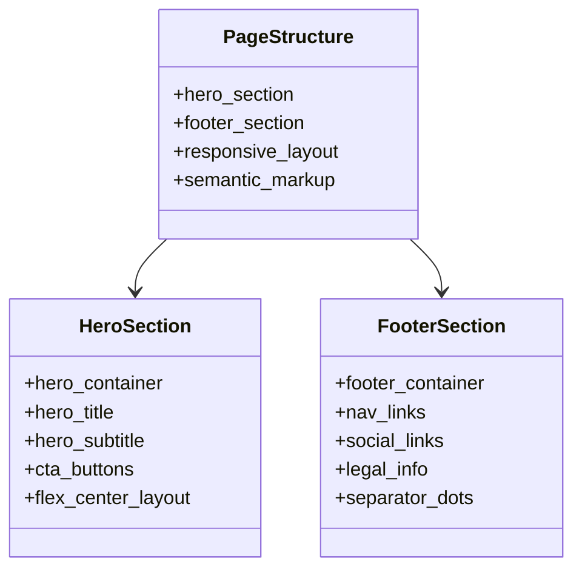
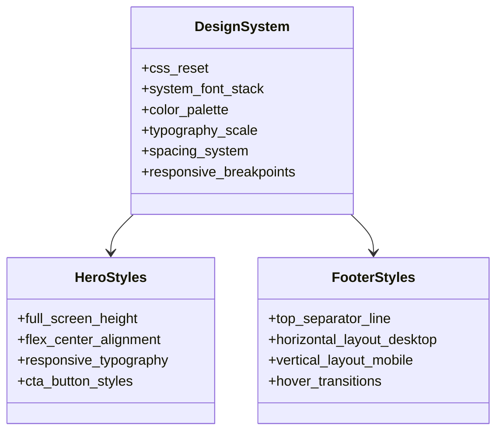
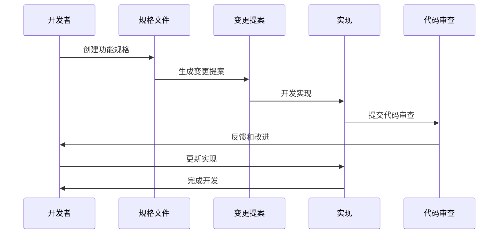
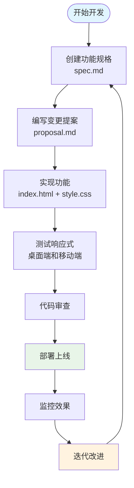
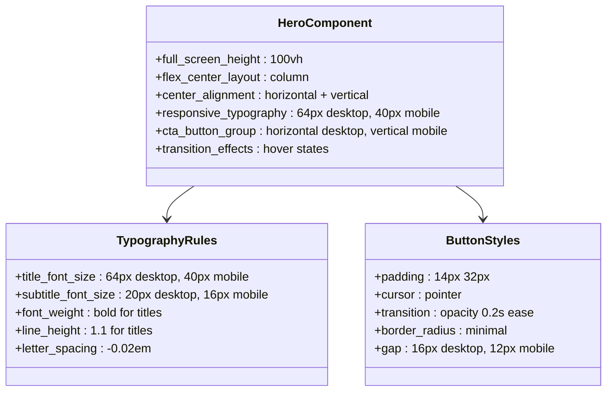
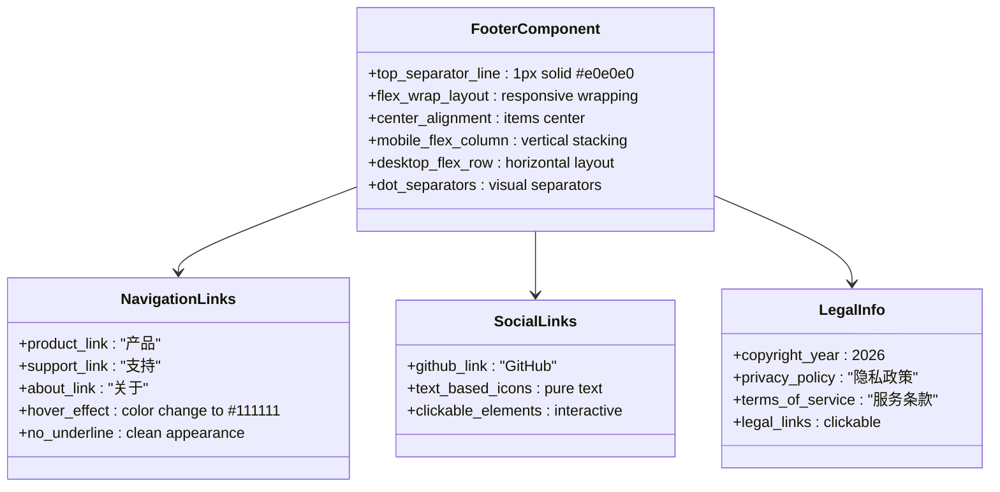
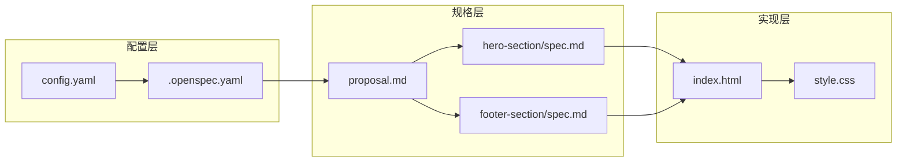
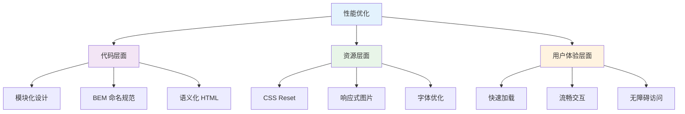
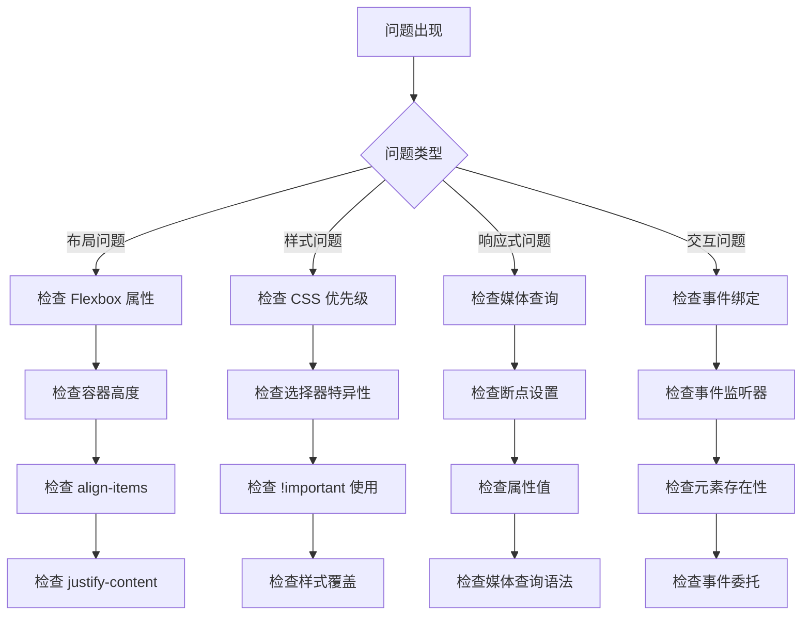

# 开发最佳实践

<cite>
**本文档引用的文件**
- [index.html](file://index.html)
- [style.css](file://style.css)
- [config.yaml](file://openspec/config.yaml)
- [proposal.md](file://openspec/changes/homepage-hero-footer/proposal.md)
- [.openspec.yaml](file://openspec/changes/homepage-hero-footer/.openspec.yaml)
- [hero-section/spec.md](file://openspec/changes/homepage-hero-footer/specs/hero-section/spec.md)
- [footer-section/spec.md](file://openspec/changes/homepage-hero-footer/specs/footer-section/spec.md)
</cite>

## 目录
1. [项目概述](#项目概述)
2. [项目结构](#项目结构)
3. [核心组件](#核心组件)
4. [架构概览](#架构概览)
5. [详细组件分析](#详细组件分析)
6. [依赖关系分析](#依赖关系分析)
7. [性能考虑](#性能考虑)
8. [故障排除指南](#故障排除指南)
9. [结论](#结论)
10. [附录](#附录)

## 项目概述

openSpec 是一个采用规范驱动开发（Spec-Driven Development）理念的前端项目，专注于创建高质量的静态网站。该项目通过明确的需求规格和设计规范，确保代码的一致性和可维护性。

### 项目特点
- **规范驱动开发**：使用 `.openspec.yaml` 和 `proposal.md` 定义变更提案
- **模块化设计**：HTML 和 CSS 分离，便于维护和扩展
- **响应式设计**：针对不同设备尺寸的自适应布局
- **设计系统**：统一的颜色、字体和间距规范

**章节来源**
- [proposal.md:1-26](file://openspec/changes/homepage-hero-footer/proposal.md#L1-L26)
- [config.yaml:1-21](file://openspec/config.yaml#L1-L21)

## 项目结构

项目采用简洁而有序的目录结构，体现了现代前端开发的最佳实践：



**图表来源**
- [index.html:1-44](file://index.html#L1-L44)
- [style.css:1-194](file://style.css#L1-L194)
- [config.yaml:1-21](file://openspec/config.yaml#L1-L21)

### 目录结构说明

**根目录文件**：
- `index.html`：主页面入口，包含 Hero 区和 Footer 区
- `style.css`：全局样式表，采用 BEM 命名规范

**openspec 目录**：
- `config.yaml`：项目配置文件，定义开发规范
- `changes/`：变更管理目录，包含具体的功能变更
- `specs/`：功能规格说明文件

**变更管理**：
- 每个功能变更都有对应的规格说明和实现文件
- 使用 `.openspec.yaml` 标记变更的元数据

**章节来源**
- [index.html:1-44](file://index.html#L1-L44)
- [style.css:1-194](file://style.css#L1-L194)
- [config.yaml:1-21](file://openspec/config.yaml#L1-L21)

## 核心组件

### HTML 结构设计

项目采用语义化的 HTML 结构，遵循现代 Web 标准：



**图表来源**
- [index.html:11-40](file://index.html#L11-L40)

### CSS 架构模式

采用 CSS Reset + BEM 命名规范的设计系统：



**图表来源**
- [style.css:39-149](file://style.css#L39-L149)

**章节来源**
- [index.html:11-40](file://index.html#L11-L40)
- [style.css:39-149](file://style.css#L39-L149)

## 架构概览

### 规范驱动开发流程

openSpec 项目采用完整的规范驱动开发流程，确保每个功能变更都经过充分的设计和验证：



**图表来源**
- [proposal.md:1-26](file://openspec/changes/homepage-hero-footer/proposal.md#L1-L26)
- [.openspec.yaml:1-3](file://openspec/changes/homepage-hero-footer/.openspec.yaml#L1-L3)

### 组件交互流程



**图表来源**
- [hero-section/spec.md:1-49](file://openspec/changes/homepage-hero-footer/specs/hero-section/spec.md#L1-L49)
- [footer-section/spec.md:1-49](file://openspec/changes/homepage-hero-footer/specs/footer-section/spec.md#L1-L49)

## 详细组件分析

### Hero 区域组件

Hero 区域是整个页面的核心视觉焦点，采用了全屏居中布局和响应式设计：

#### 设计规范分析



**图表来源**
- [hero-section/spec.md:3-49](file://openspec/changes/homepage-hero-footer/specs/hero-section/spec.md#L3-L49)
- [style.css:39-100](file://style.css#L39-L100)

#### 实现细节

Hero 区域的实现体现了以下设计原则：

1. **全屏布局**：使用 `min-height: 100vh` 确保内容占据完整视口
2. **居中对齐**：通过 Flexbox 实现水平和垂直居中
3. **响应式字体**：根据屏幕尺寸调整标题和副标题的字体大小
4. **按钮布局**：桌面端水平排列，移动端垂直堆叠

**章节来源**
- [hero-section/spec.md:3-49](file://openspec/changes/homepage-hero-footer/specs/hero-section/spec.md#L3-L49)
- [style.css:39-100](file://style.css#L39-L100)

### Footer 区域组件

Footer 区域提供了简洁的信息架构，包含了必要的导航和法律信息：

#### 布局设计分析



**图表来源**
- [footer-section/spec.md:3-49](file://openspec/changes/homepage-hero-footer/specs/footer-section/spec.md#L3-L49)
- [style.css:105-149](file://style.css#L105-L149)

#### 响应式特性

Footer 区域展现了优秀的响应式设计：

1. **桌面端布局**：单行水平排列，内容居中对齐
2. **移动端布局**：垂直堆叠排列，适合触摸操作
3. **视觉分隔**：使用 `·` 符号进行内容分隔
4. **交互反馈**：悬停状态提供颜色变化

**章节来源**
- [footer-section/spec.md:3-49](file://openspec/changes/homepage-hero-footer/specs/footer-section/spec.md#L3-L49)
- [style.css:105-149](file://style.css#L105-L149)

## 依赖关系分析

### 技术栈依赖

```mermaid
graph TB
subgraph "前端技术栈"
A[HTML5]
B[CSS3]
C[JavaScript (可选)]
end
subgraph "设计系统"
D[CSS Reset]
E[BEM Naming]
F[System Font Stack]
G[Responsive Breakpoints]
end
subgraph "开发工具"
H[规范驱动开发]
I[版本控制]
J[代码审查]
end
A --> D
B --> E
B --> F
B --> G
H --> I
H --> J
```

### 文件间依赖关系



**图表来源**
- [config.yaml:1-21](file://openspec/config.yaml#L1-L21)
- [proposal.md:1-26](file://openspec/changes/homepage-hero-footer/proposal.md#L1-L26)
- [hero-section/spec.md:1-49](file://openspec/changes/homepage-hero-footer/specs/hero-section/spec.md#L1-L49)
- [footer-section/spec.md:1-49](file://openspec/changes/homepage-hero-footer/specs/footer-section/spec.md#L1-L49)

**章节来源**
- [config.yaml:1-21](file://openspec/config.yaml#L1-L21)
- [proposal.md:1-26](file://openspec/changes/homepage-hero-footer/proposal.md#L1-L26)

## 性能考虑

### 代码组织优化

1. **模块化分离**：HTML 和 CSS 分离，便于维护和缓存
2. **语义化标记**：使用语义化 HTML 标签提高可访问性
3. **CSS Reset**：统一浏览器默认样式差异
4. **BEM 命名**：避免样式冲突，提高可维护性

### 性能最佳实践



### 响应式性能优化

1. **媒体查询优化**：使用单一断点简化逻辑
2. **Flexbox 优化**：利用现代布局 API 提高性能
3. **CSS 过渡动画**：使用 GPU 加速的 transform 属性
4. **字体渲染**：启用字体平滑和抗锯齿

**章节来源**
- [style.css:155-194](file://style.css#L155-L194)

## 故障排除指南

### 常见问题诊断



### 调试技巧

1. **浏览器开发者工具**：使用 Elements 面板检查 DOM 结构
2. **CSS Grid/Flexbox 辅助**：启用布局网格查看器
3. **性能分析**：使用 Performance 面板分析渲染性能
4. **网络监控**：检查资源加载时间和缓存策略

**章节来源**
- [index.html:11-40](file://index.html#L11-L40)
- [style.css:39-149](file://style.css#L39-L149)

## 结论

openSpec 项目展示了现代前端开发的最佳实践，通过规范驱动的方法实现了高质量的静态网站开发。项目的关键优势包括：

### 核心优势

1. **规范驱动开发**：通过明确的规格说明确保功能实现的准确性
2. **设计系统**：统一的设计语言和组件规范
3. **响应式设计**：针对不同设备的优化布局
4. **代码组织**：清晰的文件结构和命名约定

### 最佳实践总结

1. **开发流程**：从规格到实现再到审查的完整流程
2. **代码质量**：语义化标记、模块化设计、可维护性优先
3. **性能优化**：合理的资源管理和响应式优化
4. **团队协作**：标准化的开发规范和审查流程

这个项目为个人开发者和团队提供了宝贵的参考，展示了如何通过规范驱动的方法实现高质量的前端开发。

## 附录

### 开发工具推荐

1. **编辑器**：VS Code + 相关插件
2. **浏览器**：Chrome DevTools + Firefox Developer Tools
3. **版本控制**：Git + GitHub/GitLab
4. **代码格式化**：Prettier + ESLint
5. **设计工具**：Figma + Adobe XD

### 学习资源

1. **规范驱动开发**：Spec-Driven Development 方法论
2. **CSS 架构**：BEM 命名规范、CSS Modules
3. **响应式设计**：移动优先策略、断点设计
4. **性能优化**：Web Vitals、Core Web Vitals

### 团队协作建议

1. **代码审查**：建立标准化的审查流程
2. **文档维护**：保持规格和实现文档同步更新
3. **知识分享**：定期的技术分享和最佳实践交流
4. **持续改进**：基于反馈不断优化开发流程