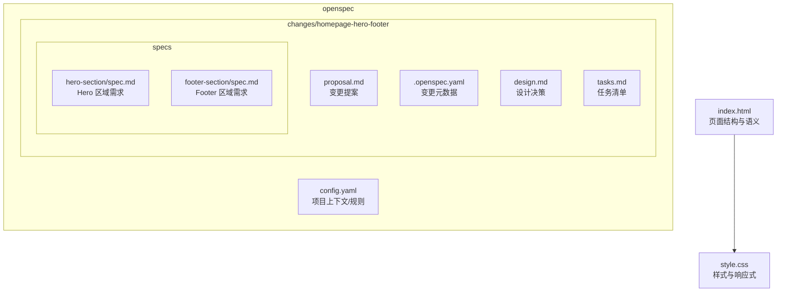
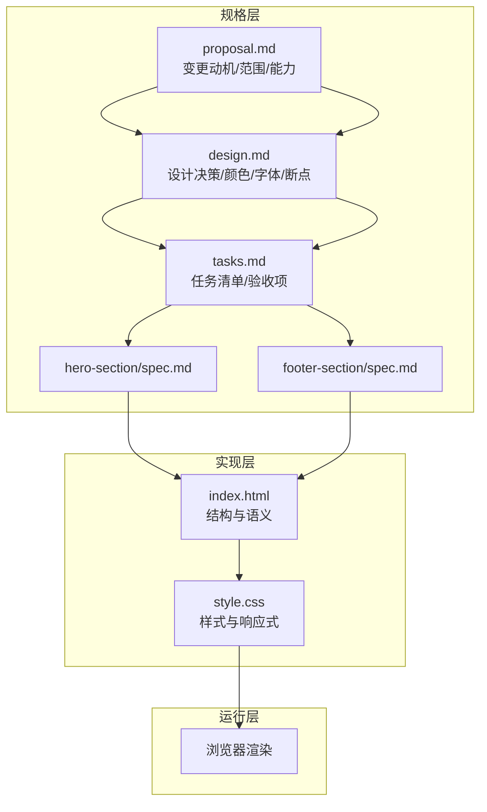
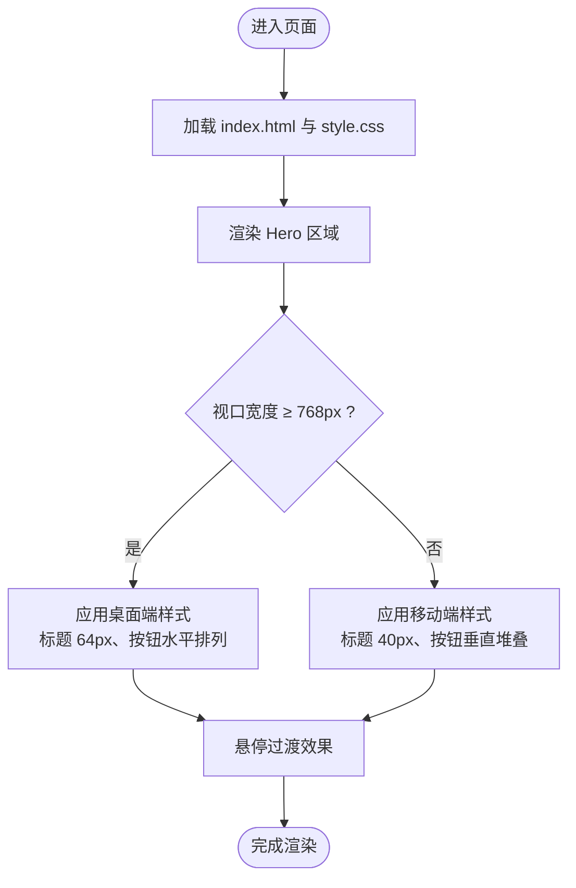
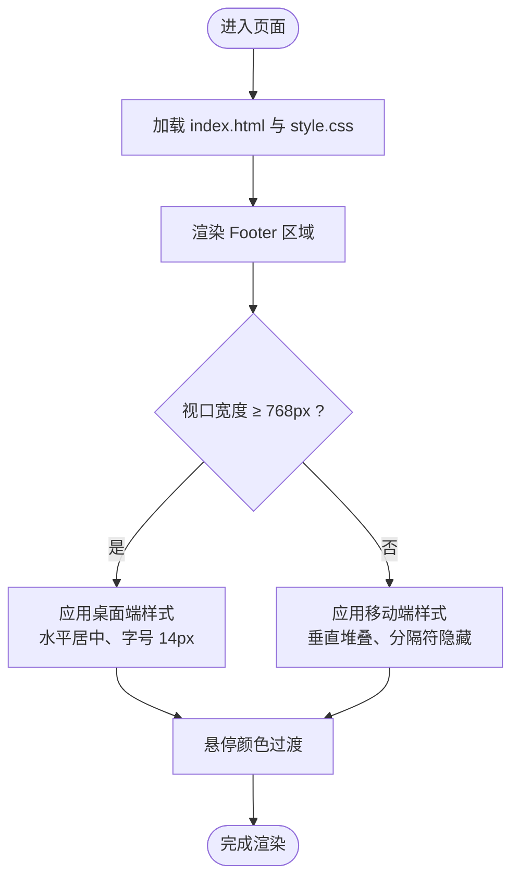
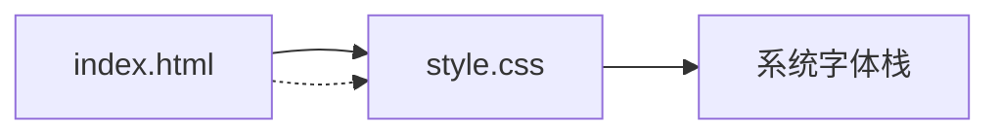

# 快速开始

<cite>
**本文引用的文件**
- [index.html](file://index.html)
- [style.css](file://style.css)
- [config.yaml](file://openspec/config.yaml)
- [proposal.md](file://openspec/changes/homepage-hero-footer/proposal.md)
- [.openspec.yaml](file://openspec/changes/homepage-hero-footer/.openspec.yaml)
- [design.md](file://openspec/changes/homepage-hero-footer/design.md)
- [tasks.md](file://openspec/changes/homepage-hero-footer/tasks.md)
- [spec.md（Hero 区）](file://openspec/changes/homepage-hero-footer/specs/hero-section/spec.md)
- [spec.md（Footer 区）](file://openspec/changes/homepage-hero-footer/specs/footer-section/spec.md)
</cite>

## 目录
1. [简介](#简介)
2. [项目结构](#项目结构)
3. [环境要求](#环境要求)
4. [安装与启动](#安装与启动)
5. [基本使用](#基本使用)
6. [浏览器兼容性](#浏览器兼容性)
7. [开发工具推荐](#开发工具推荐)
8. [常见问题](#常见问题)
9. [架构概览](#架构概览)
10. [详细组件解析](#详细组件解析)
11. [依赖关系分析](#依赖关系分析)
12. [性能考量](#性能考量)
13. [故障排查](#故障排查)
14. [结语](#结语)

## 简介
本项目是一个“纯静态”的官网首页原型，采用“规格驱动”（spec-driven）方式从零构建，目标是在 3 秒内传达产品定位与核心价值，并提供简洁、可维护的前端实现。项目由一个 HTML 文件与一个 CSS 文件组成，不依赖任何 JavaScript 框架或构建工具，可直接在浏览器中打开预览。

## 项目结构
- 顶层文件
  - index.html：页面结构与语义标记
  - style.css：样式与响应式规则
- openspec 目录
  - config.yaml：项目上下文与规则配置（可选）
  - changes/homepage-hero-footer：本次变更的规范、设计与任务清单
    - proposal.md：变更动机、范围与能力说明
    - .openspec.yaml：变更元数据（版本/时间戳）
    - design.md：设计决策、颜色体系、字体策略等
    - tasks.md：分阶段任务清单与验收项
    - specs/hero-section/spec.md：Hero 区域需求与场景
    - specs/footer-section/spec.md：Footer 区域需求与场景

图表来源
- [index.html:1-44](file://index.html#L1-L44)
- [style.css:1-194](file://style.css#L1-L194)
- [config.yaml:1-21](file://openspec/config.yaml#L1-L21)
- [proposal.md:1-26](file://openspec/changes/homepage-hero-footer/proposal.md#L1-L26)
- [.openspec.yaml:1-3](file://openspec/changes/homepage-hero-footer/.openspec.yaml#L1-L3)
- [design.md:1-84](file://openspec/changes/homepage-hero-footer/design.md#L1-L84)
- [tasks.md:1-35](file://openspec/changes/homepage-hero-footer/tasks.md#L1-L35)
- [spec.md（Hero 区）:1-49](file://openspec/changes/homepage-hero-footer/specs/hero-section/spec.md#L1-L49)
- [spec.md（Footer 区）:1-49](file://openspec/changes/homepage-hero-footer/specs/footer-section/spec.md#L1-L49)

章节来源
- [index.html:1-44](file://index.html#L1-L44)
- [style.css:1-194](file://style.css#L1-L194)
- [config.yaml:1-21](file://openspec/config.yaml#L1-L21)
- [proposal.md:1-26](file://openspec/changes/homepage-hero-footer/proposal.md#L1-L26)
- [.openspec.yaml:1-3](file://openspec/changes/homepage-hero-footer/.openspec.yaml#L1-L3)
- [design.md:1-84](file://openspec/changes/homepage-hero-footer/design.md#L1-L84)
- [tasks.md:1-35](file://openspec/changes/homepage-hero-footer/tasks.md#L1-L35)
- [spec.md（Hero 区）:1-49](file://openspec/changes/homepage-hero-footer/specs/hero-section/spec.md#L1-L49)
- [spec.md（Footer 区）:1-49](file://openspec/changes/homepage-hero-footer/specs/footer-section/spec.md#L1-L49)

## 环境要求
- 无需 Node.js、Python、Java 等运行时环境
- 无需构建工具（如 Vite、Webpack、Parcel）或包管理器（npm/yarn/pnpm）
- 仅需现代浏览器即可打开 index.html 查看效果
- 无需联网亦可运行（字体来自系统字体栈）

## 安装与启动
- 本地预览
  - 直接在浏览器中打开 index.html 文件（例如双击文件或在地址栏粘贴文件路径）
  - 若使用 VS Code，可安装 Live Server 插件，右键 index.html 选择“Open with Live Server”
- 开发环境
  - 使用任意文本编辑器（VS Code、WebStorm、Sublime Text 等）打开项目根目录
  - 修改 index.html 与 style.css 后保存，刷新浏览器即可看到变化

提示
- 本项目为纯静态页面，无需安装依赖或执行构建命令

章节来源
- [index.html:1-44](file://index.html#L1-L44)
- [style.css:1-194](file://style.css#L1-L194)

## 基本使用
- 查看效果
  - 打开 index.html，确认 Hero 区全屏居中、标题与副标题层级清晰、CTA 按钮样式正确
  - 切换到移动设备视口（或调整浏览器窗口宽度至 <768px），验证按钮堆叠与 Footer 垂直排列
- 基本修改
  - 修改标题/副标题文案：在 index.html 中对应位置替换文本
  - 调整颜色/字号/间距：在 style.css 中修改相关选择器的属性值
  - 添加链接：在 index.html 中为相应锚点添加 href
  - 新增区域：在 index.html 中新增语义标签（如 section/footer/header），并在 style.css 中补充样式

章节来源
- [index.html:11-40](file://index.html#L11-L40)
- [style.css:39-193](file://style.css#L39-L193)
- [tasks.md:1-35](file://openspec/changes/homepage-hero-footer/tasks.md#L1-L35)

## 浏览器兼容性
- 支持范围
  - 现代浏览器：Chrome、Firefox、Safari、Edge（最新两个版本）
  - iOS Safari 与 Android WebView（基于 Chromium 的浏览器）
- 不支持
  - IE（不支持现代 CSS 语法与 Flexbox）
  - 早期 Safari/Chrome（不支持某些 CSS 选择器或媒体查询）
- 设计取舍
  - 使用系统字体栈，避免网络字体带来的兼容性与加载问题
  - 采用纯 CSS 实现布局，不依赖 JavaScript，确保在禁用脚本的环境下仍可渲染

章节来源
- [design.md:38-47](file://openspec/changes/homepage-hero-footer/design.md#L38-L47)
- [tasks.md:25-28](file://openspec/changes/homepage-hero-footer/tasks.md#L25-L28)

## 开发工具推荐
- 文本编辑器
  - VS Code（推荐，内置 Live Server 插件，语法高亮与 Emmet 支持好）
  - WebStorm（专业前端 IDE，自动补全与重构能力强）
  - Sublime Text（轻量快速，适合快速修改）
- 浏览器调试
  - Chrome DevTools（检查盒模型、Flexbox、媒体查询）
  - Firefox Developer Tools（布局与响应式调试）
- 其他
  - Prettier（统一代码风格）
  - EditorConfig（跨编辑器一致性）

## 常见问题
- 页面空白或样式未生效
  - 检查 index.html 是否正确引入 style.css（link 标签路径）
  - 确认浏览器未禁用 CSS
- 字体显示异常
  - 系统字体栈依赖操作系统字体，若本地字体缺失，浏览器会回退到默认字体
- 移动端按钮未堆叠
  - 确认浏览器窗口宽度小于 768px，或在开发者工具中切换到移动设备模式
- 链接无法点击
  - 检查 index.html 中 a 标签的 href 属性是否有效
- 如何添加新功能（如导航栏）
  - 在 index.html 中新增语义结构，在 style.css 中补充样式；注意保持“纯静态、无 JS”的原则

章节来源
- [index.html](file://index.html#L7)
- [style.css:155-193](file://style.css#L155-L193)
- [tasks.md:25-35](file://openspec/changes/homepage-hero-footer/tasks.md#L25-L35)

## 架构概览
本项目采用“规格驱动”的轻量架构：
- 规格层：proposal.md、design.md、tasks.md、specs 下的需求文档
- 实现层：index.html（结构）、style.css（样式）
- 运行层：浏览器直接渲染，无需构建

图表来源
- [proposal.md:1-26](file://openspec/changes/homepage-hero-footer/proposal.md#L1-L26)
- [design.md:1-84](file://openspec/changes/homepage-hero-footer/design.md#L1-L84)
- [tasks.md:1-35](file://openspec/changes/homepage-hero-footer/tasks.md#L1-L35)
- [spec.md（Hero 区）:1-49](file://openspec/changes/homepage-hero-footer/specs/hero-section/spec.md#L1-L49)
- [spec.md（Footer 区）:1-49](file://openspec/changes/homepage-hero-footer/specs/footer-section/spec.md#L1-L49)
- [index.html:1-44](file://index.html#L1-L44)
- [style.css:1-194](file://style.css#L1-L194)

## 详细组件解析

### Hero 区域（全屏首屏）
- 结构要点
  - 使用语义化 section 容器承载首屏内容
  - 包含主标题、副标题与 CTA 按钮组
- 样式要点
  - 全屏高度与居中布局（Flexbox）
  - 桌面端与移动端字号、间距差异化
  - 悬停透明度过渡
- 响应式要点
  - 以 768px 为断点，移动端按钮垂直堆叠、字号与内边距收紧

图表来源
- [index.html:11-18](file://index.html#L11-L18)
- [style.css:39-87](file://style.css#L39-L87)
- [style.css:155-176](file://style.css#L155-L176)

章节来源
- [index.html:11-18](file://index.html#L11-L18)
- [style.css:39-87](file://style.css#L39-L87)
- [style.css:155-176](file://style.css#L155-L176)
- [spec.md（Hero 区）:1-49](file://openspec/changes/homepage-hero-footer/specs/hero-section/spec.md#L1-L49)

### Footer 区域（一行式底栏）
- 结构要点
  - 包含导航链接、社交媒体入口、版权与法律信息
  - 使用分隔符“·”串联内容
- 样式要点
  - 顶部分隔线与内边距
  - 链接 hover 效果与无下划线
- 响应式要点
  - 移动端垂直堆叠、分隔符隐藏

图表来源
- [index.html:20-40](file://index.html#L20-L40)
- [style.css:105-149](file://style.css#L105-L149)
- [style.css:178-193](file://style.css#L178-L193)

章节来源
- [index.html:20-40](file://index.html#L20-L40)
- [style.css:105-149](file://style.css#L105-L149)
- [style.css:178-193](file://style.css#L178-L193)
- [spec.md（Footer 区）:1-49](file://openspec/changes/homepage-hero-footer/specs/footer-section/spec.md#L1-L49)

## 依赖关系分析
- 外部依赖
  - 无第三方框架或构建工具
  - 无网络字体依赖，使用系统字体栈
- 内部依赖
  - index.html 依赖 style.css（通过 link 标签）
  - style.css 依赖系统字体与浏览器默认样式（通过 CSS Reset）

图表来源
- [index.html](file://index.html#L7)
- [style.css:17-28](file://style.css#L17-L28)

章节来源
- [index.html](file://index.html#L7)
- [style.css:17-28](file://style.css#L17-L28)

## 性能考量
- 加载速度
  - 仅 2 个文件，零网络请求（除系统字体外）
  - 无构建体积与打包成本
- 渲染性能
  - 使用 Flexbox 实现布局，避免复杂计算
  - 媒体查询仅在 768px 断点，减少匹配开销
- 可维护性
  - 文件分离（HTML/CSS），职责清晰
  - 无构建流程，便于快速修改与发布

## 故障排查
- 页面空白
  - 检查 link 标签路径是否正确
  - 确认浏览器未禁用 CSS
- 字体不一致
  - 系统字体因平台而异属预期行为
- 移动端样式未生效
  - 使用浏览器开发者工具切换到移动设备模式
- 链接无效
  - 检查 a 标签的 href 属性

章节来源
- [index.html](file://index.html#L7)
- [style.css:155-193](file://style.css#L155-L193)
- [tasks.md:25-35](file://openspec/changes/homepage-hero-footer/tasks.md#L25-L35)

## 结语
本项目以“规格驱动”的方式从零构建了一个极简、可维护且高性能的官网首页原型。它不依赖任何构建工具或第三方库，适合初学者快速上手，也便于后续按需扩展。建议在理解现有结构与样式的基础上，逐步添加导航、多页面或交互（如需），并保持“纯静态、无 JS”的原则以维持可移植性与稳定性。