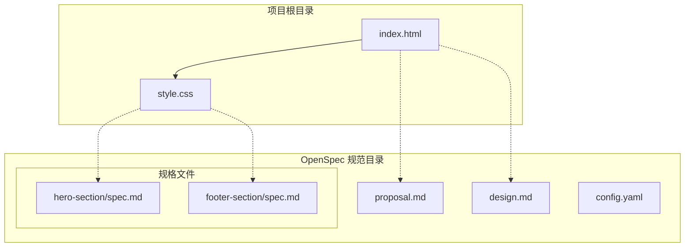
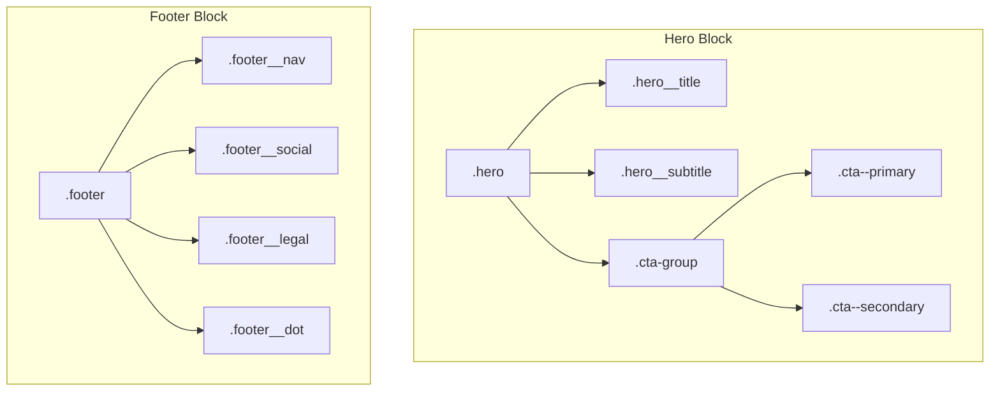
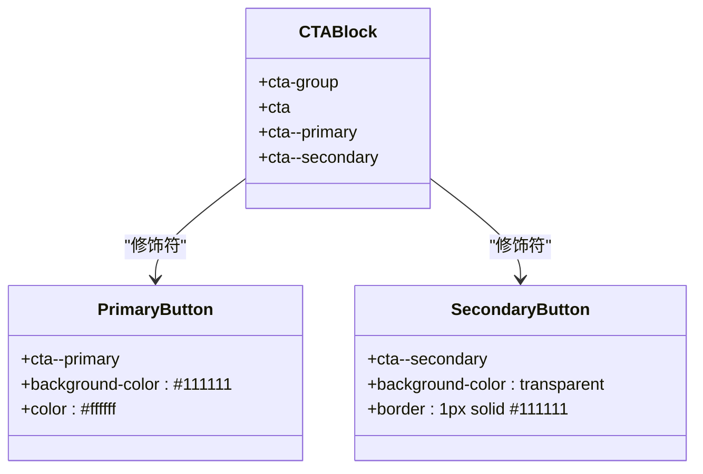
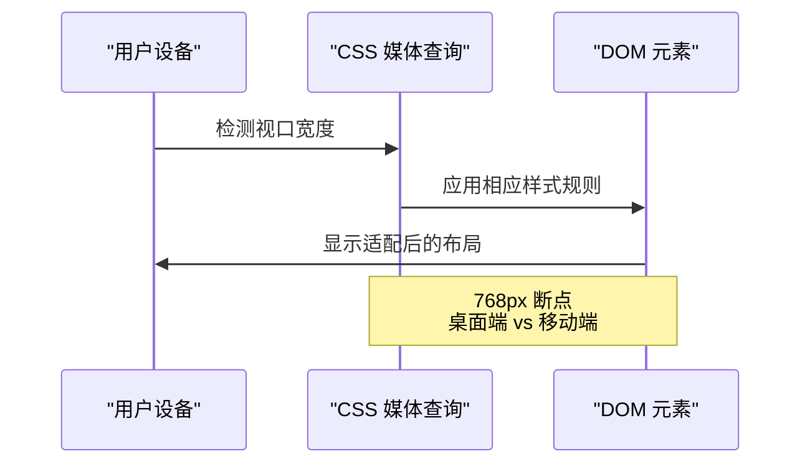
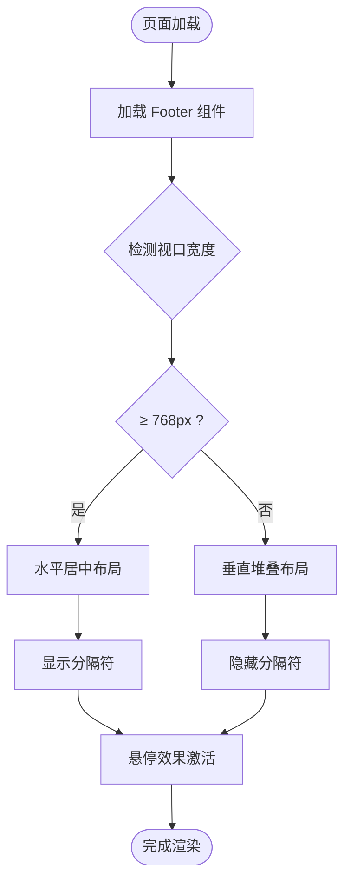
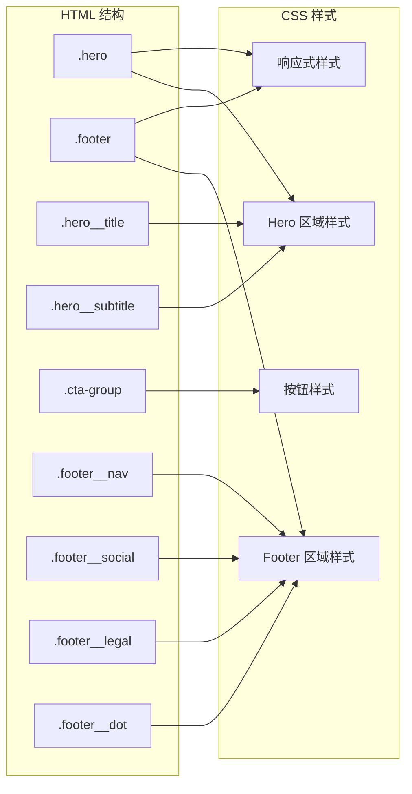

# BEM 命名规范

<cite>
**本文档引用的文件**
- [index.html](file://index.html)
- [style.css](file://style.css)
- [proposal.md](file://openspec/changes/archive/2026-05-12-homepage-hero-footer/proposal.md)
- [spec.md（Hero 规范）](file://openspec/changes/archive/2026-05-12-homepage-hero-footer/specs/hero-section/spec.md)
- [spec.md（Footer 规范）](file://openspec/changes/archive/2026-05-12-homepage-hero-footer/specs/footer-section/spec.md)
- [design.md](file://openspec/changes/archive/2026-05-12-homepage-hero-footer/design.md)
- [config.yaml](file://openspec/config.yaml)
</cite>

## 目录
1. [简介](#简介)
2. [项目结构](#项目结构)
3. [核心组件](#核心组件)
4. [架构概览](#架构概览)
5. [详细组件分析](#详细组件分析)
6. [依赖关系分析](#依赖关系分析)
7. [性能考虑](#性能考虑)
8. [故障排除指南](#故障排除指南)
9. [结论](#结论)
10. [附录](#附录)

## 简介

openSpec 项目中的 BEM（Block Element Modifier）命名规范是该项目前端架构的核心组成部分。BEM 是一种流行的前端 CSS 类命名方法论，通过 Block（块）、Element（元素）和 Modifier（修饰符）的组合来创建语义化的类名结构。

在本项目中，BEM 命名规范主要应用于 Hero 区域和 Footer 区域的实现，体现了现代前端开发中组件化思维和可维护性设计的重要性。

## 项目结构

openSpec 项目采用极简的单页面架构，专注于展示 BEM 命名规范的最佳实践：

**图表来源**
- [index.html:1-44](file://index.html#L1-L44)
- [style.css:1-194](file://style.css#L1-L194)

**章节来源**
- [index.html:1-44](file://index.html#L1-L44)
- [style.css:1-194](file://style.css#L1-L194)
- [proposal.md:1-26](file://openspec/changes/archive/2026-05-12-homepage-hero-footer/proposal.md#L1-L26)

## 核心组件

### Block（块）组件

Block 是页面中的独立组件单元，具有完整的功能和独立的作用域。在本项目中，主要的 Block 组件包括：

- **.hero** - 首屏 Hero 区域，负责品牌展示和核心信息传达
- **.footer** - 底部导航区域，提供网站导航和法律信息

每个 Block 组件都是独立的功能单元，可以单独存在和复用。

### Element（元素）组件

Element 是 Block 的子组件，必须依附于 Block 存在。它们通过双下划线（__）与 Block 分离：

- **.hero__title** - Hero 区域的主标题元素
- **.hero__subtitle** - Hero 区域的副标题元素
- **.footer__nav** - Footer 区域的导航元素
- **.footer__social** - Footer 区域的社交链接元素
- **.footer__legal** - Footer 区域的法律信息元素
- **.footer__dot** - Footer 区域的分隔符元素

### Modifier（修饰符）组件

Modifier 用于改变 Block 或 Element 的外观或状态，通过双连字符（--）标识：

- **.cta--primary** - 主要 CTA 按钮修饰符
- **.cta--secondary** - 次要 CTA 按钮修饰符

**章节来源**
- [index.html:11-18](file://index.html#L11-L18)
- [index.html:20-40](file://index.html#L20-L40)
- [style.css:39-63](file://style.css#L39-L63)
- [style.css:105-149](file://style.css#L105-L149)

## 架构概览

BEM 命名规范在项目中的应用体现了一种清晰的层级结构：

**图表来源**
- [index.html:11-18](file://index.html#L11-L18)
- [index.html:20-40](file://index.html#L20-L40)
- [style.css:39-99](file://style.css#L39-L99)
- [style.css:105-149](file://style.css#L105-L149)

## 详细组件分析

### Hero 组件分析

Hero 组件是整个页面的核心视觉焦点，采用了完整的 BEM 结构：

#### Block 结构
- **.hero** - 主容器，实现全屏居中布局和品牌展示功能

#### Element 结构
- **.hero__title** - 主标题元素，承载品牌核心信息
- **.hero__subtitle** - 副标题元素，提供产品价值补充说明

#### CTA 按钮系统

**图表来源**
- [index.html:14-17](file://index.html#L14-L17)
- [style.css:69-99](file://style.css#L69-L99)

#### 响应式设计实现
Hero 组件通过媒体查询实现了单一断点的响应式设计：

**图表来源**
- [style.css:155-193](file://style.css#L155-L193)

**章节来源**
- [index.html:11-18](file://index.html#L11-L18)
- [style.css:39-99](file://style.css#L39-L99)
- [style.css:155-193](file://style.css#L155-L193)

### Footer 组件分析

Footer 组件采用了简洁的一行式布局设计：

#### Block 结构
- **.footer** - 底部容器，实现分隔线和导航功能

#### Element 结构
- **.footer__nav** - 导航链接元素
- **.footer__social** - 社交媒体链接元素  
- **.footer__legal** - 法律信息元素
- **.footer__dot** - 分隔符元素

#### 导航系统设计

**图表来源**
- [index.html:20-40](file://index.html#L20-L40)
- [style.css:105-149](file://style.css#L105-L149)

**章节来源**
- [index.html:20-40](file://index.html#L20-L40)
- [style.css:105-149](file://style.css#L105-L149)

## 依赖关系分析

BEM 命名规范在项目中的依赖关系体现了清晰的层次结构：

**图表来源**
- [index.html:11-40](file://index.html#L11-L40)
- [style.css:39-149](file://style.css#L39-L149)

**章节来源**
- [index.html:11-40](file://index.html#L11-L40)
- [style.css:39-149](file://style.css#L39-L149)

## 性能考虑

BEM 命名规范在性能方面的优势体现在多个层面：

### 1. 选择器性能
- **扁平化结构**：BEM 采用扁平的类名结构，避免了复杂的 CSS 选择器嵌套
- **单一类名匹配**：每个元素只使用一个类名进行样式匹配，提升渲染性能

### 2. 维护性能
- **局部修改**：修改某个元素的样式不会影响其他元素
- **可预测性**：类名结构清晰，便于理解和维护

### 3. 缓存友好
- **样式复用**：相同的修饰符可以在不同组件中重复使用
- **减少冗余**：避免了重复的样式定义

## 故障排除指南

### 常见问题及解决方案

#### 1. 命名规范错误
**问题**：类名不符合 BEM 规范
**解决方案**：
- Block 必须使用单一类名：`.hero`
- Element 必须使用 Block__Element 格式：`.hero__title`
- Modifier 必须使用 Block--Modifier 格式：`.cta--primary`

#### 2. 样式覆盖问题
**问题**：修饰符样式未生效
**解决方案**：
- 确保修饰符类名位于基础类名之后：`<button class="cta cta--primary">`
- 检查 CSS 优先级，确保修饰符样式具有足够权重

#### 3. 响应式问题
**问题**：移动端样式异常
**解决方案**：
- 检查媒体查询断点设置
- 确保移动优先的样式组织方式

**章节来源**
- [style.css:85-99](file://style.css#L85-L99)
- [style.css:155-193](file://style.css#L155-L193)

## 结论

openSpec 项目中的 BEM 命名规范应用展示了现代前端开发的最佳实践。通过 Block、Element、Modifier 的清晰分离，项目实现了：

### 主要优势
1. **可读性强**：类名结构直观反映组件关系
2. **可维护性高**：模块化设计便于长期维护
3. **作用域隔离**：避免样式冲突和意外覆盖
4. **团队协作友好**：统一的命名约定降低沟通成本

### 实践价值
- **组件化开发**：BEM 为组件化架构提供了坚实的基础
- **团队协作**：标准化的命名规范提升了团队开发效率
- **代码质量**：清晰的结构有助于代码审查和质量控制

## 附录

### BEM 命名规范最佳实践

#### 1. 命名规则
- **Block**：使用描述性名词，如 `.hero`、`.footer`
- **Element**：使用 Block 名称 + `__` + 元素名称，如 `.hero__title`
- **Modifier**：使用 Block 名称 + `--` + 修饰符名称，如 `.cta--primary`

#### 2. 嵌套元素处理
当需要处理嵌套元素时，遵循以下原则：
- 每个元素都必须明确标识其 Block 作用域
- 避免深层嵌套，保持扁平化结构
- 使用语义化的元素名称

#### 3. 复合修饰符使用
复合修饰符适用于复杂的状态组合：
- 使用连字符分隔多个修饰符：`.button--large--primary`
- 避免过度复杂的修饰符组合
- 考虑使用状态类名替代复合修饰符

#### 4. 团队协作标准
- **代码审查**：检查所有新类名是否符合 BEM 规范
- **重构策略**：定期审查和优化现有类名结构
- **文档更新**：保持命名规范文档的及时更新

**章节来源**
- [proposal.md:14-16](file://openspec/changes/archive/2026-05-12-homepage-hero-footer/proposal.md#L14-L16)
- [design.md:28-36](file://openspec/changes/archive/2026-05-12-homepage-hero-footer/design.md#L28-L36)