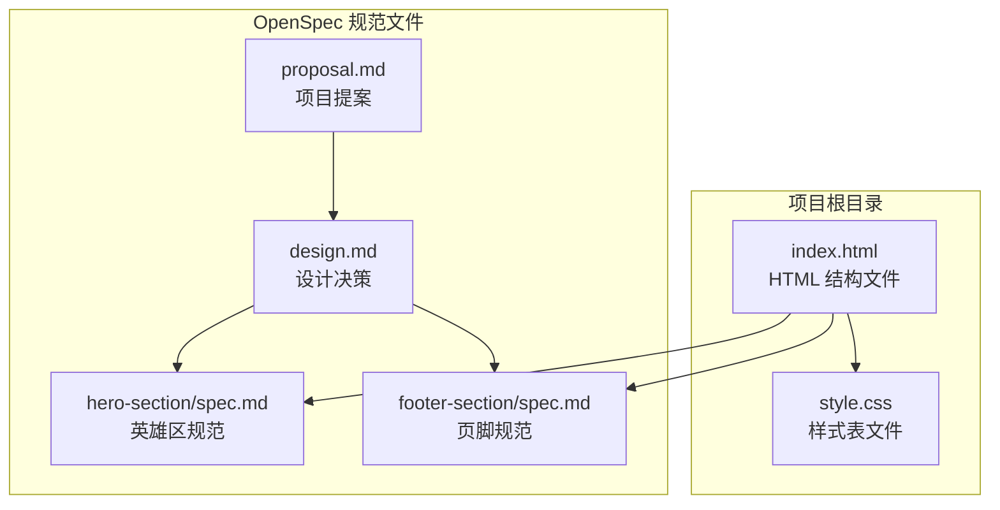
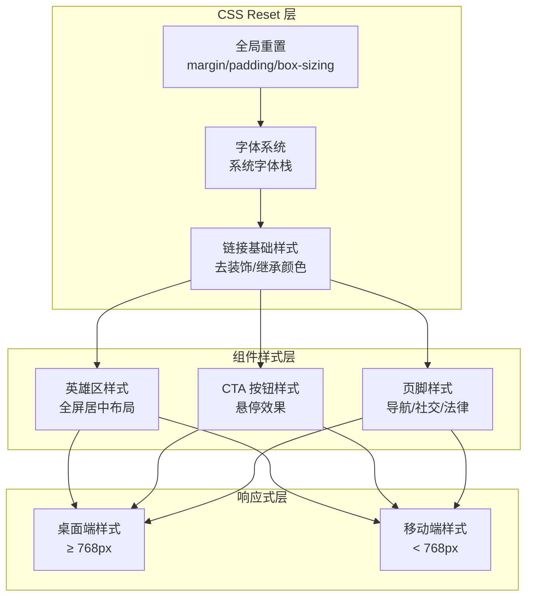
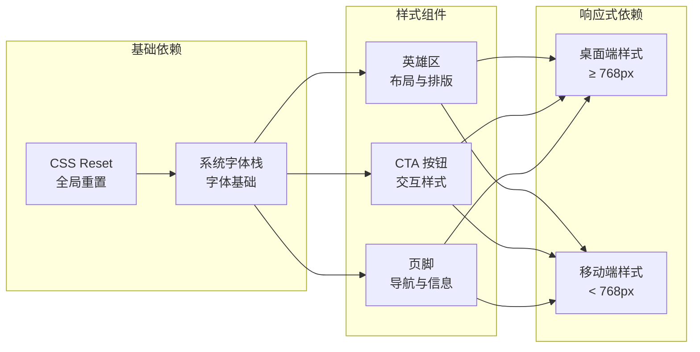

# CSS Reset 设计

<cite>
**本文档引用的文件**
- [style.css](file://style.css)
- [index.html](file://index.html)
- [proposal.md](file://openspec/changes/archive/2026-05-12-homepage-hero-footer/proposal.md)
- [design.md](file://openspec/changes/archive/2026-05-12-homepage-hero-footer/design.md)
- [hero-section/spec.md](file://openspec/changes/archive/2026-05-12-homepage-hero-footer/specs/hero-section/spec.md)
- [footer-section/spec.md](file://openspec/changes/archive/2026-05-12-homepage-hero-footer/specs/footer-section/spec.md)
</cite>

## 目录
1. [简介](#简介)
2. [项目结构](#项目结构)
3. [核心组件](#核心组件)
4. [架构概览](#架构概览)
5. [详细组件分析](#详细组件分析)
6. [依赖关系分析](#依赖关系分析)
7. [性能考量](#性能考量)
8. [故障排除指南](#故障排除指南)
9. [结论](#结论)

## 简介

openSpec 项目的 CSS Reset 设计采用了现代化的全局重置策略，旨在为整个网站提供一致、可预测的基础样式环境。该设计特别针对纯静态 HTML/CSS 实现的手机产品官网首页进行了优化，确保在不同浏览器和设备上都能获得最佳的视觉呈现效果。

本项目采用极简主义设计理念，通过精心选择的重置策略和基础排版规则，为后续的组件样式开发奠定了坚实的基础。设计决策充分考虑了性能、可维护性和跨浏览器兼容性等因素。

## 项目结构

该项目采用分离的关注点架构，将 HTML 结构与 CSS 样式完全分离，实现了最佳的可维护性和可读性。



**图表来源**
- [index.html:1-44](file://index.html#L1-L44)
- [style.css:1-194](file://style.css#L1-L194)

**章节来源**
- [index.html:1-44](file://index.html#L1-L44)
- [proposal.md:1-26](file://openspec/changes/archive/2026-05-12-homepage-hero-footer/proposal.md#L1-L26)

## 核心组件

### 全局 CSS Reset 组件

项目的核心重置策略集中在 style.css 文件的前 11 行，采用了业界标准的通配符选择器模式：

```css
*,
*::before,
*::after {
  margin: 0;
  padding: 0;
  box-sizing: border-box;
}
```

这个设计包含了三个关键要素：
- **margin: 0** - 将所有元素的外边距重置为 0
- **padding: 0** - 将所有元素的内边距重置为 0  
- **box-sizing: border-box** - 统一盒模型计算方式

**章节来源**
- [style.css:5-11](file://style.css#L5-L11)

### 系统字体栈组件

项目采用了精心设计的系统字体栈，确保在不同平台上都能获得最佳的字体渲染效果：

```css
html {
  font-size: 16px;
}

body {
  font-family: -apple-system, BlinkMacSystemFont, "Segoe UI", Roboto, sans-serif;
  color: #111111;
  background-color: #ffffff;
  line-height: 1.5;
  -webkit-font-smoothing: antialiased;
  -moz-osx-font-smoothing: grayscale;
}
```

**章节来源**
- [style.css:17-28](file://style.css#L17-L28)

### 基础链接样式组件

为了保持整体设计的一致性，项目还包含了基础的链接样式重置：

```css
a {
  text-decoration: none;
  color: inherit;
}
```

**章节来源**
- [style.css:30-33](file://style.css#L30-L33)

## 架构概览

整个 CSS Reset 架构遵循了现代前端开发的最佳实践，通过分层的设计实现了高度的模块化和可维护性。



**图表来源**
- [style.css:1-194](file://style.css#L1-L194)

## 详细组件分析

### 选择器作用范围与优先级分析

#### 通配符选择器的使用策略

项目采用了标准的 CSS Reset 通配符选择器模式，这种选择器具有以下特点：

```css
*,                    /* 选择所有元素 */
*::before,            /* 选择所有元素的伪元素 */
*::after              /* 选择所有元素的伪元素 */
```

**选择器优先级分析**：
- 通配符选择器的特异性为 0,0,0,0
- 由于其广泛的作用范围，它能够确保所有元素都遵循统一的基础样式规则
- 通过在后续样式中使用更具体的选择器，可以轻松覆盖重置规则

#### 伪元素选择器的重要性

项目同时重置了 `::before` 和 `::after` 伪元素，这是现代 CSS Reset 的标准做法：

```css
*::before,
*::after {
  /* 继承全局重置规则 */
}
```

**设计考虑因素**：
- 确保使用 `::before` 和 `::after` 伪元素的组件也能遵循统一的样式规则
- 防止伪元素意外产生默认的边距或内边距
- 为未来的扩展提供一致性保障

**章节来源**
- [style.css:5-11](file://style.css#L5-L11)

### 盒模型统一策略

#### border-box 盒模型的优势

项目选择了 `border-box` 作为统一的盒模型计算方式：

```css
box-sizing: border-box;
```

**优势分析**：
- 简化了宽度和高度的计算逻辑
- 使边框和内边距成为内容尺寸的一部分
- 减少了布局计算中的数学运算复杂度
- 提高了样式的可预测性和一致性

**对后续开发的影响**：
- 开发者可以更直观地理解和预测元素的实际占用空间
- 减少了因盒模型差异导致的布局问题
- 为响应式设计提供了更好的基础

**章节来源**
- [style.css:10](file://style.css#L10)

### 字体平滑处理机制

#### 多平台字体优化策略

项目采用了多层次的字体平滑处理机制：

```css
-webkit-font-smoothing: antialiased;
-moz-osx-font-smoothing: grayscale;
```

**跨平台兼容性考虑**：
- `-webkit-font-smoothing` 适用于 WebKit 内核浏览器（Chrome、Safari）
- `-moz-osx-font-smoothing` 专门针对 macOS 平台的 Firefox 浏览器
- 这种双重处理确保了在不同操作系统和浏览器上的最佳字体渲染效果

**性能影响分析**：
- 字体平滑处理对渲染性能影响微乎其微
- 通过使用系统字体栈，避免了额外的网络请求
- 字体渲染优化提升了用户体验质量

**章节来源**
- [style.css:26-27](file://style.css#L26-L27)

### 行高设置与基础排版规则

#### 行高的设计决策

项目选择了 `1.5` 作为基础行高值：

```css
line-height: 1.5;
```

**设计考量因素**：
- 提供良好的文本可读性，特别是在长段落阅读场景
- 与标题层级形成合理的视觉层次关系
- 保持在不同字体和字号下的视觉平衡
- 符合现代网页设计的可读性标准

**对排版系统的影响**：
- 为标题、段落、列表等文本元素提供了统一的基线
- 简化了垂直间距的计算和维护
- 有助于创建一致的阅读体验

**章节来源**
- [style.css:25](file://style.css#L25)

### 颜色体系与对比度设计

#### 极简色彩策略

项目采用了黑白灰三级色彩体系：

```css
color: #111111;           /* 近黑文字 */
background-color: #ffffff; /* 纯白背景 */
```

**设计原则**：
- 黑白灰三级色彩足以表达完整的视觉层次
- 避免了品牌色彩的使用，保持极简主义风格
- 近黑文字色 (#111111) 提供了良好的对比度
- 中灰辅助色 (#666666) 用于次要信息

**可访问性考虑**：
- 确保了足够的对比度标准
- 支持不同视觉需求的用户
- 符合无障碍设计的基本要求

**章节来源**
- [style.css:23-24](file://style.css#L23-L24)

## 依赖关系分析

### CSS Reset 与其他组件的依赖关系



**图表来源**
- [style.css:1-194](file://style.css#L1-L194)

### 外部依赖与集成点

#### 系统字体栈的依赖关系

项目通过系统字体栈减少了对外部资源的依赖：

```css
font-family: -apple-system, BlinkMacSystemFont, "Segoe UI", Roboto, sans-serif;
```

**依赖分析**：
- 无外部 CDN 依赖，提升离线可用性
- 减少网络请求，提高页面加载速度
- 各平台原生字体提供最佳渲染效果
- 降低维护成本和复杂度

**章节来源**
- [style.css:22](file://style.css#L22)

## 性能考量

### 加载性能优化

#### CSS Reset 的性能优势

```css
/* 11 行核心重置代码 */
*,
*::before,
*::after {
  margin: 0;
  padding: 0;
  box-sizing: border-box;
}
```

**性能特点**：
- 代码量极小，减少 CSS 文件体积
- 选择器简单高效，浏览器解析速度快
- 无复杂的计算和函数调用
- 一次性应用到整个页面，避免重复计算

#### 字体加载优化

```css
/* 系统字体栈，零网络请求 */
font-family: -apple-system, BlinkMacSystemFont, "Segoe UI", Roboto, sans-serif;
```

**优化策略**：
- 使用系统字体避免网络延迟
- 字体渲染由操作系统优化，性能最佳
- 减少 HTTP 请求，提升首屏加载速度
- 支持离线访问，增强可靠性

### 渲染性能影响

#### 盒模型统一的性能收益

```css
box-sizing: border-box;
```

**性能改进**：
- 简化了布局计算，减少重排重绘
- 避免了复杂的尺寸计算逻辑
- 提高了动态样式的响应速度
- 减少了布局抖动的可能性

## 故障排除指南

### 常见问题诊断

#### 重置规则被意外覆盖

**问题症状**：
- 某些元素仍然显示默认边距
- 盒模型计算不符合预期
- 字体渲染效果异常

**解决方案**：
- 检查 CSS 文件的加载顺序
- 确认重置规则位于样式文件的开头
- 验证选择器的特异性是否足够高

#### 跨浏览器兼容性问题

**问题症状**：
- 不同浏览器显示效果不一致
- 字体渲染质量差异明显
- 盒模型行为异常

**解决方案**：
- 确保使用标准的 CSS 属性
- 添加必要的浏览器前缀
- 测试主要浏览器的兼容性
- 考虑使用 Autoprefixer 自动添加前缀

#### 响应式断点问题

**问题症状**：
- 移动端样式未按预期生效
- 断点位置导致布局错乱
- 媒体查询条件判断错误

**解决方案**：
- 验证媒体查询语法的正确性
- 检查断点值与实际需求的匹配度
- 确认媒体查询的加载顺序
- 测试不同设备和浏览器的显示效果

**章节来源**
- [style.css:155-193](file://style.css#L155-L193)

### 最佳实践建议

#### CSS Reset 的维护要点

1. **保持重置规则的完整性**
   - 确保通配符选择器和伪元素选择器都被正确重置
   - 定期检查是否有新的 CSS 属性需要加入重置列表

2. **版本控制和变更管理**
   - 为 CSS Reset 的每次变更添加注释说明
   - 使用版本控制系统跟踪样式文件的演进
   - 建立变更审查流程，确保重大修改经过评估

3. **测试和验证**
   - 在主要浏览器和设备上进行兼容性测试
   - 建立自动化测试流程，验证样式的一致性
   - 定期检查第三方库更新对样式的影响

## 结论

openSpec 项目的 CSS Reset 设计体现了现代前端开发的最佳实践，通过精心设计的全局重置策略为整个网站奠定了坚实的基础。该设计在以下几个方面表现出色：

**设计优势**：
- 采用极简主义理念，代码量精简但功能完整
- 注重跨浏览器兼容性和性能优化
- 为后续组件开发提供了清晰的样式基线
- 体现了项目整体的设计哲学和美学追求

**技术特色**：
- 通配符选择器与伪元素选择器的组合使用
- 系统字体栈的性能优化策略
- border-box 盒模型的统一处理
- 多层次字体平滑处理机制

**未来扩展性**：
- 清晰的模块化架构便于功能扩展
- 标准化的重置策略降低了维护成本
- 响应式设计的前瞻性考虑
- 可访问性友好的设计基础

这套 CSS Reset 设计不仅解决了当前项目的需求，更为未来的功能扩展和技术演进提供了可靠的基础。通过遵循这些设计原则和最佳实践，开发者可以在此基础上构建出更加丰富和完善的用户界面。