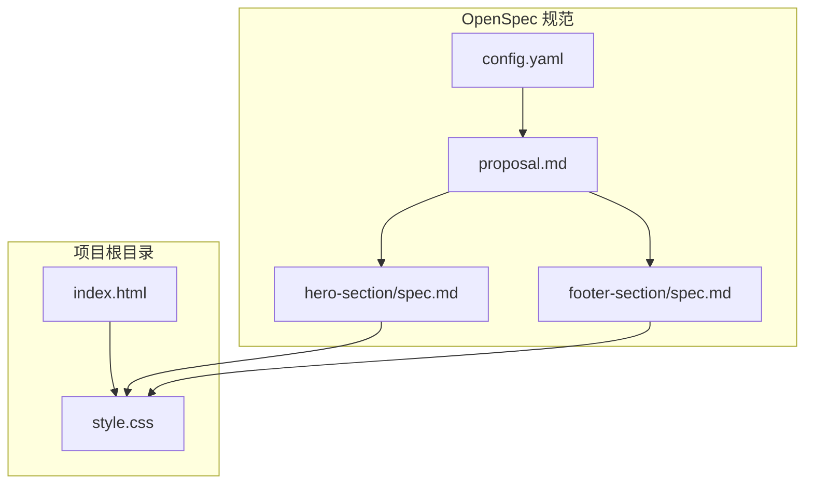
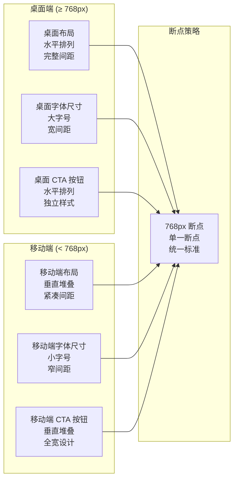
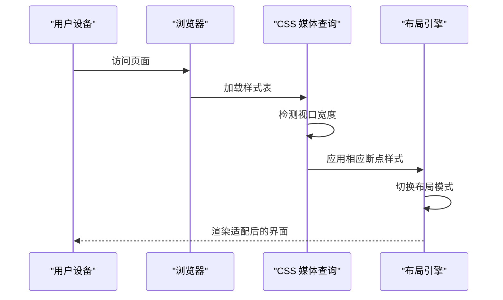
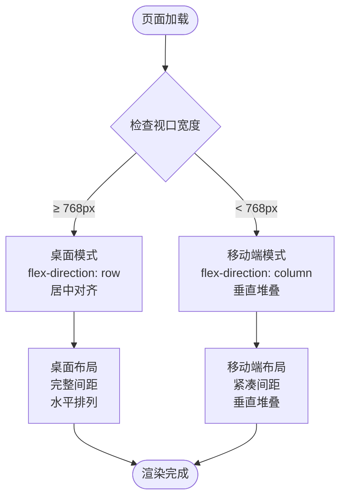
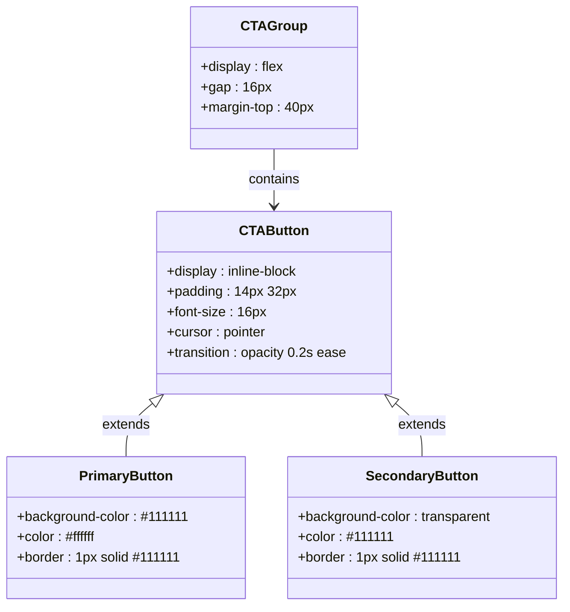
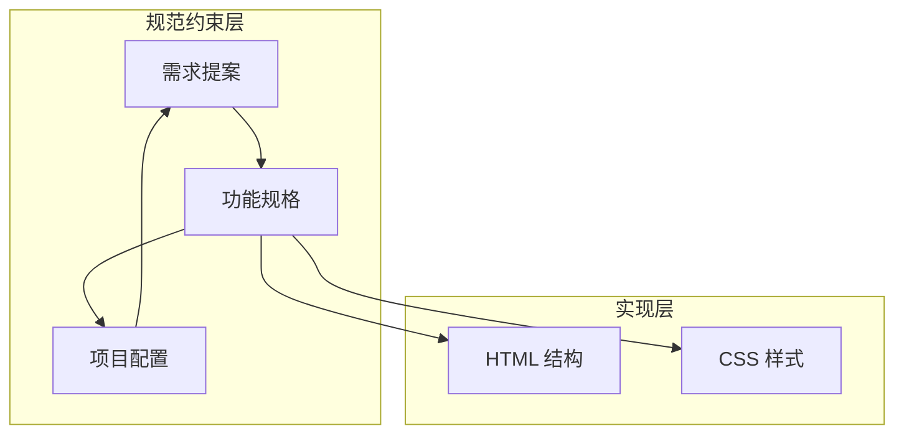
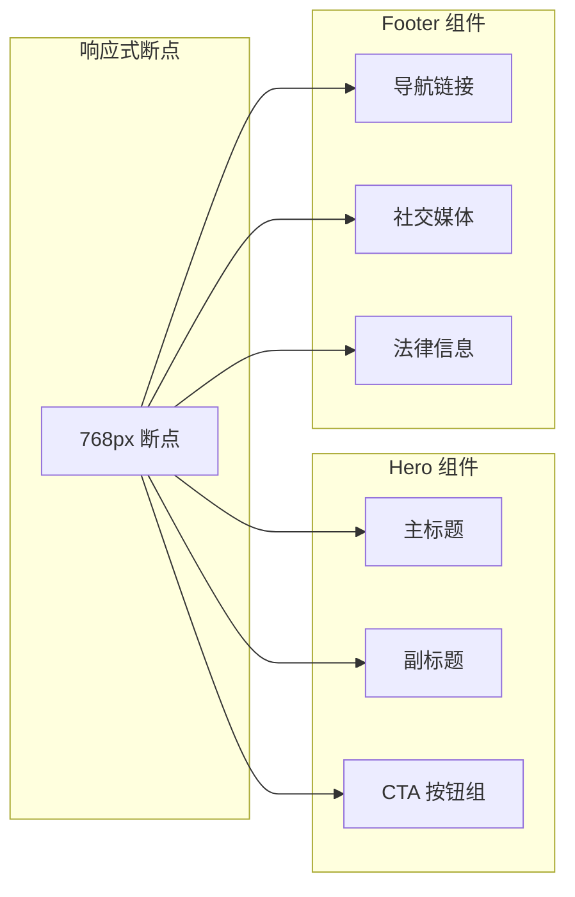

# 响应式设计实现

<cite>
**本文档引用的文件**
- [index.html](file://index.html)
- [style.css](file://style.css)
- [proposal.md](file://openspec/changes/archive/2026-05-12-homepage-hero-footer/proposal.md)
- [spec.md](file://openspec/changes/archive/2026-05-12-homepage-hero-footer/specs/hero-section/spec.md)
- [spec.md](file://openspec/changes/archive/2026-05-12-homepage-hero-footer/specs/footer-section/spec.md)
- [proposal.md](file://openspec/changes/add-banner-image/proposal.md)
- [config.yaml](file://openspec/config.yaml)
</cite>

## 目录
1. [简介](#简介)
2. [项目结构](#项目结构)
3. [核心组件](#核心组件)
4. [架构概览](#架构概览)
5. [详细组件分析](#详细组件分析)
6. [依赖关系分析](#依赖关系分析)
7. [性能考量](#性能考量)
8. [故障排除指南](#故障排除指南)
9. [结论](#结论)
10. [附录](#附录)

## 简介
本项目为 openSpec 手机官网首页，采用纯静态实现，包含 Hero 首屏区域与 Footer 底栏区域。响应式设计以 768px 为单一断点，针对移动设备进行专门优化，确保在不同屏幕尺寸下提供一致且优质的用户体验。项目遵循规范驱动开发模式，所有功能变更均通过提案与规格文档进行约束和验证。

## 项目结构
项目采用极简的三层结构：HTML 页面负责内容组织，CSS 样式负责视觉表现，OpenSpec 规范文档负责需求约束。这种分离使得响应式设计的实现更加清晰和可维护。

**图表来源**
- [index.html:1-44](file://index.html#L1-L44)
- [style.css:1-194](file://style.css#L1-L194)
- [proposal.md:1-26](file://openspec/changes/archive/2026-05-12-homepage-hero-footer/proposal.md#L1-L26)

**章节来源**
- [index.html:1-44](file://index.html#L1-L44)
- [style.css:1-194](file://style.css#L1-L194)
- [proposal.md:1-26](file://openspec/changes/archive/2026-05-12-homepage-hero-footer/proposal.md#L1-L26)

## 核心组件
项目包含两个主要组件：Hero 首屏区域和 Footer 底栏区域。每个组件都实现了完整的响应式适配，确保在桌面端和移动端提供最佳的视觉效果和交互体验。

### Hero 首屏区域
Hero 区域采用全屏居中布局，包含品牌主标题、副标题和双 CTA 按钮。该区域是用户接触品牌的第一触点，需要在 3 秒内传达产品定位与核心价值。

### Footer 底栏区域  
Footer 区域提供精简的一行式布局，包含链接导航、社交媒体入口和版权法律信息。该区域通过分隔符连接各个元素，确保信息层次清晰。

**章节来源**
- [index.html:11-40](file://index.html#L11-L40)
- [style.css:39-150](file://style.css#L39-L150)

## 架构概览
整个响应式设计采用"单一断点策略"，以 768px 为界，在此断点处进行布局和样式的重大调整。这种设计策略简化了开发复杂度，同时满足了大多数移动设备的适配需求。

**图表来源**
- [style.css:155-193](file://style.css#L155-L193)
- [spec.md:43-49](file://openspec/changes/archive/2026-05-12-homepage-hero-footer/specs/hero-section/spec.md#L43-L49)

## 详细组件分析

### 单一断点策略设计
项目采用 768px 作为唯一的响应式断点，这一决策基于以下考虑：
- 简化开发复杂度，避免多断点带来的维护成本
- 覆盖大部分移动设备屏幕尺寸范围
- 保持设计一致性，减少视觉跳跃感
- 降低性能开销，减少媒体查询数量

**图表来源**
- [style.css:155-193](file://style.css#L155-L193)

#### 断点条件判断逻辑
媒体查询使用 `max-width: 767px` 条件，当视口宽度小于 768px 时触发移动端样式。这种条件判断确保了在 768px 边界处的平滑过渡。

**章节来源**
- [style.css:155-193](file://style.css#L155-L193)
- [spec.md:46-49](file://openspec/changes/archive/2026-05-12-homepage-hero-footer/specs/hero-section/spec.md#L46-L49)

### 移动端适配实现

#### 字体大小调整
桌面端和移动端采用不同的字体层级体系：
- 桌面端主标题：64px
- 移动端主标题：40px  
- 桌面端副标题：20px
- 移动端副标题：16px

这种字体缩放确保了在小屏幕上仍具有良好的可读性和视觉层次。

#### 布局方向变化
Flexbox 布局在断点处发生根本性变化：
- 桌面端：水平排列，居中对齐
- 移动端：垂直堆叠，紧凑排列

**图表来源**
- [style.css:168-182](file://style.css#L168-L182)

#### 间距优化
移动端采用更紧凑的间距策略：
- Hero 区内边距：桌面端 48px 24px，移动端 32px 20px
- CTA 按钮间距：桌面端 16px，移动端 12px
- Footer 间距：桌面端 24px，移动端 8px

**章节来源**
- [style.css:156-182](file://style.css#L156-L182)

### 交互元素适配

#### CTA 按钮响应式设计
CTA 按钮在移动端采用全宽设计，确保触摸目标足够大：
- 桌面端：独立按钮，水平排列
- 移动端：垂直堆叠，100% 宽度

**图表来源**
- [style.css:69-99](file://style.css#L69-L99)

**章节来源**
- [style.css:69-99](file://style.css#L69-L99)

### Flexbox 在响应式设计中的应用

#### 弹性布局切换
项目广泛使用 Flexbox 实现响应式布局：
- Hero 区域：垂直居中，内容在主轴上居中
- Footer 区域：水平排列，wrap 支持
- CTA 组：灵活的间距控制

#### 对齐方式调整
不同断点下的对齐策略：
- 桌面端：水平居中，垂直居中
- 移动端：垂直堆叠，水平居中

**章节来源**
- [style.css:39-47](file://style.css#L39-L47)
- [style.css:108-115](file://style.css#L108-L115)

## 依赖关系分析

### 规范驱动的开发流程
项目采用 OpenSpec 规范驱动开发模式，所有功能变更都需要通过提案和规格文档进行约束：

**图表来源**
- [proposal.md:1-26](file://openspec/changes/archive/2026-05-12-homepage-hero-footer/proposal.md#L1-L26)
- [config.yaml:1-21](file://openspec/config.yaml#L1-L21)

### 组件间依赖关系
Hero 和 Footer 组件相互独立，但共享相同的响应式断点策略：

**图表来源**
- [style.css:155-193](file://style.css#L155-L193)
- [spec.md:10-12](file://openspec/changes/archive/2026-05-12-homepage-hero-footer/specs/footer-section/spec.md#L10-L12)

**章节来源**
- [proposal.md:12-25](file://openspec/changes/archive/2026-05-12-homepage-hero-footer/proposal.md#L12-L25)
- [config.yaml:1-21](file://openspec/config.yaml#L1-L21)

## 性能考量

### 媒体查询优化
项目仅使用单一媒体查询，这种设计具有以下优势：
- 减少 CSS 文件大小
- 降低浏览器解析复杂度
- 提高渲染性能
- 简化维护工作量

### 字体渲染优化
- 使用系统字体栈，确保快速加载
- 启用字体抗锯齿优化
- 合理的行高设置，提升可读性

### 布局性能
- Flexbox 布局计算简单高效
- 最小化的重排和重绘
- 合理的盒模型使用

## 故障排除指南

### 常见问题诊断

#### 断点不生效
**症状**：媒体查询样式未按预期应用
**排查步骤**：
1. 检查 viewport meta 标签是否正确设置
2. 验证媒体查询语法是否正确
3. 确认断点值与实际需求一致

#### 布局错乱
**症状**：移动端布局出现溢出或重叠
**排查步骤**：
1. 检查容器宽度设置
2. 验证 Flexbox 属性配置
3. 确认间距值在移动端的适用性

#### 字体显示异常
**症状**：移动端字体过小或过大
**排查步骤**：
1. 检查字体缩放比例
2. 验证媒体查询中的字体设置
3. 测试不同设备的显示效果

### 调试技巧

#### 设备模拟测试
- 使用浏览器开发者工具的设备模拟器
- 测试 320px、375px、414px、768px 等关键断点
- 检查触摸目标的可点击性

#### 真机测试建议
- 在真实设备上验证触摸交互
- 测试不同网络环境下的加载性能
- 验证不同操作系统下的字体渲染

**章节来源**
- [style.css:155-193](file://style.css#L155-L193)

## 结论
openSpec 项目的响应式设计通过单一断点策略实现了简洁而高效的移动端适配。该策略不仅简化了开发流程，还确保了在不同设备上的用户体验一致性。项目采用规范驱动的开发模式，所有功能变更都有据可依，保证了代码质量和可维护性。

通过合理的媒体查询使用、Flexbox 布局优化和性能考量，项目在保持极简设计风格的同时，提供了优秀的跨设备兼容性。这种设计思路值得在类似的静态页面项目中借鉴和推广。

## 附录

### 响应式测试清单
- [ ] 验证 768px 断点的平滑过渡
- [ ] 测试移动端触摸目标可达性
- [ ] 检查不同字体大小的可读性
- [ ] 验证 Flexbox 布局在各设备上的表现
- [ ] 确认媒体查询的正确应用

### 相关变更记录
项目后续可能的扩展包括：
- Hero 区域添加横幅图片支持
- 增加更多的交互元素
- 优化动画和过渡效果

**章节来源**
- [proposal.md:1-26](file://openspec/changes/add-banner-image/proposal.md#L1-L26)