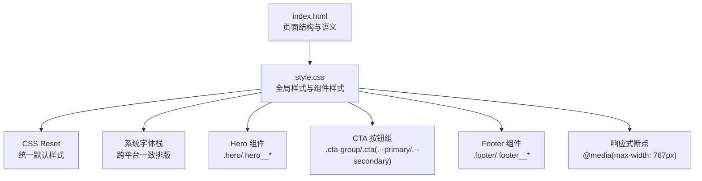
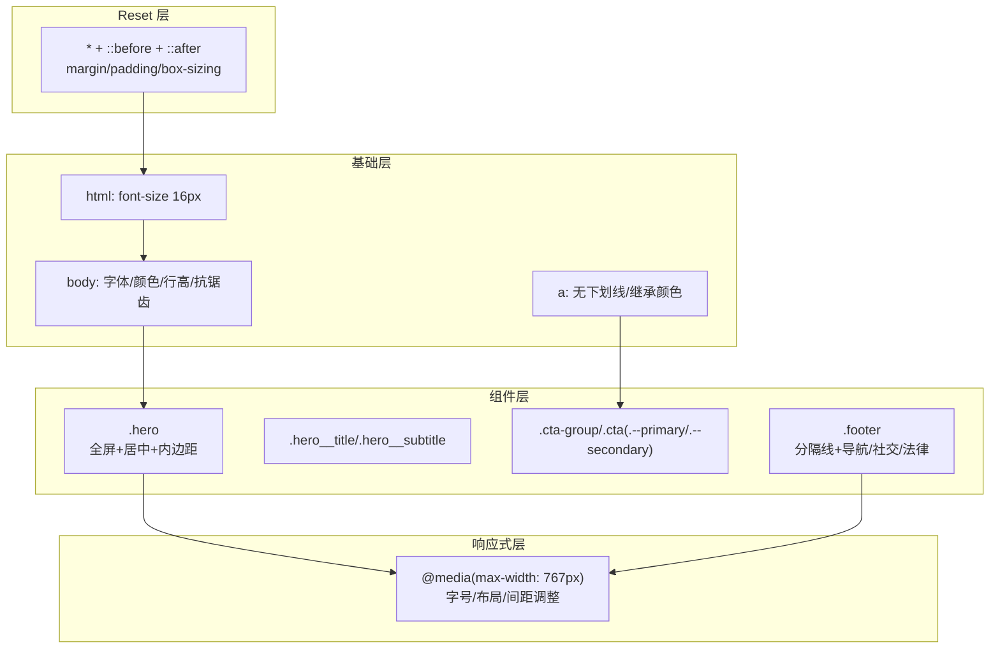
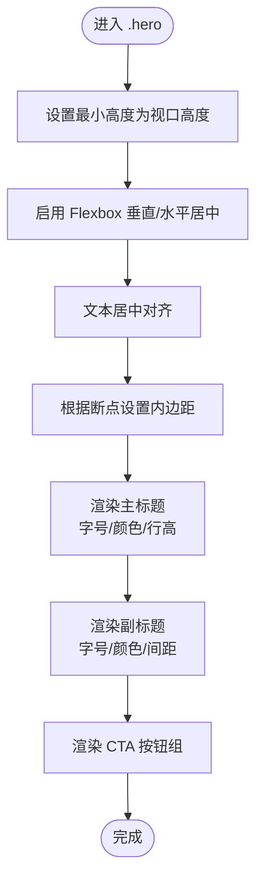
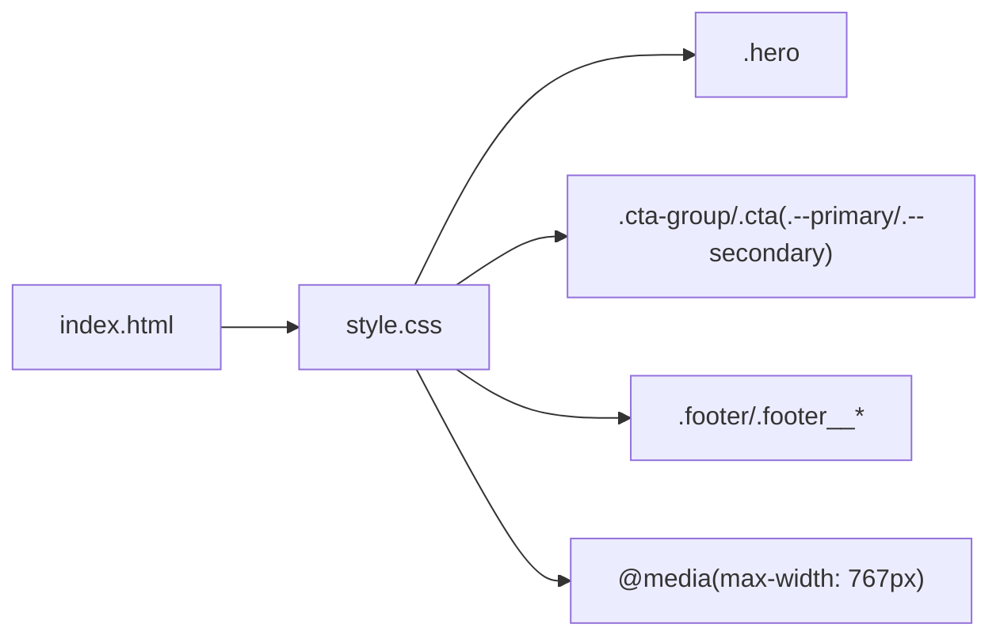

# 样式系统架构

<cite>
**本文引用的文件**
- [style.css](file://style.css)
- [index.html](file://index.html)
- [proposal.md](file://openspec/changes/homepage-hero-footer/proposal.md)
- [design.md](file://openspec/changes/homepage-hero-footer/design.md)
- [tasks.md](file://openspec/changes/homepage-hero-footer/tasks.md)
- [hero-spec.md](file://openspec/changes/homepage-hero-footer/specs/hero-section/spec.md)
- [footer-spec.md](file://openspec/changes/homepage-hero-footer/specs/footer-section/spec.md)
- [config.yaml](file://openspec/config.yaml)
</cite>

## 目录
1. [简介](#简介)
2. [项目结构](#项目结构)
3. [核心组件](#核心组件)
4. [架构总览](#架构总览)
5. [详细组件分析](#详细组件分析)
6. [依赖分析](#依赖分析)
7. [性能考虑](#性能考虑)
8. [故障排查指南](#故障排查指南)
9. [结论](#结论)
10. [附录](#附录)

## 简介
本文件面向 openSpec 项目的样式系统，系统性阐述 CSS 架构设计、CSS Reset 策略、BEM 命名规范应用、模块化样式组织、样式继承与层叠规则、Flexbox 布局实现、媒体查询与响应式策略、颜色系统与排版规范、动画与交互设计原则，并提供调试方法、维护策略与扩展指南。文档同时兼顾初学者与专业开发者的需求，既给出基础概念，也提供深入的设计模式与实现细节。

## 项目结构
openSpec 当前采用“HTML + CSS 分离”的极简单页架构：
- index.html：页面结构与语义标记，引入 style.css
- style.css：全局样式与组件样式，包含 CSS Reset、系统字体栈、组件样式与媒体查询

图表来源
- [index.html](file://index.html)
- [style.css](file://style.css)

章节来源
- [index.html](file://index.html)
- [style.css](file://style.css)
- [proposal.md](file://openspec/changes/homepage-hero-footer/proposal.md)
- [design.md](file://openspec/changes/homepage-hero-footer/design.md)

## 核心组件
- CSS Reset：统一所有元素的 margin、padding、box-sizing，消除浏览器默认差异
- 系统字体栈：使用系统字体，保证即时渲染与跨平台一致性
- Hero 区域：全屏居中、文字驱动、主标题/副标题、双 CTA 按钮
- Footer 区域：一行式布局、导航/社交/法律信息、分隔线
- 响应式策略：以 768px 为断点，移动端进行字号、布局与间距调整

章节来源
- [style.css](file://style.css)
- [hero-spec.md](file://openspec/changes/homepage-hero-footer/specs/hero-section/spec.md)
- [footer-spec.md](file://openspec/changes/homepage-hero-footer/specs/footer-section/spec.md)

## 架构总览
样式系统遵循“Reset + 基础层 + 组件层 + 响应式层”的分层架构：
- Reset 层：统一基础样式，确保跨浏览器一致性
- 基础层：系统字体栈、基础排版、链接样式
- 组件层：Hero、CTA、Footer 等业务组件，采用 BEM 命名
- 响应式层：媒体查询在组件层之上叠加，按断点微调

图表来源
- [style.css](file://style.css)

## 详细组件分析

### CSS Reset 策略
- 影响范围：所有元素及其伪元素
- 关键点：统一 margin/padding 为 0；border-box 确保盒模型一致
- 作用：消除浏览器默认样式差异，为后续组件样式提供稳定基线

章节来源
- [style.css](file://style.css)

### 系统字体栈与基础排版
- 字号基准：html 字号 16px，便于 rem/em 计算
- 字体族：系统字体栈，保证即时渲染与跨平台一致性
- 文本颜色：主体文字 #111111，辅助文字 #666666，背景 #ffffff
- 行高与抗锯齿：提升可读性与清晰度

章节来源
- [style.css](file://style.css)
- [design.md](file://openspec/changes/homepage-hero-footer/design.md)

### Hero 区域（.hero）
- 布局：min-height 100vh + Flexbox 垂直水平居中 + 文本居中
- 内边距：桌面端较大，移动端收紧
- 主标题：字号随断点变化，强调技术理性风格
- 副标题：字号约为主标题的 1/3，颜色与间距明确
- CTA 按钮组：水平排列，移动端堆叠，宽度 100%

图表来源
- [style.css](file://style.css)
- [hero-spec.md](file://openspec/changes/homepage-hero-footer/specs/hero-section/spec.md)

章节来源
- [style.css](file://style.css)
- [hero-spec.md](file://openspec/changes/homepage-hero-footer/specs/hero-section/spec.md)

### CTA 按钮（.cta-group/.cta/.cta--primary/.cta--secondary）
- 基础按钮：内边距、字号、对齐、指针、过渡
- 主按钮：黑色填充 + 白字 + 黑色边框
- 次按钮：透明底 + 黑色边框 + 黑字
- 交互：hover 降低透明度，提升反馈
- 移动端：按钮堆叠、宽度 100%、间距收紧

章节来源
- [style.css](file://style.css)
- [hero-spec.md](file://openspec/changes/homepage-hero-footer/specs/hero-section/spec.md)

### Footer 区域（.footer/.footer__nav/.footer__social/.footer__legal/.footer__dot）
- 布局：顶部分隔线 + 居中排列 + wrap 自适应
- 导航/社交/法律：三组内容，移动端垂直堆叠
- 交互：链接 hover 改色，无下划线
- 分隔符：使用占位符“·”，移动端隐藏多余分隔符

章节来源
- [style.css](file://style.css)
- [footer-spec.md](file://openspec/changes/homepage-hero-footer/specs/footer-section/spec.md)

### 媒体查询与响应式策略
- 断点：768px（max-width: 767px）
- 调整项：
  - Hero：内边距收紧、主标题/副标题字号下调、按钮组堆叠
  - Footer：整体垂直堆叠、居中对齐、分隔符精简
- 设计理念：单一断点覆盖极简页面需求，避免过度细分

章节来源
- [style.css](file://style.css)
- [design.md](file://openspec/changes/homepage-hero-footer/design.md)

### BEM 命名规范应用
- 块（Block）：.hero、.cta-group、.footer
- 元素（Element）：.hero__title、.hero__subtitle、.footer__nav、.footer__social、.footer__legal、.footer__dot
- 修饰（Modifier）：.cta--primary、.cta--secondary
- 原则：语义清晰、层级扁平、可组合性强，便于维护与扩展

章节来源
- [style.css](file://style.css)
- [proposal.md](file://openspec/changes/homepage-hero-footer/proposal.md)

### 样式继承与层叠规则
- 继承：链接继承颜色，减少重复声明
- 层叠：基础层（Reset/基础排版） < 组件层（Hero/Footer/CTA） < 响应式层（媒体查询）
- 优先级：组件样式覆盖基础层；媒体查询在组件之上按断点叠加

章节来源
- [style.css](file://style.css)

### 动画与交互设计原则
- 过渡：按钮 hover 透明度过渡，时长短促，反馈即时
- 交互：链接 hover 改色，保持无下划线的极简风格
- 动画边界：当前版本无复杂动画，保持页面轻量与快速渲染

章节来源
- [style.css](file://style.css)
- [design.md](file://openspec/changes/homepage-hero-footer/design.md)

## 依赖分析
- HTML 依赖 CSS：通过 link 引入 style.css
- 组件依赖：.hero 与 .cta-group/.cta 为 Hero 场景的核心依赖；.footer 依赖其子元素组
- 响应式依赖：媒体查询对组件样式进行条件覆盖

图表来源
- [index.html](file://index.html)
- [style.css](file://style.css)

章节来源
- [index.html](file://index.html)
- [style.css](file://style.css)

## 性能考虑
- 零 JS 依赖：纯 HTML/CSS，减少运行时开销
- 系统字体：零网络请求，即时渲染，降低阻塞
- 样式体积：极简结构，样式文件体量小，加载快
- 媒体查询：单一断点，减少匹配复杂度
- 建议优化：
  - 合理拆分：若组件增多，可按功能拆分样式文件并在构建阶段合并
  - 选择器优化：避免深层嵌套，保持扁平 BEM 结构
  - 资源缓存：生产环境配置合适的缓存头

章节来源
- [design.md](file://openspec/changes/homepage-hero-footer/design.md)
- [tasks.md](file://openspec/changes/homepage-hero-footer/tasks.md)

## 故障排查指南
- 页面空白或排版错乱
  - 检查是否正确引入 style.css
  - 确认 meta viewport 是否存在
- 字体渲染异常
  - 确认系统字体栈生效，检查字体回退链
- 响应式失效
  - 检查媒体查询断点与设备宽度
  - 确认容器尺寸与 Flexbox 属性
- 交互无反馈
  - 检查 hover 选择器与 transition 属性
- 链接样式异常
  - 确认 a 标签继承颜色且无下划线

章节来源
- [index.html](file://index.html)
- [style.css](file://style.css)
- [tasks.md](file://openspec/changes/homepage-hero-footer/tasks.md)

## 结论
openSpec 的样式系统以“极简、克制、一致”为核心设计原则：通过 CSS Reset 统一基线，系统字体栈保障跨平台体验，BEM 命名与模块化组织提升可维护性，单一断点响应式策略满足当前页面需求。该架构为后续扩展提供了清晰的演进路径：可在不破坏现有结构的前提下逐步引入更复杂的组件与交互。

## 附录

### 开发与维护最佳实践
- 保持 BEM 命名一致性，避免跨组件命名冲突
- 将媒体查询集中在组件末尾，便于维护与覆盖
- 使用语义化 HTML 标签，减少不必要的样式耦合
- 定期进行跨浏览器与跨设备验证，确保一致性

章节来源
- [proposal.md](file://openspec/changes/homepage-hero-footer/proposal.md)
- [design.md](file://openspec/changes/homepage-hero-footer/design.md)
- [tasks.md](file://openspec/changes/homepage-hero-footer/tasks.md)

### 扩展指南（建议）
- 组件拆分：按功能拆分样式文件，构建阶段合并
- 主题系统：引入 CSS 变量，支持浅/深色主题切换
- 动画增强：在不影响性能的前提下，适度加入过渡与微交互
- 规范沉淀：结合 config.yaml 与 spec.md，形成可复用的设计规范

章节来源
- [config.yaml](file://openspec/config.yaml)
- [design.md](file://openspec/changes/homepage-hero-footer/design.md)
- [hero-spec.md](file://openspec/changes/homepage-hero-footer/specs/hero-section/spec.md)
- [footer-spec.md](file://openspec/changes/homepage-hero-footer/specs/footer-section/spec.md)