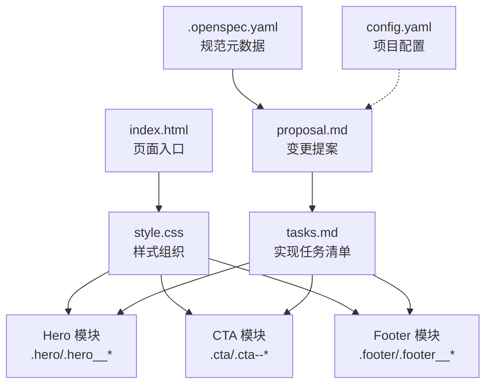
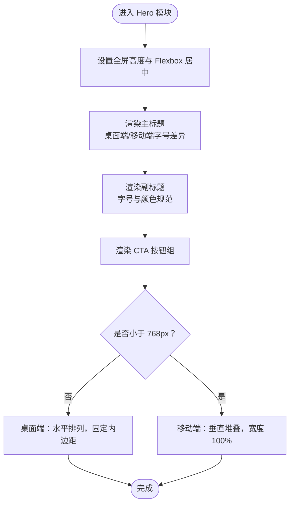
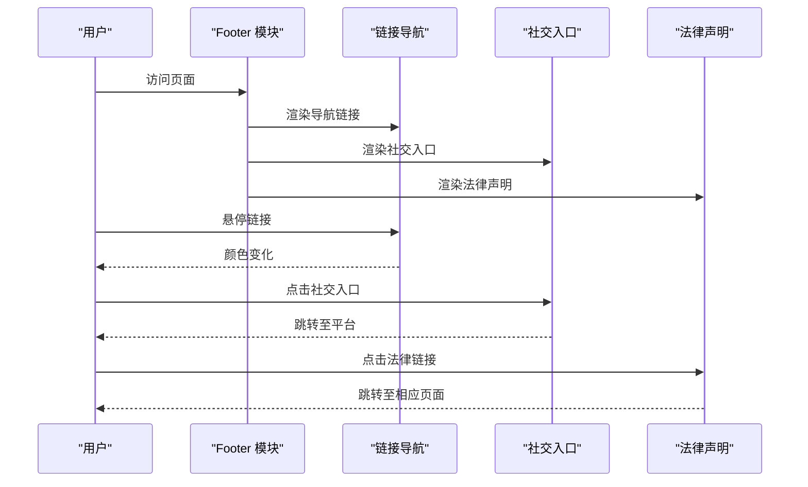
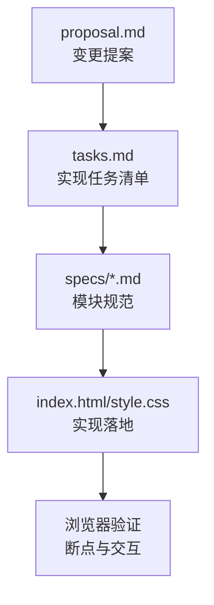
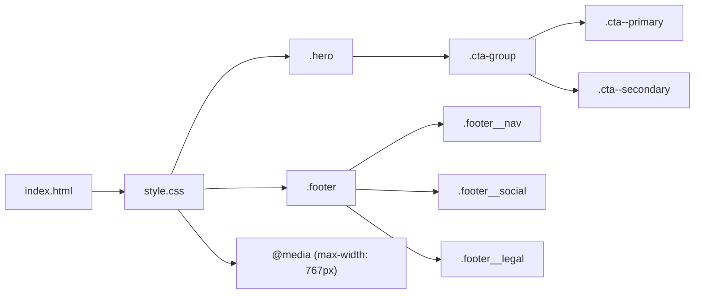

# 模块化样式组织

<cite>
**本文档引用的文件**
- [index.html](file://index.html)
- [style.css](file://style.css)
- [.openspec.yaml](file://openspec/changes/archive/2026-05-12-homepage-hero-footer/.openspec.yaml)
- [proposal.md](file://openspec/changes/archive/2026-05-12-homepage-hero-footer/proposal.md)
- [tasks.md](file://openspec/changes/archive/2026-05-12-homepage-hero-footer/tasks.md)
- [hero-section/spec.md](file://openspec/changes/archive/2026-05-12-homepage-hero-footer/specs/hero-section/spec.md)
- [footer-section/spec.md](file://openspec/changes/archive/2026-05-12-homepage-hero-footer/specs/footer-section/spec.md)
- [config.yaml](file://openspec/config.yaml)
- [add-banner-image/proposal.md](file://openspec/changes/add-banner-image/proposal.md)
</cite>

## 目录
1. [引言](#引言)
2. [项目结构](#项目结构)
3. [核心组件](#核心组件)
4. [架构总览](#架构总览)
5. [详细组件分析](#详细组件分析)
6. [依赖分析](#依赖分析)
7. [性能考量](#性能考量)
8. [故障排除指南](#故障排除指南)
9. [结论](#结论)
10. [附录](#附录)

## 引言
本文件面向 openSpec 项目的模块化样式组织，围绕 Hero 区域、CTA 按钮与 Footer 等独立模块进行系统性梳理。文档重点阐述：
- 样式文件的模块划分策略与注释分隔的组织方式
- 模块间的依赖关系与边界定义
- 模块化带来的代码复用、维护便利与性能优化
- 跨模块样式共享的处理方式与扩展性考虑
- 大型项目组织策略与具体模块重构案例及最佳实践

## 项目结构
openSpec 当前采用“规范驱动”的变更管理方式，将页面需求、规范与实现任务以 YAML/Markdown 文档形式归档，配合单一 HTML 与 CSS 文件落地。结构要点如下：
- 页面入口与样式：index.html 引入 style.css
- 样式组织：style.css 使用注释分隔块组织 Hero、CTA、Footer 等模块
- 规范与任务：openspec/changes 下按时间归档的 proposal、tasks、specs 等文档
- 项目配置：openspec/config.yaml 提供规范驱动的上下文与规则



图表来源
- [index.html:1-44](file://index.html#L1-L44)
- [style.css:1-194](file://style.css#L1-L194)
- [.openspec.yaml:1-3](file://openspec/changes/archive/2026-05-12-homepage-hero-footer/.openspec.yaml#L1-L3)
- [proposal.md:1-26](file://openspec/changes/archive/2026-05-12-homepage-hero-footer/proposal.md#L1-L26)
- [tasks.md:1-35](file://openspec/changes/archive/2026-05-12-homepage-hero-footer/tasks.md#L1-L35)
- [config.yaml:1-21](file://openspec/config.yaml#L1-L21)

章节来源
- [index.html:1-44](file://index.html#L1-L44)
- [style.css:1-194](file://style.css#L1-L194)
- [.openspec.yaml:1-3](file://openspec/changes/archive/2026-05-12-homepage-hero-footer/.openspec.yaml#L1-L3)
- [proposal.md:1-26](file://openspec/changes/archive/2026-05-12-homepage-hero-footer/proposal.md#L1-L26)
- [tasks.md:1-35](file://openspec/changes/archive/2026-05-12-homepage-hero-footer/tasks.md#L1-L35)
- [config.yaml:1-21](file://openspec/config.yaml#L1-L21)

## 核心组件
- Hero 区域模块：负责首屏全屏居中布局、主副标题排版、CTA 按钮组的水平/垂直排列与响应式适配。
- CTA 按钮模块：提供主次两种按钮变体，统一的交互状态与过渡效果，移动端堆叠布局。
- Footer 模块：顶部分隔线、导航链接、社交入口与法律声明的组合布局，移动端垂直堆叠。

模块化优势体现在：
- 代码复用：通过 BEM 风格类名与统一断点（768px）减少重复样式
- 维护便利：注释分隔块使职责清晰，便于定位与修改
- 性能优化：单一 CSS 文件减少网络往返；媒体查询集中于一处，避免重复计算

章节来源
- [style.css:35-63](file://style.css#L35-L63)
- [style.css:65-100](file://style.css#L65-L100)
- [style.css:101-149](file://style.css#L101-L149)
- [hero-section/spec.md:1-49](file://openspec/changes/archive/2026-05-12-homepage-hero-footer/specs/hero-section/spec.md#L1-L49)
- [footer-section/spec.md:1-49](file://openspec/changes/archive/2026-05-12-homepage-hero-footer/specs/footer-section/spec.md#L1-L49)

## 架构总览
模块化样式架构以“注释分隔块”为组织单元，每个模块对应一套选择器与响应式规则。HTML 结构通过语义化标签承载模块容器，CSS 通过 BEM 命名约定明确模块边界与子元素关系。

```mermaid
graph TB
subgraph "页面结构"
H["<section class=\"hero\">"] --> T["<h1 class=\"hero__title\">"]
H --> S["<p class=\"hero__subtitle\">"]
H --> CG["<div class=\"cta-group\">"]
CG --> CP["<a class=\"cta cta--primary\">"]
CG --> CS["<a class=\"cta cta--secondary\">"]
F["<footer class=\"footer\">"] --> FN["<nav class=\"footer__nav\">"]
F --> FS["<div class=\"footer__social\">"]
F --> FL["<div class=\"footer__legal\">"]
end
subgraph "样式模块"
HS[".hero"] --> HT[".hero__title"]
HS --> HSb[".hero__subtitle"]
HS --> HCG[".cta-group"]
HCG --> HCP[".cta--primary"]
HCG --> HCS[".cta--secondary"]
FSel[".footer"] --> FNav[".footer__nav"]
FSel --> FSo[".footer__social"]
FSel --> FLg[".footer__legal"]
end
H --> HS
CG --> HCG
CP --> HCP
CS --> HCS
F --> FSel
```

图表来源
- [index.html:11-40](file://index.html#L11-L40)
- [style.css:39-149](file://style.css#L39-L149)

章节来源
- [index.html:11-40](file://index.html#L11-L40)
- [style.css:39-149](file://style.css#L39-L149)

## 详细组件分析

### Hero 区域模块
- 设计目标：全屏首屏、文字驱动、理性技术调性，强调品牌定位与核心价值传递。
- 关键特性：
  - 全屏高度与居中布局：通过最小高度与 Flexbox 实现垂直水平居中
  - 主副标题：桌面端与移动端字号差异，颜色与行高统一
  - CTA 按钮组：水平排列，移动端堆叠，宽度自适应
- 响应式策略：以 768px 为断点，统一收缩内边距、调整字号与布局方向



图表来源
- [style.css:39-63](file://style.css#L39-L63)
- [style.css:69-87](file://style.css#L69-L87)
- [style.css:155-176](file://style.css#L155-L176)
- [hero-section/spec.md:36-49](file://openspec/changes/archive/2026-05-12-homepage-hero-footer/specs/hero-section/spec.md#L36-L49)

章节来源
- [style.css:39-63](file://style.css#L39-L63)
- [style.css:69-87](file://style.css#L69-L87)
- [style.css:155-176](file://style.css#L155-L176)
- [hero-section/spec.md:1-49](file://openspec/changes/archive/2026-05-12-homepage-hero-footer/specs/hero-section/spec.md#L1-L49)

### CTA 按钮模块
- 设计目标：提供主次两种行动号召按钮，统一交互反馈与过渡效果。
- 关键特性：
  - 统一尺寸与内边距：提升视觉一致性
  - 主次变体：主按钮实心填充，次按钮边框样式
  - 交互状态：悬停透明度变化，增强反馈
- 响应式策略：移动端按钮堆叠，宽度 100%，间距收紧

```mermaid
classDiagram
class CTAButton {
"+cta"
"+cta--primary"
"+cta--secondary"
"统一内边距与字号"
"悬停透明度过渡"
}
class CTAGroup {
"+cta-group"
"Flex 容器"
"gap 控制间距"
}
CTAGroup --> CTAButton : "包含"
```

图表来源
- [style.css:69-100](file://style.css#L69-L100)
- [style.css:168-176](file://style.css#L168-L176)

章节来源
- [style.css:69-100](file://style.css#L69-L100)
- [style.css:168-176](file://style.css#L168-L176)

### Footer 模块
- 设计目标：简洁的一行式底栏，包含导航、社交与法律信息，顶部分隔线明确区域边界。
- 关键特性：
  - 顶部分隔线：与内容保持 24px 内边距
  - 导航、社交、法律三段式布局：桌面端水平居中，移动端垂直堆叠
  - 交互状态：链接 hover 颜色变化，无下划线
- 响应式策略：移动端隐藏分隔符，统一居中与间距



图表来源
- [style.css:105-149](file://style.css#L105-L149)
- [index.html:20-40](file://index.html#L20-L40)
- [footer-section/spec.md:1-49](file://openspec/changes/archive/2026-05-12-homepage-hero-footer/specs/footer-section/spec.md#L1-L49)

章节来源
- [style.css:105-149](file://style.css#L105-L149)
- [index.html:20-40](file://index.html#L20-L40)
- [footer-section/spec.md:1-49](file://openspec/changes/archive/2026-05-12-homepage-hero-footer/specs/footer-section/spec.md#L1-L49)

### 规范驱动的模块化流程
openSpec 通过 proposal、tasks、specs 等文档形成“需求—实现—验证”的闭环，确保模块边界与行为一致。



图表来源
- [proposal.md:1-26](file://openspec/changes/archive/2026-05-12-homepage-hero-footer/proposal.md#L1-L26)
- [tasks.md:1-35](file://openspec/changes/archive/2026-05-12-homepage-hero-footer/tasks.md#L1-L35)
- [hero-section/spec.md:1-49](file://openspec/changes/archive/2026-05-12-homepage-hero-footer/specs/hero-section/spec.md#L1-L49)
- [footer-section/spec.md:1-49](file://openspec/changes/archive/2026-05-12-homepage-hero-footer/specs/footer-section/spec.md#L1-L49)

章节来源
- [proposal.md:1-26](file://openspec/changes/archive/2026-05-12-homepage-hero-footer/proposal.md#L1-L26)
- [tasks.md:1-35](file://openspec/changes/archive/2026-05-12-homepage-hero-footer/tasks.md#L1-L35)
- [hero-section/spec.md:1-49](file://openspec/changes/archive/2026-05-12-homepage-hero-footer/specs/hero-section/spec.md#L1-L49)
- [footer-section/spec.md:1-49](file://openspec/changes/archive/2026-05-12-homepage-hero-footer/specs/footer-section/spec.md#L1-L49)

## 依赖分析
- HTML 对 CSS 的依赖：index.html 通过 link 引入 style.css
- 模块间依赖：
  - Hero 与 CTA：Hero 内部包含 CTA 按钮组，存在父子级依赖
  - Footer 子模块：导航、社交、法律三者并列，相互独立
- 响应式依赖：媒体查询集中于 style.css，依赖统一断点（768px）



图表来源
- [index.html](file://index.html#L7)
- [style.css:39-149](file://style.css#L39-L149)
- [style.css:155-193](file://style.css#L155-L193)

章节来源
- [index.html:7](file://index.html#L7)
- [style.css:39-149](file://style.css#L39-L149)
- [style.css:155-193](file://style.css#L155-L193)

## 性能考量
- 资源加载：单一 CSS 文件减少网络往返，利于首屏渲染
- 选择器复杂度：BEM 命名降低选择器层级，提升匹配效率
- 媒体查询：集中于一处，避免重复计算与冗余规则
- 无 JS 依赖：纯静态页面，无需运行时解析，提升可访问性与稳定性

## 故障排除指南
- 样式未生效
  - 检查 index.html 是否正确引入 style.css
  - 确认注释分隔块内选择器命名与 HTML 类名一致
- 响应式异常
  - 核对媒体查询断点是否为 768px
  - 检查移动端堆叠逻辑（按钮宽度、方向、间距）
- 交互状态无效
  - 确认 hover 状态选择器存在且优先级合理
  - 排查是否存在更高等级选择器覆盖

章节来源
- [index.html:7](file://index.html#L7)
- [style.css:155-193](file://style.css#L155-L193)
- [style.css:85-87](file://style.css#L85-L87)
- [style.css:129-133](file://style.css#L129-L133)

## 结论
openSpec 的模块化样式组织以“注释分隔块 + BEM 命名 + 统一断点”为核心，实现了清晰的模块边界、良好的可维护性与稳定的性能表现。通过规范驱动的变更管理，模块需求、实现与验证形成闭环，为大型项目的样式组织提供了可复制的模式。

## 附录

### 模块边界定义标准
- 语义化容器：每个模块以独立容器（如 .hero、.footer）承载
- 命名约定：使用 BEM 风格，模块名作为基类，子元素以模块名加下划线分隔
- 作用域隔离：模块内部样式尽量不外溢，避免跨模块耦合
- 响应式集中：模块内的媒体查询集中于模块末尾，便于维护

### 跨模块样式共享
- 共享变量：通过 CSS 自定义属性或预处理器变量（如颜色、字号、间距）集中管理
- 通用工具类：如文本对齐、间距、颜色等，可在模块间复用
- 组件化思维：将通用交互（如 hover、focus）抽象为可复用的样式片段

### 扩展性考虑与重构案例
- 扩展性：模块化便于新增能力（如 banner-image），通过在现有模块中插入新元素并补充样式即可
- 重构案例：从纯文字 Hero 迁移至图文结合（添加 banner 图），遵循以下步骤：
  - 在 HTML 中插入图片元素，置于副标题与 CTA 之间
  - 在 CSS 中新增图片样式与响应式适配
  - 更新任务清单与规范文档，确保变更可追溯
- 最佳实践：
  - 保持注释分隔块的完整性，便于定位与回滚
  - 统一断点与命名约定，减少维护成本
  - 将媒体查询集中管理，避免分散导致的冲突

章节来源
- [add-banner-image/proposal.md:1-26](file://openspec/changes/add-banner-image/proposal.md#L1-L26)
- [tasks.md:1-35](file://openspec/changes/archive/2026-05-12-homepage-hero-footer/tasks.md#L1-L35)
- [proposal.md:1-26](file://openspec/changes/archive/2026-05-12-homepage-hero-footer/proposal.md#L1-L26)