# 系统字体栈

<cite>
**本文档引用的文件**
- [style.css](file://style.css)
- [index.html](file://index.html)
- [proposal.md](file://openspec/changes/archive/2026-05-12-homepage-hero-footer/proposal.md)
- [hero-section/spec.md](file://openspec/changes/archive/2026-05-12-homepage-hero-footer/specs/hero-section/spec.md)
- [footer-section/spec.md](file://openspec/changes/archive/2026-05-12-homepage-hero-footer/specs/footer-section/spec.md)
- [config.yaml](file://openspec/config.yaml)
</cite>

## 目录
1. [简介](#简介)
2. [项目结构](#项目结构)
3. [核心组件](#核心组件)
4. [架构概览](#架构概览)
5. [详细组件分析](#详细组件分析)
6. [字体栈配置分析](#字体栈配置分析)
7. [字体平滑处理](#字体平滑处理)
8. [字体大小基准](#字体大小基准)
9. [跨平台适配策略](#跨平台适配策略)
10. [性能优化考虑](#性能优化考虑)
11. [可访问性考量](#可访问性考量)
12. [故障排除指南](#故障排除指南)
13. [结论](#结论)

## 简介

openSpec 项目采用系统字体栈（System Font Stack）策略，通过精心设计的字体降级机制确保在各种操作系统和设备上都能获得最佳的文本渲染效果。本项目的核心目标是为手机产品官网创建一个极简、理性的首屏体验，通过系统字体栈实现一致且高质量的文字显示效果。

系统字体栈是一种现代 Web 开发的最佳实践，它利用操作系统原生字体来提供更快的加载速度、更好的视觉质量和更佳的用户体验。该项目实现了完整的系统字体栈配置，包括字体选择策略、降级机制、平滑处理和响应式适配。

## 项目结构

openSpec 项目采用极简的静态网站架构，主要由以下核心文件组成：

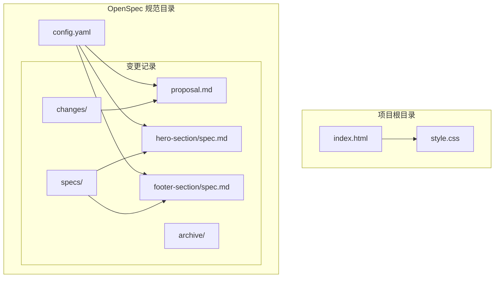

**图表来源**
- [index.html:1-44](file://index.html#L1-L44)
- [style.css:1-194](file://style.css#L1-L194)
- [config.yaml:1-21](file://config.yaml#L1-L21)

**章节来源**
- [index.html:1-44](file://index.html#L1-L44)
- [style.css:1-194](file://style.css#L1-L194)
- [config.yaml:1-21](file://config.yaml#L1-L21)

## 核心组件

### 字体栈实现

项目的核心字体栈配置位于 CSS 文件的系统字体区域，采用了经过精心设计的字体序列：

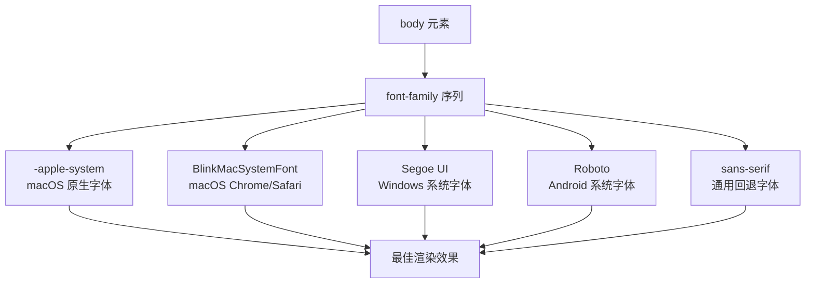

**图表来源**
- [style.css:21-28](file://style.css#L21-L28)

### 响应式字体体系

项目建立了完整的响应式字体体系，通过 16px 基准字体大小实现灵活的字体缩放：

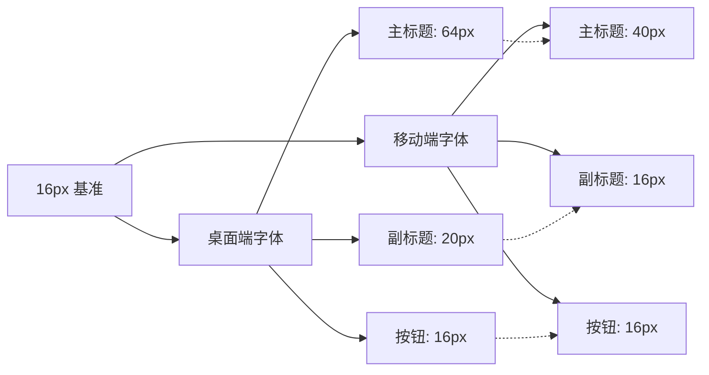

**图表来源**
- [style.css:49-63](file://style.css#L49-L63)
- [style.css:160-166](file://style.css#L160-L166)

**章节来源**
- [style.css:17-28](file://style.css#L17-L28)
- [style.css:49-63](file://style.css#L49-L63)
- [style.css:160-166](file://style.css#L160-L166)

## 架构概览

系统字体栈的整体架构体现了现代 Web 开发的最佳实践，通过层次化的字体选择和降级机制确保在各种环境下的兼容性和一致性。

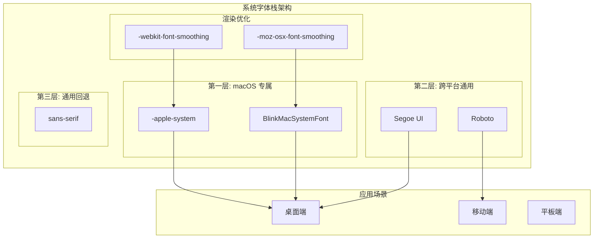

**图表来源**
- [style.css:17-28](file://style.css#L17-L28)

## 详细组件分析

### 字体栈配置组件

系统字体栈的配置体现了对多平台兼容性的深度考虑，每个字体都有其特定的作用和适用场景：

#### 字体选择策略

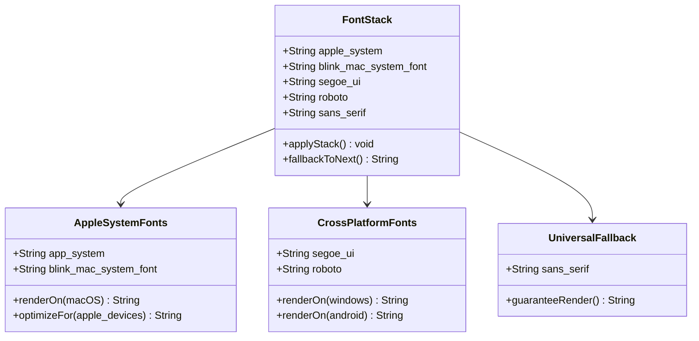

**图表来源**
- [style.css:21-28](file://style.css#L21-L28)

#### 字体降级机制

字体降级机制确保了在任何情况下都能获得可读的文本显示效果：

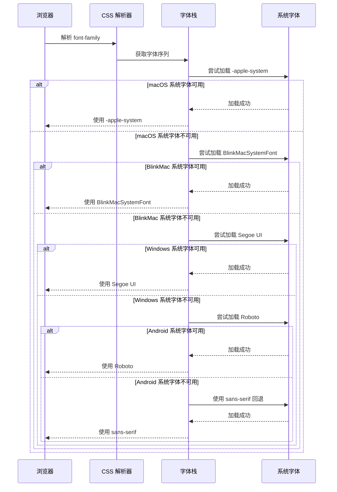

**图表来源**
- [style.css:21-28](file://style.css#L21-L28)

**章节来源**
- [style.css:21-28](file://style.css#L21-L28)

### 字体平滑处理组件

字体平滑处理是提升文本可读性和视觉质量的关键技术，项目实现了针对不同操作系统的专门优化：

#### 字体平滑技术

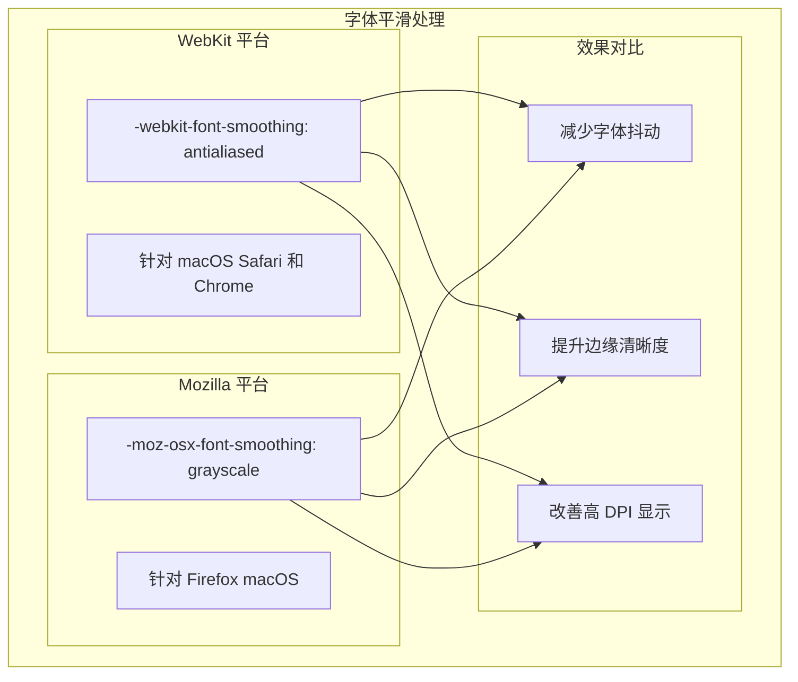

**图表来源**
- [style.css:26-27](file://style.css#L26-L27)

**章节来源**
- [style.css:26-27](file://style.css#L26-L27)

### 响应式字体组件

响应式字体系统根据屏幕尺寸自动调整字体大小，确保在不同设备上都具有最佳的阅读体验：

#### 响应式字体逻辑

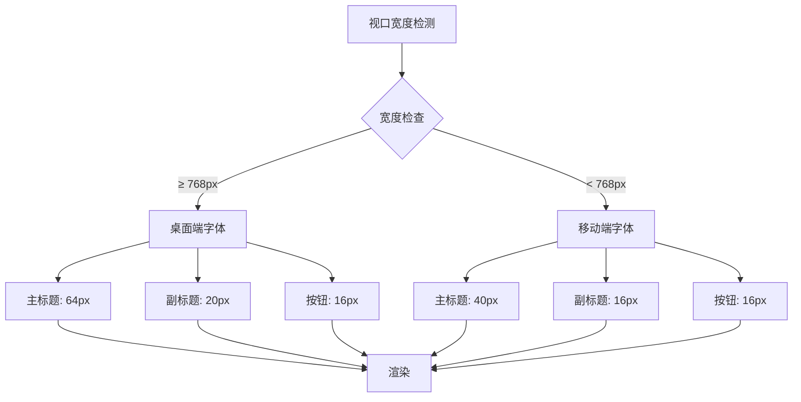

**图表来源**
- [style.css:155-193](file://style.css#L155-L193)

**章节来源**
- [style.css:155-193](file://style.css#L155-L193)

## 字体栈配置分析

### 字体序列设计原理

系统字体栈的设计遵循了严格的优先级原则，确保在不同平台环境下都能获得最佳的字体渲染效果：

#### 字体序列优先级

| 字体名称 | 适用平台 | 设计目的 | 降级顺序 |
|---------|---------|---------|---------|
| -apple-system | macOS、iOS | 提供原生苹果字体体验 | 第1优先级 |
| BlinkMacSystemFont | macOS Chrome/Safari | 跨浏览器兼容性 | 第2优先级 |
| Segoe UI | Windows | 微软系统字体支持 | 第3优先级 |
| Roboto | Android | Google Material Design 字体 | 第4优先级 |
| sans-serif | 通用回退 | 确保基本可读性 | 最终回退 |

#### 平台适配策略

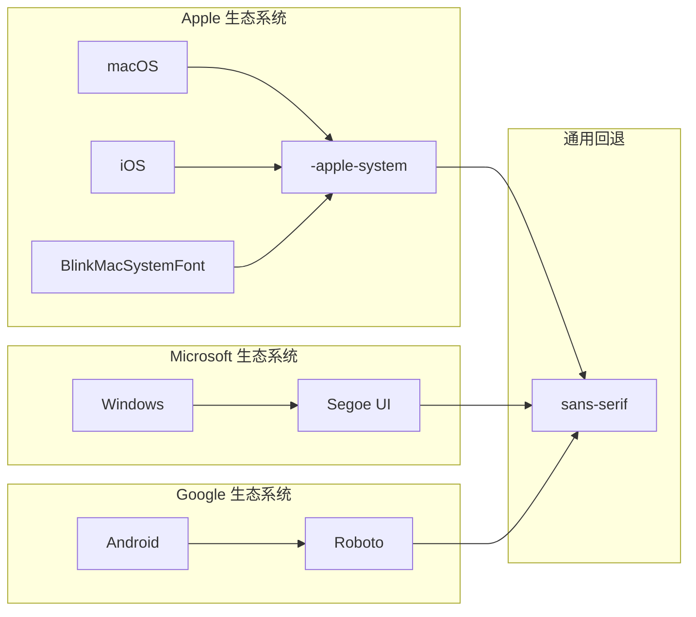

**图表来源**
- [style.css:21-28](file://style.css#L21-L28)

**章节来源**
- [style.css:21-28](file://style.css#L21-L28)

### 字体加载性能分析

系统字体栈在性能方面具有显著优势，避免了网络字体加载的时间开销：

#### 性能对比分析

| 方面 | 系统字体栈 | 自定义字体 |
|------|-----------|-----------|
| 加载时间 | 即时可用 | 需要网络请求 |
| 带宽消耗 | 0 KB | 通常几十 KB |
| 可靠性 | 高 | 取决于 CDN 稳定性 |
| 缓存策略 | 系统缓存 | 需要应用缓存 |
| 渲染速度 | 快速 | 可能出现 FOIT/FOUT |
| 跨平台一致性 | 优秀 | 可能存在差异 |

## 字体平滑处理

### 抗锯齿技术原理

字体平滑处理通过 CSS 属性实现，针对不同操作系统的渲染引擎进行专门优化：

#### 抗锯齿技术详解

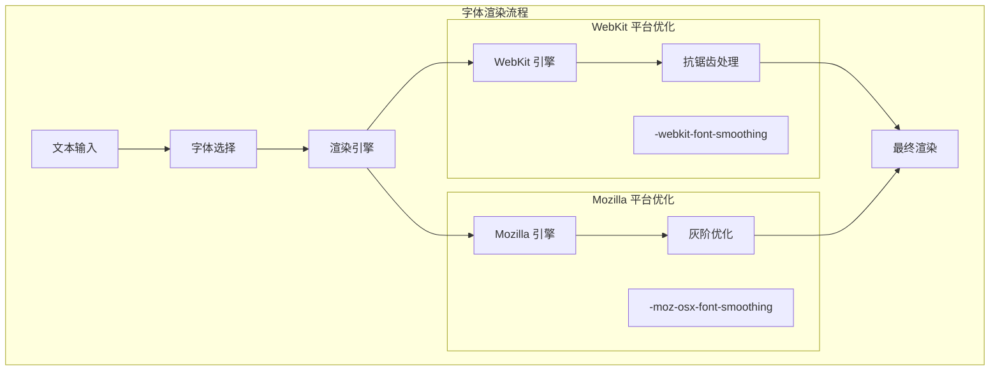

**图表来源**
- [style.css:26-27](file://style.css#L26-L27)

### 平滑处理效果

字体平滑处理在不同平台上产生不同的视觉效果：

#### 效果对比表

| 处理方式 | 平台支持 | 视觉效果 | 性能影响 |
|---------|---------|---------|---------|
| -webkit-font-smoothing: antialiased | macOS Safari, Chrome | 减少字体抖动，提升边缘清晰度 | 无明显性能影响 |
| -moz-osx-font-smoothing: grayscale | macOS Firefox | 改善灰阶渲染，减少色彩偏差 | 无明显性能影响 |
| 无平滑处理 | 所有平台 | 基础字体渲染 | 无性能影响 |

**章节来源**
- [style.css:26-27](file://style.css#L26-L27)

## 字体大小基准

### 16px 基准设定

项目采用 16px 作为字体大小基准，这是现代 Web 开发的标准做法，具有以下优势：

#### 基准字体大小选择

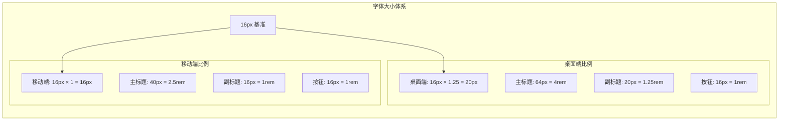

**图表来源**
- [style.css:18](file://style.css#L18)
- [style.css:49-63](file://style.css#L49-L63)
- [style.css:160-166](file://style.css#L160-L166)

### rem/em 单位换算

基于 16px 基准，项目建立了清晰的 rem 单位换算体系：

#### 单位换算关系

| 设备类型 | 基准字体大小 | rem 换算关系 | 实际像素值 |
|---------|-------------|-------------|-----------|
| 桌面端 | 16px | 1rem = 16px | 主标题: 4rem = 64px |
| 移动端 | 16px | 1rem = 16px | 主标题: 2.5rem = 40px |
| 副标题 | 20px | 1rem = 16px | 1.25rem = 20px |
| 按钮文字 | 16px | 1rem = 16px | 1rem = 16px |

**章节来源**
- [style.css:18](file://style.css#L18)
- [style.css:49-63](file://style.css#L49-L63)
- [style.css:160-166](file://style.css#L160-L166)

## 跨平台适配策略

### 操作系统差异化处理

系统字体栈针对不同操作系统提供了专门的适配策略：

#### 平台适配矩阵

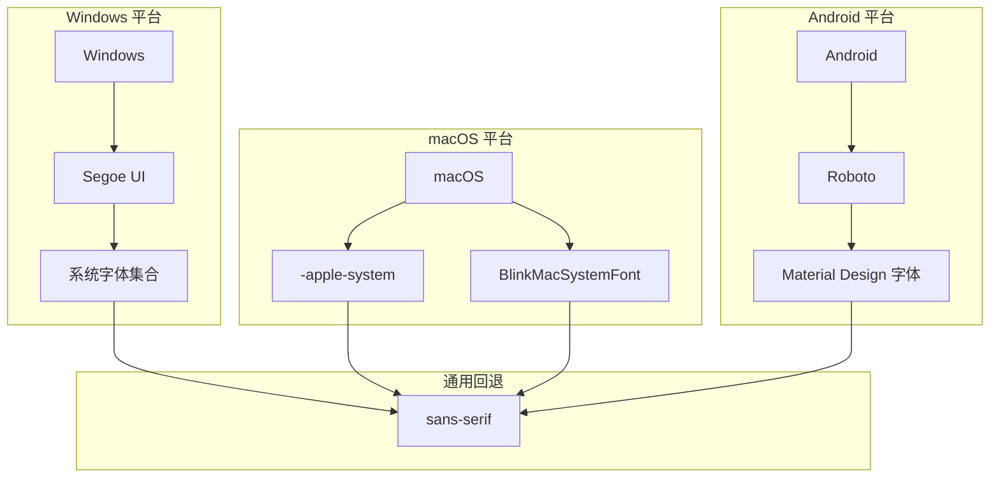

**图表来源**
- [style.css:21-28](file://style.css#L21-L28)

### 设备类型适配

项目针对不同设备类型提供了专门的适配策略：

#### 设备适配策略

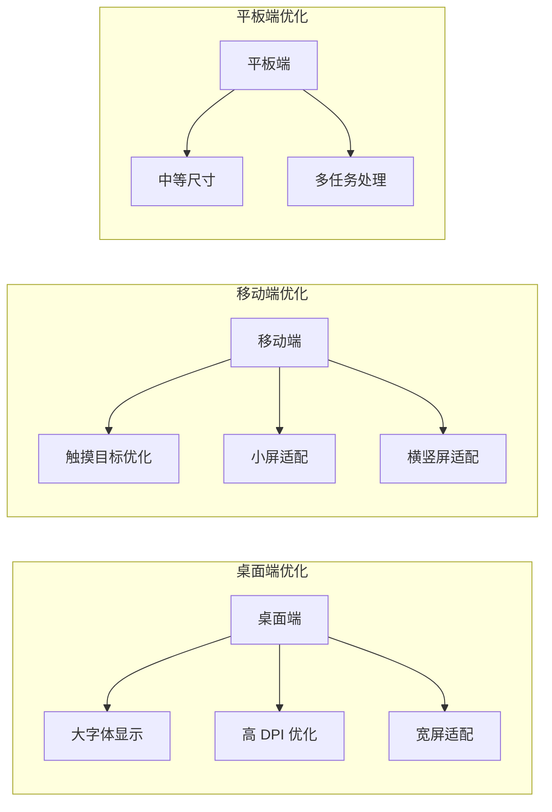

**图表来源**
- [style.css:155-193](file://style.css#L155-L193)

**章节来源**
- [style.css:155-193](file://style.css#L155-L193)

## 性能优化考虑

### 字体加载优化

系统字体栈在性能方面具有天然优势，但仍有进一步优化的空间：

#### 性能优化策略

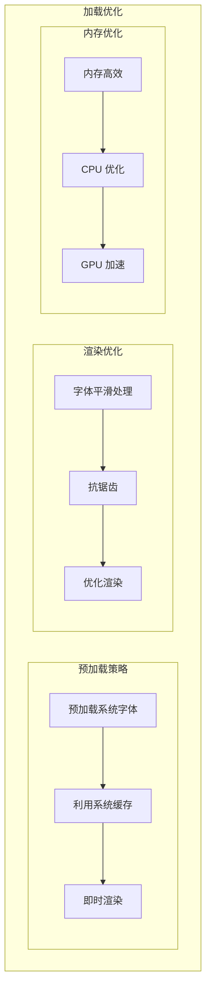

### 可访问性优化

系统字体栈在可访问性方面也表现出色，提供了良好的用户体验：

#### 可访问性特性

| 特性 | 实现方式 | 用户收益 |
|------|---------|---------|
| 高对比度 | 使用 #111111 和 #ffffff | 视障用户易读 |
| 字体大小 | 基于 16px 基准 | 支持缩放设置 |
| 字体族 | sans-serif 回退 | 保证可读性 |
| 行高 | 1.5 基准 | 改善阅读流畅性 |
| 颜色方案 | 深浅对比 | 减少视觉疲劳 |

## 可访问性考量

### 颜色对比度

项目在颜色选择上充分考虑了可访问性要求：

#### 对比度分析

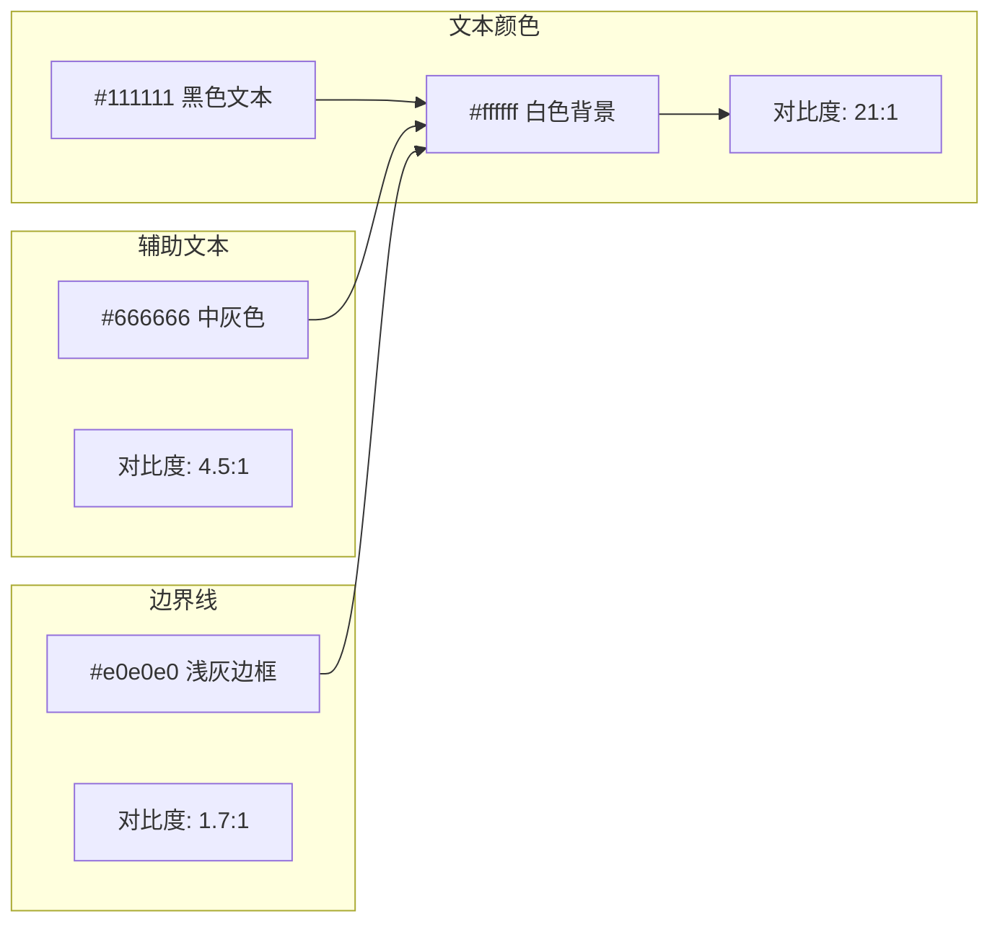

**图表来源**
- [style.css:23](file://style.css#L23)
- [style.css:61](file://style.css#L61)
- [style.css:106](file://style.css#L106)

### 字体可读性

系统字体栈在可读性方面的优势体现在多个层面：

#### 可读性优化

| 优化维度 | 实现方式 | 效果 |
|---------|---------|------|
| 字体选择 | 系统原生字体 | 更自然的笔画形状 |
| 字重控制 | bold 和 normal | 良好的视觉层次 |
| 行高设置 | 1.5 基准 | 改善阅读舒适度 |
| 字间距 | -0.02em 调整 | 优化密集文本可读性 |
| 断字处理 | 自动断字 | 防止溢出和断行问题 |

**章节来源**
- [style.css:23](file://style.css#L23)
- [style.css:54](file://style.css#L54)
- [style.css:106](file://style.css#L106)

## 故障排除指南

### 常见问题诊断

在使用系统字体栈时可能遇到的问题及解决方案：

#### 问题排查流程

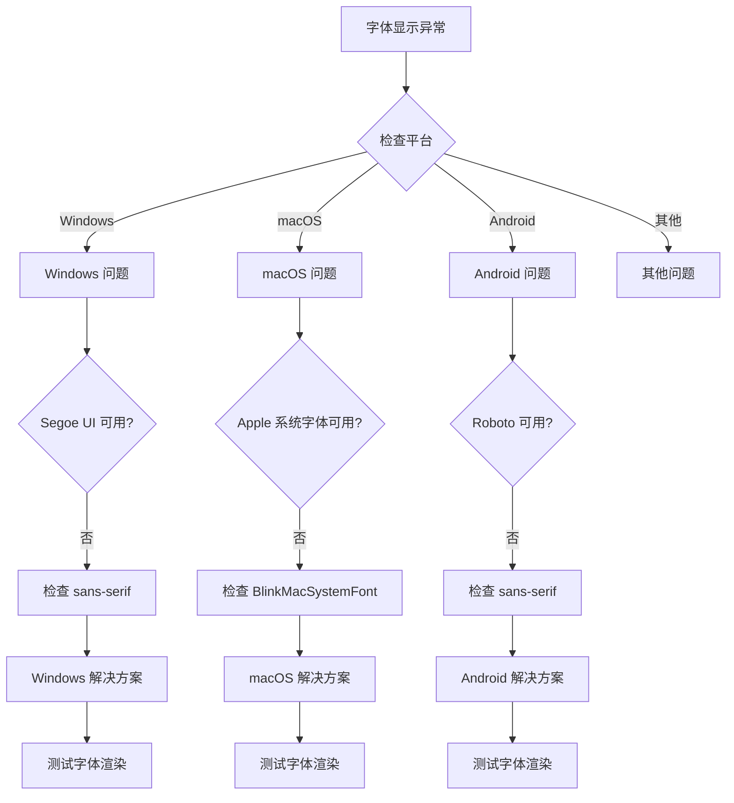

### 调试工具和方法

#### 调试建议

1. **浏览器开发者工具**
   - 使用 Elements 面板检查字体属性
   - 查看计算样式中的 font-family
   - 检查字体渲染效果

2. **跨平台测试**
   - 在不同操作系统上验证字体显示
   - 测试不同浏览器的兼容性
   - 验证高 DPI 显示器效果

3. **性能监控**
   - 监控字体加载时间
   - 检查渲染性能指标
   - 验证内存使用情况

**章节来源**
- [style.css:21-28](file://style.css#L21-L28)

## 结论

openSpec 项目的系统字体栈实现展现了现代 Web 开发的最佳实践，通过精心设计的字体序列、降级机制和性能优化，在保证视觉质量的同时最大化了加载效率和跨平台兼容性。

### 主要优势总结

1. **卓越的跨平台兼容性**：通过多层字体降级机制确保在各种操作系统和设备上都能获得最佳的字体渲染效果

2. **优秀的性能表现**：利用系统字体避免网络加载延迟，实现即时可用的字体显示

3. **专业的视觉设计**：针对不同平台的原生字体特性进行专门优化，提供接近原生应用的视觉体验

4. **完善的响应式适配**：基于 16px 基准建立的字体体系，确保在不同设备上都具有良好的可读性和视觉平衡

5. **可访问性友好**：通过合理的颜色对比度、字体大小和行高设置，为所有用户提供了优质的阅读体验

### 技术创新点

- **智能字体降级**：从 macOS 原生字体开始，逐步降级到通用回退字体，确保每一步都有最佳的视觉效果
- **平台特定优化**：针对不同操作系统的渲染特点进行专门的字体平滑处理
- **响应式字体体系**：基于 16px 基准的灵活字体缩放机制，适应不同设备的显示需求

这个系统字体栈实现为类似的项目提供了宝贵的参考，展示了如何在保持代码简洁的同时实现复杂的跨平台字体管理策略。