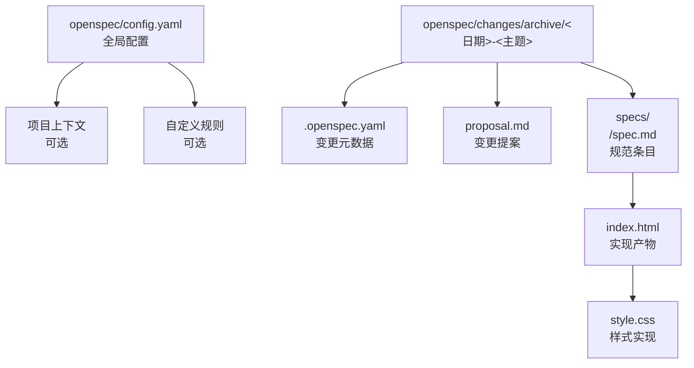
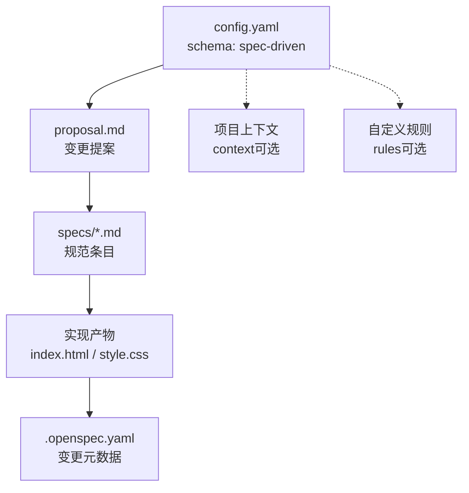
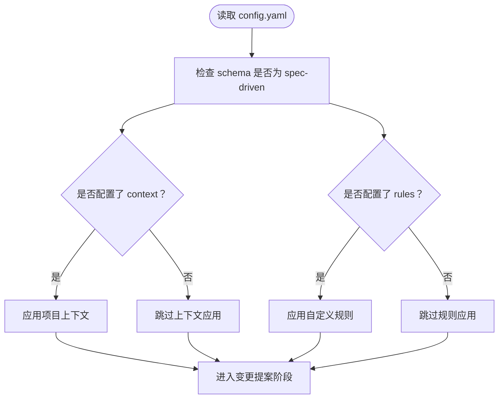
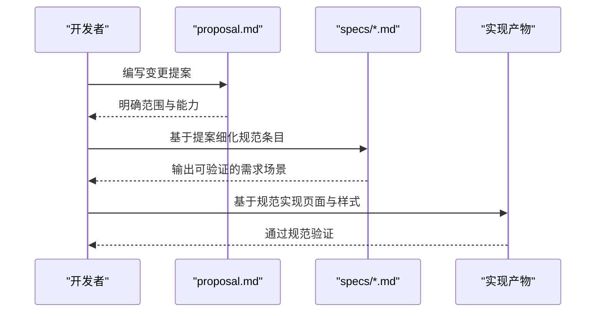
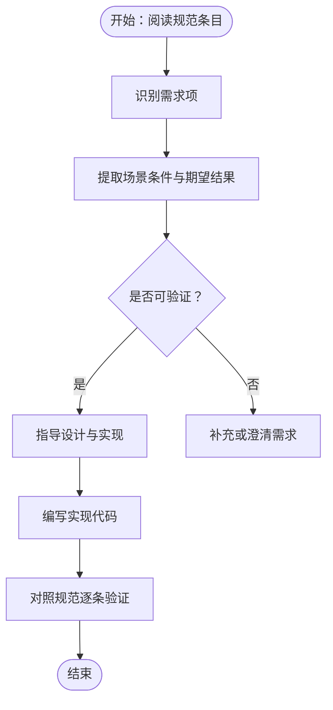
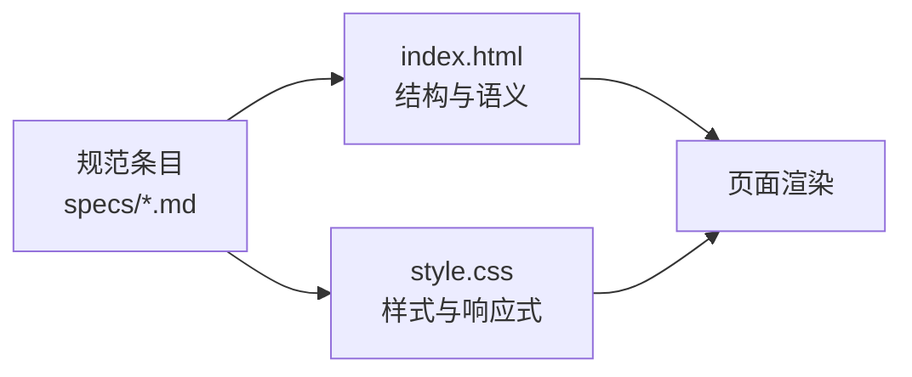
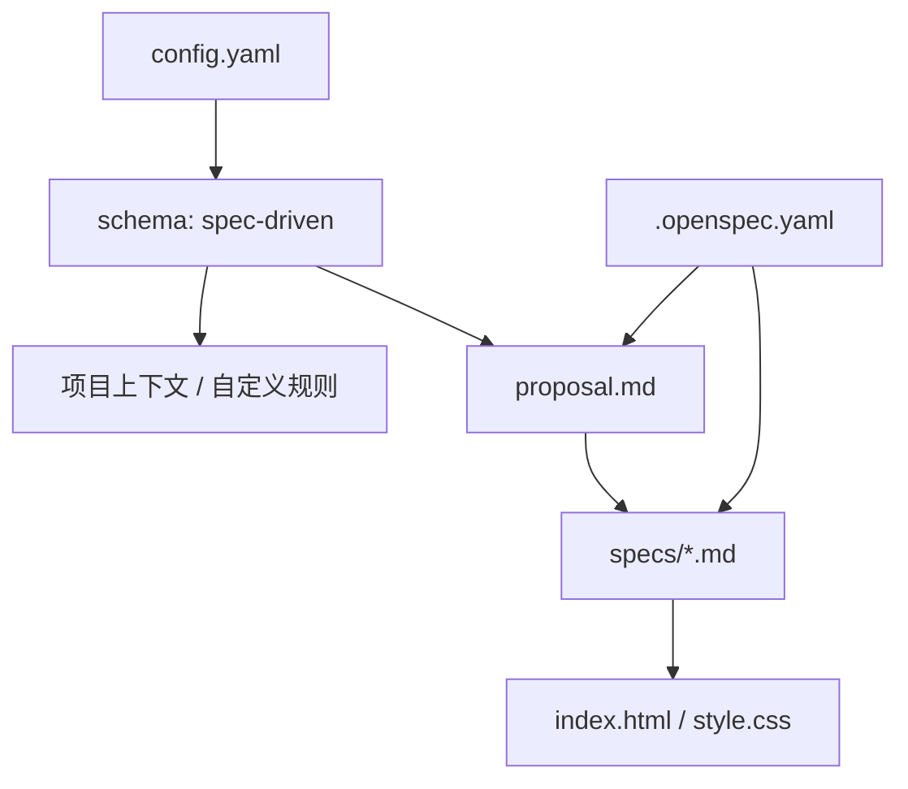

# OpenSpec 概念与原理

<cite>
**本文引用的文件**
- [openspec/config.yaml](file://openspec/config.yaml)
- [openspec/changes/archive/2026-05-12-homepage-hero-footer/.openspec.yaml](file://openspec/changes/archive/2026-05-12-homepage-hero-footer/.openspec.yaml)
- [openspec/changes/archive/2026-05-12-homepage-hero-footer/proposal.md](file://openspec/changes/archive/2026-05-12-homepage-hero-footer/proposal.md)
- [openspec/changes/archive/2026-05-12-homepage-hero-footer/specs/hero-section/spec.md](file://openspec/changes/archive/2026-05-12-homepage-hero-footer/specs/hero-section/spec.md)
- [openspec/changes/archive/2026-05-12-homepage-hero-footer/specs/footer-section/spec.md](file://openspec/changes/archive/2026-05-12-homepage-hero-footer/specs/footer-section/spec.md)
- [index.html](file://index.html)
- [style.css](file://style.css)
</cite>

## 目录
1. [引言](#引言)
2. [项目结构](#项目结构)
3. [核心组件](#核心组件)
4. [架构总览](#架构总览)
5. [详细组件分析](#详细组件分析)
6. [依赖分析](#依赖分析)
7. [性能考虑](#性能考虑)
8. [故障排除指南](#故障排除指南)
9. [结论](#结论)
10. [附录](#附录)

## 引言
本文件面向希望理解 OpenSpec 规范驱动开发理念与实践的读者。OpenSpec 以“规范驱动”为核心思想，强调通过明确、可执行的规范文档贯穿需求、设计、实现与验证的全流程，从而提升协作效率、降低歧义、增强一致性与可维护性。本文将结合仓库中的配置、提案与规范示例，系统阐述 OpenSpec 的基本原理、设计思想、配置方式与实践路径，并提供与其他常见开发模式的对比分析，帮助读者建立完整的认知框架。

## 项目结构
该仓库采用“规范驱动”的组织方式，将规范、提案与实现产物并行管理，形成“先规范、再实现”的闭环。关键目录与文件如下：
- openspec/config.yaml：全局配置，定义 schema 类型与可选的项目上下文与规则
- openspec/changes/archive/<日期>-<主题>/proposal.md：变更提案，描述背景、范围、能力变化与影响
- openspec/changes/archive/<日期>-<主题>/specs/<section>/spec.md：各模块规范条目，以需求与场景形式定义行为
- openspec/changes/archive/<日期>-<主题>/.openspec.yaml：变更级别的元数据（如 schema 与创建时间）
- index.html 与 style.css：基于规范实现的前端页面与样式

图表来源
- [openspec/config.yaml:1-21](file://openspec/config.yaml#L1-L21)
- [openspec/changes/archive/2026-05-12-homepage-hero-footer/.openspec.yaml:1-3](file://openspec/changes/archive/2026-05-12-homepage-hero-footer/.openspec.yaml#L1-L3)
- [openspec/changes/archive/2026-05-12-homepage-hero-footer/proposal.md:1-26](file://openspec/changes/archive/2026-05-12-homepage-hero-footer/proposal.md#L1-L26)
- [openspec/changes/archive/2026-05-12-homepage-hero-footer/specs/hero-section/spec.md:1-49](file://openspec/changes/archive/2026-05-12-homepage-hero-footer/specs/hero-section/spec.md#L1-L49)
- [index.html:1-44](file://index.html#L1-L44)
- [style.css:1-194](file://style.css#L1-L194)

章节来源
- [openspec/config.yaml:1-21](file://openspec/config.yaml#L1-L21)
- [openspec/changes/archive/2026-05-12-homepage-hero-footer/.openspec.yaml:1-3](file://openspec/changes/archive/2026-05-12-homepage-hero-footer/.openspec.yaml#L1-L3)
- [openspec/changes/archive/2026-05-12-homepage-hero-footer/proposal.md:1-26](file://openspec/changes/archive/2026-05-12-homepage-hero-footer/proposal.md#L1-L26)
- [openspec/changes/archive/2026-05-12-homepage-hero-footer/specs/hero-section/spec.md:1-49](file://openspec/changes/archive/2026-05-12-homepage-hero-footer/specs/hero-section/spec.md#L1-L49)
- [index.html:1-44](file://index.html#L1-L44)
- [style.css:1-194](file://style.css#L1-L194)

## 核心组件
- 规范驱动模式（Schema: spec-driven）
  - schema 字段用于声明项目遵循“规范驱动”的开发范式，确保所有后续流程（提案、规范、任务、实现）均以规范为依据进行编排与校验。
- 项目上下文（context，可选）
  - 用于向生成工具或团队成员提供技术栈、约定、风格指南与领域知识等背景信息，帮助在生成或评审时保持一致的上下文一致性。
- 自定义规则（rules，可选）
  - 针对特定产物类型（如 proposal、tasks 等）设定约束，保证产出质量与规范性，例如字数限制、必须包含的章节等。
- 变更提案（proposal.md）
  - 描述变更动机、范围、新增/修改的能力以及影响评估，是规范驱动流程中的“需求入口”。
- 规范条目（specs/*.md）
  - 将需求拆解为可验证的场景与条件，明确在不同条件下系统的预期行为，支撑设计与实现的一致性。
- 实现产物（index.html、style.css）
  - 基于规范严格实现，确保视觉与交互符合规范要求；通过媒体查询与类名体系体现响应式与可维护性。

章节来源
- [openspec/config.yaml:1-21](file://openspec/config.yaml#L1-L21)
- [openspec/changes/archive/2026-05-12-homepage-hero-footer/proposal.md:1-26](file://openspec/changes/archive/2026-05-12-homepage-hero-footer/proposal.md#L1-L26)
- [openspec/changes/archive/2026-05-12-homepage-hero-footer/specs/hero-section/spec.md:1-49](file://openspec/changes/archive/2026-05-12-homepage-hero-footer/specs/hero-section/spec.md#L1-L49)
- [index.html:1-44](file://index.html#L1-L44)
- [style.css:1-194](file://style.css#L1-L194)

## 架构总览
OpenSpec 的整体架构围绕“规范优先”的闭环展开：以 config.yaml 定义范式，以 proposal.md 明确变更范围，以 specs/*.md 细化需求与场景，最终由实现产物（HTML/CSS）回归验证。变更级别元数据（.openspec.yaml）确保版本与时间线清晰。

图表来源
- [openspec/config.yaml:1-21](file://openspec/config.yaml#L1-L21)
- [openspec/changes/archive/2026-05-12-homepage-hero-footer/proposal.md:1-26](file://openspec/changes/archive/2026-05-12-homepage-hero-footer/proposal.md#L1-L26)
- [openspec/changes/archive/2026-05-12-homepage-hero-footer/specs/hero-section/spec.md:1-49](file://openspec/changes/archive/2026-05-12-homepage-hero-footer/specs/hero-section/spec.md#L1-L49)
- [index.html:1-44](file://index.html#L1-L44)
- [style.css:1-194](file://style.css#L1-L194)
- [openspec/changes/archive/2026-05-12-homepage-hero-footer/.openspec.yaml:1-3](file://openspec/changes/archive/2026-05-12-homepage-hero-footer/.openspec.yaml#L1-L3)

## 详细组件分析

### 组件一：配置文件与范式声明
- schema 字段
  - 用于声明项目遵循“规范驱动”范式，确保后续流程以规范为依据进行组织与校验。
- 项目上下文（context）
  - 提供技术栈、约定、风格指南与领域知识等背景信息，帮助生成与评审时保持一致的上下文。
- 自定义规则（rules）
  - 针对特定产物类型设定约束，保证产出质量与规范性。

图表来源
- [openspec/config.yaml:1-21](file://openspec/config.yaml#L1-L21)

章节来源
- [openspec/config.yaml:1-21](file://openspec/config.yaml#L1-L21)

### 组件二：变更提案（Proposal）
- 作用
  - 明确变更的动机、范围、新增/修改的能力以及影响评估，作为规范驱动流程的“需求入口”。
- 关键要素
  - 背景与目标、变更内容清单、新增/修改能力列表、影响说明（文件、依赖、部署等）。

图表来源
- [openspec/changes/archive/2026-05-12-homepage-hero-footer/proposal.md:1-26](file://openspec/changes/archive/2026-05-12-homepage-hero-footer/proposal.md#L1-L26)

章节来源
- [openspec/changes/archive/2026-05-12-homepage-hero-footer/proposal.md:1-26](file://openspec/changes/archive/2026-05-12-homepage-hero-footer/proposal.md#L1-L26)

### 组件三：规范条目（Spec）
- 结构与表达
  - 使用“需求 + 场景”的形式，将需求拆解为在不同条件下系统的预期行为，便于设计与实现。
- 示例要点
  - 主标题展示、副标题展示、CTA 按钮样式、全屏居中布局、响应式断点等，均以场景化条件与期望结果呈现。

图表来源
- [openspec/changes/archive/2026-05-12-homepage-hero-footer/specs/hero-section/spec.md:1-49](file://openspec/changes/archive/2026-05-12-homepage-hero-footer/specs/hero-section/spec.md#L1-L49)

章节来源
- [openspec/changes/archive/2026-05-12-homepage-hero-footer/specs/hero-section/spec.md:1-49](file://openspec/changes/archive/2026-05-12-homepage-hero-footer/specs/hero-section/spec.md#L1-L49)

### 组件四：实现产物（HTML/CSS）
- HTML
  - 以语义化的结构承载内容，类名与布局与规范一致，便于样式层精确控制。
- CSS
  - 采用系统字体栈、CSS Reset、分模块样式与媒体查询，确保跨设备一致性与可维护性。

图表来源
- [openspec/changes/archive/2026-05-12-homepage-hero-footer/specs/hero-section/spec.md:1-49](file://openspec/changes/archive/2026-05-12-homepage-hero-footer/specs/hero-section/spec.md#L1-L49)
- [index.html:1-44](file://index.html#L1-L44)
- [style.css:1-194](file://style.css#L1-L194)

章节来源
- [index.html:1-44](file://index.html#L1-L44)
- [style.css:1-194](file://style.css#L1-L194)

### 组件五：变更元数据（.openspec.yaml）
- 作用
  - 记录变更的 schema 与创建时间，便于版本追踪与流程归档。
- 影响
  - 保证每个变更都具备统一的元数据格式，便于工具链与人工审计。

章节来源
- [openspec/changes/archive/2026-05-12-homepage-hero-footer/.openspec.yaml:1-3](file://openspec/changes/archive/2026-05-12-homepage-hero-footer/.openspec.yaml#L1-L3)

## 依赖分析
- 配置到规范的依赖
  - config.yaml 的 schema 决定后续流程范式；proposal.md 与 specs/*.md 依赖该范式进行组织。
- 规范到实现的依赖
  - HTML 与 CSS 严格遵循规范条目中的场景与条件，形成“需求—实现—验证”的闭环。
- 元数据到流程的依赖
  - .openspec.yaml 为每个变更提供统一元数据，便于版本与时间线管理。

图表来源
- [openspec/config.yaml:1-21](file://openspec/config.yaml#L1-L21)
- [openspec/changes/archive/2026-05-12-homepage-hero-footer/.openspec.yaml:1-3](file://openspec/changes/archive/2026-05-12-homepage-hero-footer/.openspec.yaml#L1-L3)
- [openspec/changes/archive/2026-05-12-homepage-hero-footer/proposal.md:1-26](file://openspec/changes/archive/2026-05-12-homepage-hero-footer/proposal.md#L1-L26)
- [openspec/changes/archive/2026-05-12-homepage-hero-footer/specs/hero-section/spec.md:1-49](file://openspec/changes/archive/2026-05-12-homepage-hero-footer/specs/hero-section/spec.md#L1-L49)
- [index.html:1-44](file://index.html#L1-L44)
- [style.css:1-194](file://style.css#L1-L194)

章节来源
- [openspec/config.yaml:1-21](file://openspec/config.yaml#L1-L21)
- [openspec/changes/archive/2026-05-12-homepage-hero-footer/.openspec.yaml:1-3](file://openspec/changes/archive/2026-05-12-homepage-hero-footer/.openspec.yaml#L1-L3)
- [openspec/changes/archive/2026-05-12-homepage-hero-footer/proposal.md:1-26](file://openspec/changes/archive/2026-05-12-homepage-hero-footer/proposal.md#L1-L26)
- [openspec/changes/archive/2026-05-12-homepage-hero-footer/specs/hero-section/spec.md:1-49](file://openspec/changes/archive/2026-05-12-homepage-hero-footer/specs/hero-section/spec.md#L1-L49)
- [index.html:1-44](file://index.html#L1-L44)
- [style.css:1-194](file://style.css#L1-L194)

## 性能考虑
- 规范驱动带来的收益
  - 通过明确的需求与场景，减少返工与歧义，间接提升开发效率与质量。
- 实现层面的优化建议
  - 使用系统字体栈与 CSS Reset 减少默认差异；采用模块化样式与媒体查询，提升可维护性与加载体验。
  - 在 HTML 中仅引入必要资源，避免不必要的脚本与第三方依赖，确保静态页面的快速加载与稳定运行。

## 故障排除指南
- 常见问题与对策
  - 规范与实现不一致：对照规范条目逐条验证，确保场景条件与期望结果得到满足。
  - 响应式效果异常：检查媒体查询断点与类名映射，确保在移动与桌面端的行为一致。
  - 样式覆盖冲突：采用模块化命名与层级控制，避免全局污染。
- 参考路径
  - 规范条目：[openspec/changes/archive/2026-05-12-homepage-hero-footer/specs/hero-section/spec.md](file://openspec/changes/archive/2026-05-12-homepage-hero-footer/specs/hero-section/spec.md)
  - 实现文件：[index.html](file://index.html)、[style.css](file://style.css)

章节来源
- [openspec/changes/archive/2026-05-12-homepage-hero-footer/specs/hero-section/spec.md:1-49](file://openspec/changes/archive/2026-05-12-homepage-hero-footer/specs/hero-section/spec.md#L1-L49)
- [index.html:1-44](file://index.html#L1-L44)
- [style.css:1-194](file://style.css#L1-L194)

## 结论
OpenSpec 以“规范驱动”为核心，通过配置、提案、规范与实现的闭环，将需求转化为可验证、可追溯、可复用的知识资产。它不仅提升了团队协作效率与交付质量，也为持续演进提供了稳定基础。对于希望在前端工程中引入规范化与可追溯性的团队，OpenSpec 提供了清晰的实践路径与可操作的参考模板。

## 附录
- 术语表
  - 规范驱动：以明确、可执行的规范文档为起点，贯穿需求、设计、实现与验证的全流程。
  - 场景：在特定条件下系统应表现出的预期行为，通常包含“当...发生时，系统应...”的结构。
  - 变更提案：描述变更动机、范围、能力变化与影响的文档。
- 成功案例提示
  - 本仓库中的首页 Hero 与 Footer 区块，通过规范条目与实现产物的对应关系，展示了从需求到落地的完整路径，可作为团队内部推广的参考案例。