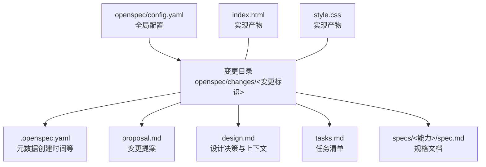
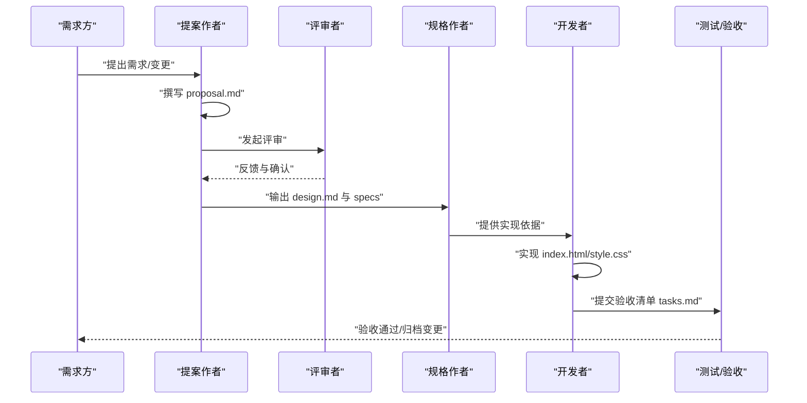
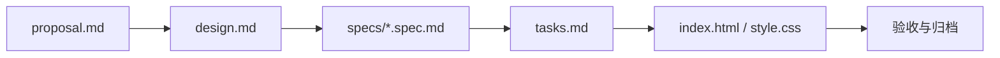

# 开发流程与规范

<cite>
**本文引用的文件**
- [openspec/config.yaml](file://openspec/config.yaml)
- [openspec/changes/archive/2026-05-12-homepage-hero-footer/.openspec.yaml](file://openspec/changes/archive/2026-05-12-homepage-hero-footer/.openspec.yaml)
- [openspec/changes/archive/2026-05-12-homepage-hero-footer/proposal.md](file://openspec/changes/archive/2026-05-12-homepage-hero-footer/proposal.md)
- [openspec/changes/archive/2026-05-12-homepage-hero-footer/design.md](file://openspec/changes/archive/2026-05-12-homepage-hero-footer/design.md)
- [openspec/changes/archive/2026-05-12-homepage-hero-footer/specs/hero-section/spec.md](file://openspec/changes/archive/2026-05-12-homepage-hero-footer/specs/hero-section/spec.md)
- [openspec/changes/archive/2026-05-12-homepage-hero-footer/specs/footer-section/spec.md](file://openspec/changes/archive/2026-05-12-homepage-hero-footer/specs/footer-section/spec.md)
- [openspec/changes/add-banner-image/.openspec.yaml](file://openspec/changes/add-banner-image/.openspec.yaml)
- [index.html](file://index.html)
- [style.css](file://style.css)
- [openspec/changes/archive/2026-05-12-homepage-hero-footer/tasks.md](file://openspec/changes/archive/2026-05-12-homepage-hero-footer/tasks.md)
</cite>

## 目录
1. [引言](#引言)
2. [项目结构](#项目结构)
3. [核心组件](#核心组件)
4. [架构总览](#架构总览)
5. [详细组件分析](#详细组件分析)
6. [依赖关系分析](#依赖关系分析)
7. [性能考虑](#性能考虑)
8. [故障排查指南](#故障排查指南)
9. [结论](#结论)
10. [附录](#附录)

## 引言
本文件面向规范驱动开发（Spec-Driven Development）的实践者，系统阐述从“需求提出”到“代码实现”的完整流程，覆盖变更提案编写、评审、实现与验收各环节。文档同时解释 proposal.md 的标准结构与编写规范，说明 .openspec.yaml 的作用与格式要求，并结合仓库中的真实示例，给出可复用的流程模板与最佳实践。

## 项目结构
该仓库采用“变更目录 + 规范文档 + 实现产物”的组织方式：
- openspec/config.yaml：全局配置，定义规范类型与可选的项目上下文与规则
- openspec/changes/<变更目录>：每个变更作为一个独立目录，包含变更元数据、提案、设计、规格、任务清单与规格文件
- openspec/specs：顶层规格集合（本仓库示例中由具体变更内的 specs 子目录承载）
- index.html 与 style.css：最终实现产物，对应变更中的提案与规格

图表来源
- [openspec/config.yaml:1-21](file://openspec/config.yaml#L1-L21)
- [openspec/changes/archive/2026-05-12-homepage-hero-footer/.openspec.yaml:1-3](file://openspec/changes/archive/2026-05-12-homepage-hero-footer/.openspec.yaml#L1-L3)
- [openspec/changes/archive/2026-05-12-homepage-hero-footer/proposal.md:1-26](file://openspec/changes/archive/2026-05-12-homepage-hero-footer/proposal.md#L1-L26)
- [openspec/changes/archive/2026-05-12-homepage-hero-footer/design.md:1-84](file://openspec/changes/archive/2026-05-12-homepage-hero-footer/design.md#L1-L84)
- [openspec/changes/archive/2026-05-12-homepage-hero-footer/tasks.md:1-35](file://openspec/changes/archive/2026-05-12-homepage-hero-footer/tasks.md#L1-L35)
- [openspec/changes/archive/2026-05-12-homepage-hero-footer/specs/hero-section/spec.md:1-49](file://openspec/changes/archive/2026-05-12-homepage-hero-footer/specs/hero-section/spec.md#L1-L49)
- [openspec/changes/archive/2026-05-12-homepage-hero-footer/specs/footer-section/spec.md:1-49](file://openspec/changes/archive/2026-05-12-homepage-hero-footer/specs/footer-section/spec.md#L1-L49)
- [index.html:1-44](file://index.html#L1-L44)
- [style.css:1-194](file://style.css#L1-L194)

章节来源
- [openspec/config.yaml:1-21](file://openspec/config.yaml#L1-L21)
- [openspec/changes/archive/2026-05-12-homepage-hero-footer/.openspec.yaml:1-3](file://openspec/changes/archive/2026-05-12-homepage-hero-footer/.openspec.yaml#L1-L3)
- [openspec/changes/archive/2026-05-12-homepage-hero-footer/proposal.md:1-26](file://openspec/changes/archive/2026-05-12-homepage-hero-footer/proposal.md#L1-L26)
- [openspec/changes/archive/2026-05-12-homepage-hero-footer/design.md:1-84](file://openspec/changes/archive/2026-05-12-homepage-hero-footer/design.md#L1-L84)
- [openspec/changes/archive/2026-05-12-homepage-hero-footer/tasks.md:1-35](file://openspec/changes/archive/2026-05-12-homepage-hero-footer/tasks.md#L1-L35)
- [openspec/changes/archive/2026-05-12-homepage-hero-footer/specs/hero-section/spec.md:1-49](file://openspec/changes/archive/2026-05-12-homepage-hero-footer/specs/hero-section/spec.md#L1-L49)
- [openspec/changes/archive/2026-05-12-homepage-hero-footer/specs/footer-section/spec.md:1-49](file://openspec/changes/archive/2026-05-12-homepage-hero-footer/specs/footer-section/spec.md#L1-L49)
- [index.html:1-44](file://index.html#L1-L44)
- [style.css:1-194](file://style.css#L1-L194)

## 核心组件
- 全局配置 openspec/config.yaml：定义规范类型（如 spec-driven），可选地注入项目上下文与针对特定工件的规则（如字数限制、必须包含的章节等）
- 变更元数据 .openspec.yaml：记录变更的创建时间等元信息，便于变更追踪与归档
- 变更提案 proposal.md：描述“为什么需要变更”、“变更包含哪些内容”、“新增/修改的能力”、“影响范围”等
- 设计文档 design.md：沉淀设计背景、目标与非目标、关键决策、权衡与风险
- 规格文档 specs/<能力>/spec.md：以“需求 + 场景”的形式明确验收标准与行为规范
- 任务清单 tasks.md：将规格拆解为可执行的任务步骤，便于实现与验收
- 实现产物 index.html 与 style.css：最终落地的静态页面与样式

章节来源
- [openspec/config.yaml:1-21](file://openspec/config.yaml#L1-L21)
- [openspec/changes/archive/2026-05-12-homepage-hero-footer/.openspec.yaml:1-3](file://openspec/changes/archive/2026-05-12-homepage-hero-footer/.openspec.yaml#L1-L3)
- [openspec/changes/archive/2026-05-12-homepage-hero-footer/proposal.md:1-26](file://openspec/changes/archive/2026-05-12-homepage-hero-footer/proposal.md#L1-L26)
- [openspec/changes/archive/2026-05-12-homepage-hero-footer/design.md:1-84](file://openspec/changes/archive/2026-05-12-homepage-hero-footer/design.md#L1-L84)
- [openspec/changes/archive/2026-05-12-homepage-hero-footer/specs/hero-section/spec.md:1-49](file://openspec/changes/archive/2026-05-12-homepage-hero-footer/specs/hero-section/spec.md#L1-L49)
- [openspec/changes/archive/2026-05-12-homepage-hero-footer/specs/footer-section/spec.md:1-49](file://openspec/changes/archive/2026-05-12-homepage-hero-footer/specs/footer-section/spec.md#L1-L49)
- [openspec/changes/archive/2026-05-12-homepage-hero-footer/tasks.md:1-35](file://openspec/changes/archive/2026-05-12-homepage-hero-footer/tasks.md#L1-L35)
- [index.html:1-44](file://index.html#L1-L44)
- [style.css:1-194](file://style.css#L1-L194)

## 架构总览
规范驱动开发的端到端流程如下：需求提出 → 变更提案 → 设计与评审 → 规格细化 → 任务拆解 → 实现 → 验收与归档。

图表来源
- [openspec/changes/archive/2026-05-12-homepage-hero-footer/proposal.md:1-26](file://openspec/changes/archive/2026-05-12-homepage-hero-footer/proposal.md#L1-L26)
- [openspec/changes/archive/2026-05-12-homepage-hero-footer/design.md:1-84](file://openspec/changes/archive/2026-05-12-homepage-hero-footer/design.md#L1-L84)
- [openspec/changes/archive/2026-05-12-homepage-hero-footer/specs/hero-section/spec.md:1-49](file://openspec/changes/archive/2026-05-12-homepage-hero-footer/specs/hero-section/spec.md#L1-L49)
- [openspec/changes/archive/2026-05-12-homepage-hero-footer/specs/footer-section/spec.md:1-49](file://openspec/changes/archive/2026-05-12-homepage-hero-footer/specs/footer-section/spec.md#L1-L49)
- [openspec/changes/archive/2026-05-12-homepage-hero-footer/tasks.md:1-35](file://openspec/changes/archive/2026-05-12-homepage-hero-footer/tasks.md#L1-L35)
- [index.html:1-44](file://index.html#L1-L44)
- [style.css:1-194](file://style.css#L1-L194)

## 详细组件分析

### proposal.md 标准结构与编写规范
- 为什么（Why）：说明变更的背景、动机与业务价值，强调“为什么要做”
- 变更内容（What Changes）：列出新增/修改的具体能力与产物，明确交付物形态
- 新增能力（New Capabilities）：从用户视角描述新能力的行为边界
- 修改能力（Modified Capabilities）：如有既有能力被调整，需在此说明
- 影响（Impact）：说明资源占用、依赖变化、部署影响等

编写要点
- 简洁明确，聚焦价值与范围
- 与 design.md 的目标保持一致
- 为后续规格细化提供输入

章节来源
- [openspec/changes/archive/2026-05-12-homepage-hero-footer/proposal.md:1-26](file://openspec/changes/archive/2026-05-12-homepage-hero-footer/proposal.md#L1-L26)

### .openspec.yaml 配置文件
- 作用：作为变更的元数据文件，用于记录创建时间等信息，便于变更追踪与归档
- 格式要求：包含 schema 与 created 字段；可扩展其他元信息字段

章节来源
- [openspec/changes/archive/2026-05-12-homepage-hero-footer/.openspec.yaml:1-3](file://openspec/changes/archive/2026-05-12-homepage-hero-footer/.openspec.yaml#L1-L3)
- [openspec/changes/add-banner-image/.openspec.yaml:1-3](file://openspec/changes/add-banner-image/.openspec.yaml#L1-L3)

### 设计文档 design.md
- 上下文（Context）：项目背景、约束与目标
- 目标与非目标（Goals / Non-Goals）：明确边界，避免范围蔓延
- 关键决策（Decisions）：列出重要设计选择及其理由与备选方案
- 风险与权衡（Risks / Trade-offs）：识别潜在问题与取舍

章节来源
- [openspec/changes/archive/2026-05-12-homepage-hero-footer/design.md:1-84](file://openspec/changes/archive/2026-05-12-homepage-hero-footer/design.md#L1-L84)

### 规格文档 specs/<能力>/spec.md
- 采用“需求 + 场景”的结构，明确“系统 SHALL 如何”以及“在何种条件下如何”
- 每个需求可拆分为若干场景，覆盖桌面端、移动端、交互状态等
- 与实现产物（HTML/CSS）一一对应，确保可测试与可验证

章节来源
- [openspec/changes/archive/2026-05-12-homepage-hero-footer/specs/hero-section/spec.md:1-49](file://openspec/changes/archive/2026-05-12-homepage-hero-footer/specs/hero-section/spec.md#L1-L49)
- [openspec/changes/archive/2026-05-12-homepage-hero-footer/specs/footer-section/spec.md:1-49](file://openspec/changes/archive/2026-05-12-homepage-hero-footer/specs/footer-section/spec.md#L1-L49)

### 任务清单 tasks.md
- 将规格拆解为可执行的任务步骤，标注完成状态
- 便于实现过程中的里程碑检查与验收

章节来源
- [openspec/changes/archive/2026-05-12-homepage-hero-footer/tasks.md:1-35](file://openspec/changes/archive/2026-05-12-homepage-hero-footer/tasks.md#L1-L35)

### 实现产物 index.html 与 style.css
- index.html：语义化的结构，包含 Hero 与 Footer 两大部分
- style.css：基于规格实现的样式，包含 CSS Reset、系统字体栈、Hero 与 Footer 样式、响应式断点等

章节来源
- [index.html:1-44](file://index.html#L1-L44)
- [style.css:1-194](file://style.css#L1-L194)

## 依赖关系分析
- proposal.md 与 design.md 共同决定规格范围与边界
- specs/*.md 为实现提供精确的行为规范
- tasks.md 将规格转化为可执行任务
- index.html 与 style.css 是最终可验证的产物

图表来源
- [openspec/changes/archive/2026-05-12-homepage-hero-footer/proposal.md:1-26](file://openspec/changes/archive/2026-05-12-homepage-hero-footer/proposal.md#L1-L26)
- [openspec/changes/archive/2026-05-12-homepage-hero-footer/design.md:1-84](file://openspec/changes/archive/2026-05-12-homepage-hero-footer/design.md#L1-L84)
- [openspec/changes/archive/2026-05-12-homepage-hero-footer/specs/hero-section/spec.md:1-49](file://openspec/changes/archive/2026-05-12-homepage-hero-footer/specs/hero-section/spec.md#L1-L49)
- [openspec/changes/archive/2026-05-12-homepage-hero-footer/specs/footer-section/spec.md:1-49](file://openspec/changes/archive/2026-05-12-homepage-hero-footer/specs/footer-section/spec.md#L1-L49)
- [openspec/changes/archive/2026-05-12-homepage-hero-footer/tasks.md:1-35](file://openspec/changes/archive/2026-05-12-homepage-hero-footer/tasks.md#L1-L35)
- [index.html:1-44](file://index.html#L1-L44)
- [style.css:1-194](file://style.css#L1-L194)

## 性能考虑
- 静态页面无需运行时计算，首屏渲染快
- 采用系统字体栈，避免额外网络请求
- 通过单一断点（768px）简化响应式逻辑，降低复杂度
- 无 JavaScript 依赖，减少运行时错误与安全风险

## 故障排查指南
- 样式未生效
  - 检查 HTML 是否正确引入 CSS 文件
  - 检查媒体查询断点是否覆盖目标设备
- 响应式异常
  - 确认断点设置与规格一致
  - 在移动设备模拟器中逐项核验关键尺寸与间距
- 交互状态异常
  - 检查 hover 状态样式是否按规格实现
- 语义结构问题
  - 确保使用语义化标签，避免滥用 div

章节来源
- [index.html:1-44](file://index.html#L1-L44)
- [style.css:1-194](file://style.css#L1-L194)
- [openspec/changes/archive/2026-05-12-homepage-hero-footer/specs/hero-section/spec.md:1-49](file://openspec/changes/archive/2026-05-12-homepage-hero-footer/specs/hero-section/spec.md#L1-L49)
- [openspec/changes/archive/2026-05-12-homepage-hero-footer/specs/footer-section/spec.md:1-49](file://openspec/changes/archive/2026-05-12-homepage-hero-footer/specs/footer-section/spec.md#L1-L49)

## 结论
本仓库展示了规范驱动开发的完整闭环：以 proposal.md 明确范围，以 design.md 统一认知，以 specs/*.spec.md 精细化到可测试的行为，以 tasks.md 将其转化为可执行任务，最终以 index.html 与 style.css 落地并可追溯归档。遵循该流程可显著提升协作效率与交付质量。

## 附录

### proposal.md 示例结构（路径）
- [变更提案示例:1-26](file://openspec/changes/archive/2026-05-12-homepage-hero-footer/proposal.md#L1-L26)

### .openspec.yaml 示例（路径）
- [变更元数据示例（hero-footer）:1-3](file://openspec/changes/archive/2026-05-12-homepage-hero-footer/.openspec.yaml#L1-L3)
- [变更元数据示例（add-banner-image）:1-3](file://openspec/changes/add-banner-image/.openspec.yaml#L1-L3)

### 规格文档示例（路径）
- [Hero 规格示例:1-49](file://openspec/changes/archive/2026-05-12-homepage-hero-footer/specs/hero-section/spec.md#L1-L49)
- [Footer 规格示例:1-49](file://openspec/changes/archive/2026-05-12-homepage-hero-footer/specs/footer-section/spec.md#L1-L49)

### 任务清单示例（路径）
- [任务清单示例:1-35](file://openspec/changes/archive/2026-05-12-homepage-hero-footer/tasks.md#L1-L35)

### 实现产物（路径）
- [HTML 实现:1-44](file://index.html#L1-L44)
- [CSS 实现:1-194](file://style.css#L1-L194)