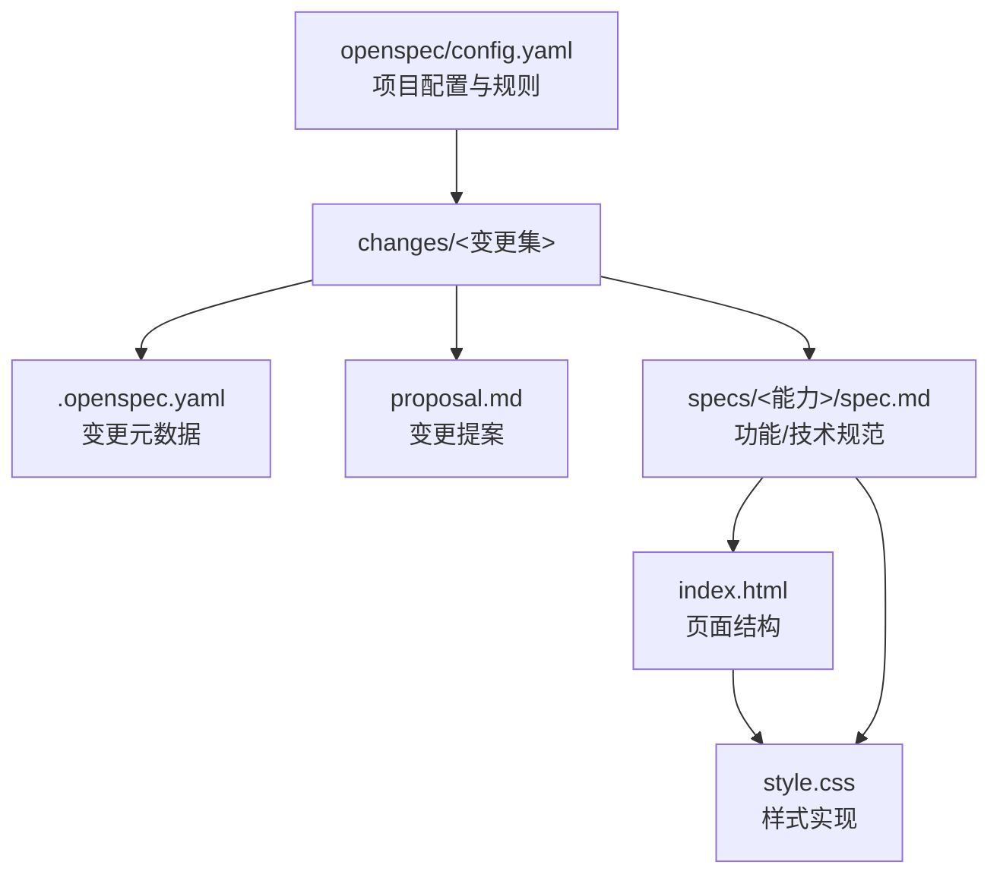
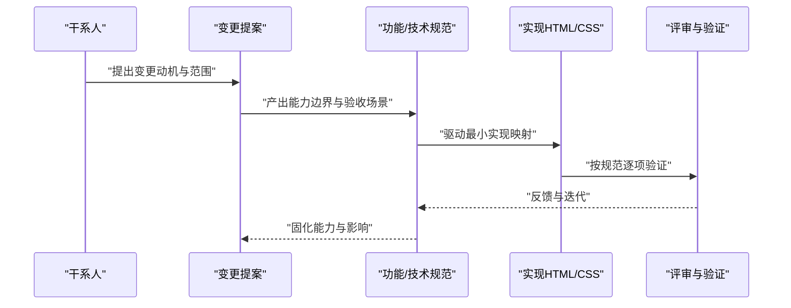
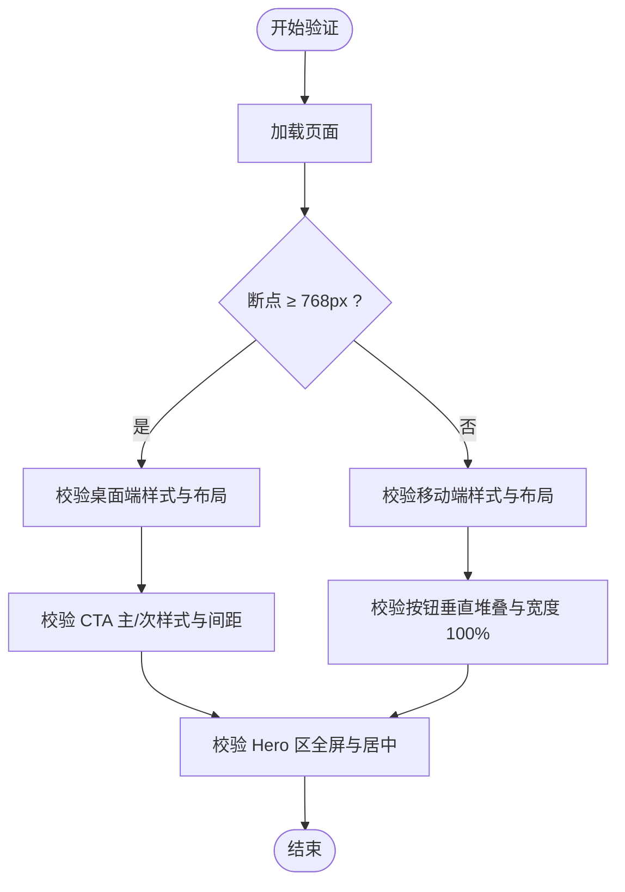
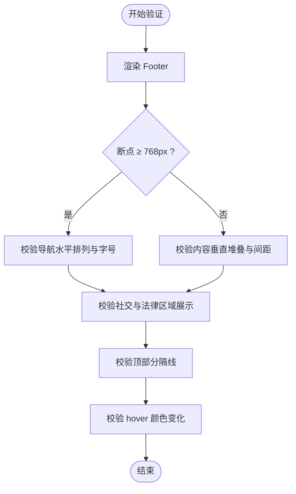
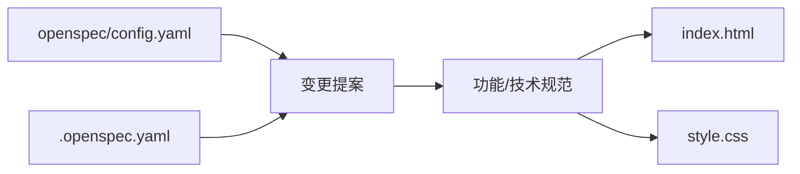

# 规范编写指南

<cite>
**本文引用的文件**
- [openspec/config.yaml](file://openspec/config.yaml)
- [proposal.md](file://openspec/changes/archive/2026-05-12-homepage-hero-footer/proposal.md)
- [.openspec.yaml](file://openspec/changes/archive/2026-05-12-homepage-hero-footer/.openspec.yaml)
- [hero-section/spec.md](file://openspec/changes/archive/2026-05-12-homepage-hero-footer/specs/hero-section/spec.md)
- [footer-section/spec.md](file://openspec/changes/archive/2026-05-12-homepage-hero-footer/specs/footer-section/spec.md)
- [index.html](file://index.html)
- [style.css](file://style.css)
</cite>

## 目录
1. [引言](#引言)
2. [项目结构](#项目结构)
3. [核心组件](#核心组件)
4. [架构总览](#架构总览)
5. [详细组件分析](#详细组件分析)
6. [依赖分析](#依赖分析)
7. [性能考虑](#性能考虑)
8. [故障排查指南](#故障排查指南)
9. [结论](#结论)
10. [附录](#附录)

## 引言
本指南面向规范编写者，系统阐述如何基于开源规范（OpenSpec）框架编写高质量的规范文档，覆盖需求规格、功能规范、技术规范等类型，并以 hero-section 与 footer-section 的完整规范为例，展示从“为什么”到“如何验证”的闭环规范流程。文档强调规范的可执行性与可验证性，提供审查清单与质量评估标准，帮助团队统一规范语言、提升协作效率。

## 项目结构
该仓库采用 OpenSpec 规范驱动的组织方式，将变更提案、规范文件与实现代码解耦管理，便于版本演进与评审追溯。

图示来源
- [openspec/config.yaml:1-21](file://openspec/config.yaml#L1-L21)
- [.openspec.yaml:1-3](file://openspec/changes/archive/2026-05-12-homepage-hero-footer/.openspec.yaml#L1-L3)
- [proposal.md:1-26](file://openspec/changes/archive/2026-05-12-homepage-hero-footer/proposal.md#L1-L26)
- [hero-section/spec.md:1-49](file://openspec/changes/archive/2026-05-12-homepage-hero-footer/specs/hero-section/spec.md#L1-L49)
- [footer-section/spec.md:1-49](file://openspec/changes/archive/2026-05-12-homepage-hero-footer/specs/footer-section/spec.md#L1-L49)
- [index.html:1-44](file://index.html#L1-L44)
- [style.css:1-194](file://style.css#L1-L194)

章节来源
- [openspec/config.yaml:1-21](file://openspec/config.yaml#L1-L21)
- [.openspec.yaml:1-3](file://openspec/changes/archive/2026-05-12-homepage-hero-footer/.openspec.yaml#L1-L3)
- [proposal.md:1-26](file://openspec/changes/archive/2026-05-12-homepage-hero-footer/proposal.md#L1-L26)

## 核心组件
- 变更提案（Proposal）：说明“为什么”进行变更、“变更内容”“新增/修改的能力”以及“影响范围”，用于高层决策与跨职能对齐。
- 功能/技术规范（Spec）：以“需求 + 场景化验收条件”的形式描述能力边界，确保可执行与可验证。
- 实现（HTML/CSS）：以最小可行实现映射规范，保证规范与实现一一对应。
- 项目配置（config.yaml）：定义规范 schema 与可选的项目上下文、工件规则，约束规范风格与长度。

章节来源
- [proposal.md:1-26](file://openspec/changes/archive/2026-05-12-homepage-hero-footer/proposal.md#L1-L26)
- [openspec/config.yaml:1-21](file://openspec/config.yaml#L1-L21)
- [index.html:1-44](file://index.html#L1-L44)
- [style.css:1-194](file://style.css#L1-L194)

## 架构总览
OpenSpec 规范驱动的“提案—规范—实现”闭环如下：

图示来源
- [proposal.md:1-26](file://openspec/changes/archive/2026-05-12-homepage-hero-footer/proposal.md#L1-L26)
- [hero-section/spec.md:1-49](file://openspec/changes/archive/2026-05-12-homepage-hero-footer/specs/hero-section/spec.md#L1-L49)
- [footer-section/spec.md:1-49](file://openspec/changes/archive/2026-05-12-homepage-hero-footer/specs/footer-section/spec.md#L1-L49)
- [index.html:1-44](file://index.html#L1-L44)
- [style.css:1-194](file://style.css#L1-L194)

## 详细组件分析

### 变更提案（Proposal）最佳实践
- 结构要点
  - Why：清晰阐述业务价值与问题背景，限定范围与约束。
  - What Changes：明确新增/修改的能力与产物（如文件、接口、行为）。
  - Capabilities：区分“新增能力”和“修改能力”，避免混淆。
  - Impact：量化影响（文件数、依赖、部署方式、回滚策略等）。
- 语言规范
  - 使用简洁、可验证的描述；避免模糊术语。
  - 列表化呈现变更点，便于评审与追踪。
- 质量评估
  - 是否覆盖所有相关方关注点？
  - 是否给出影响评估与风险提示？

章节来源
- [proposal.md:1-26](file://openspec/changes/archive/2026-05-12-homepage-hero-footer/proposal.md#L1-L26)

### 功能/技术规范（Spec）最佳实践
- 结构要求
  - 顶层分组：ADDED Requirements（新增需求）、MODIFIED Requirements（如有）。
  - 需求粒度：每个需求聚焦单一行为或界面元素，避免“复合需求”。
  - 场景化验收：以 WHEN-THEN 形式描述输入、环境与期望输出/状态。
- 语言与表达
  - 使用“SHALL/SHOULD/MAY”等规范性词汇明确约束等级。
  - 明确断点、尺寸、颜色、交互状态等可测量参数。
  - 对响应式场景，明确断点与过渡行为。
- 可执行性与可验证性
  - 将规范映射到实现中的具体选择器、属性与媒体查询。
  - 通过截图对比、自动化测试或人工验收清单进行验证。

章节来源
- [hero-section/spec.md:1-49](file://openspec/changes/archive/2026-05-12-homepage-hero-footer/specs/hero-section/spec.md#L1-L49)
- [footer-section/spec.md:1-49](file://openspec/changes/archive/2026-05-12-homepage-hero-footer/specs/footer-section/spec.md#L1-L49)

### 实现映射与验证
- 映射关系
  - 规范中的“需求 + 场景”应与 HTML 结构与 CSS 样式一一对应。
  - 响应式断点与样式规则需与规范场景一致。
- 验证清单
  - 结构完整性：是否存在所需节点与类名？
  - 样式一致性：字号、颜色、间距、对齐是否符合规范？
  - 交互一致性：悬停、焦点、过渡效果是否满足场景？
  - 响应式一致性：断点切换时的行为是否一致？

章节来源
- [index.html:1-44](file://index.html#L1-L44)
- [style.css:1-194](file://style.css#L1-L194)

### 示例：Hero 区域规范与实现对照
- 关键需求与场景
  - 主标题：字号、字重、颜色、居中；桌面端与移动端差异。
  - 副标题：字号比例、颜色、间距；桌面端与移动端差异。
  - CTA 按钮：主/次样式、内边距、交互态；移动端堆叠。
  - 全屏布局：Flexbox 居中、最小高度 100vh。
  - 响应式：以 768px 为断点的过渡。
- 实现映射
  - HTML 节点与类名承载语义与样式锚点。
  - CSS 选择器与媒体查询实现断点与状态。
- 验证流程
  - 截图比对：在断点处核对字号、间距、布局。
  - 交互验证：悬停态、点击态是否符合场景。
  - 自动化：以媒体查询与选择器存在性作为自动化检查项。

图示来源
- [hero-section/spec.md:3-49](file://openspec/changes/archive/2026-05-12-homepage-hero-footer/specs/hero-section/spec.md#L3-L49)
- [index.html:11-18](file://index.html#L11-L18)
- [style.css:39-100](file://style.css#L39-L100)
- [style.css:155-177](file://style.css#L155-L177)

章节来源
- [hero-section/spec.md:1-49](file://openspec/changes/archive/2026-05-12-homepage-hero-footer/specs/hero-section/spec.md#L1-L49)
- [index.html:1-44](file://index.html#L1-L44)
- [style.css:1-194](file://style.css#L1-L194)

### 示例：Footer 区域规范与实现对照
- 关键需求与场景
  - 一行式布局：导航、社交、法律信息水平排列；断点下垂直堆叠。
  - 导航链接：可点击、hover 颜色变化、无下划线。
  - 社交入口：以文字标签展示 GitHub 等。
  - 版权与法律：显示格式与法律链接可访问。
  - 顶部分隔线：1px 分隔线与间距。
- 实现映射
  - HTML 使用 nav、span（分隔符）、div 容器承载三段内容。
  - CSS 控制 FlexWrap、gap、hover 效果与断点样式。
- 验证流程
  - 断点切换：确认断点下布局方向与间距变化。
  - 文本与链接：确认分隔符与链接文本、href 占位。
  - 交互：hover 颜色变化是否一致。

图示来源
- [footer-section/spec.md:3-49](file://openspec/changes/archive/2026-05-12-homepage-hero-footer/specs/footer-section/spec.md#L3-L49)
- [index.html:20-40](file://index.html#L20-L40)
- [style.css:105-149](file://style.css#L105-L149)
- [style.css:178-193](file://style.css#L178-L193)

章节来源
- [footer-section/spec.md:1-49](file://openspec/changes/archive/2026-05-12-homepage-hero-footer/specs/footer-section/spec.md#L1-L49)
- [index.html:1-44](file://index.html#L1-L44)
- [style.css:1-194](file://style.css#L1-L194)

## 依赖分析
- 组件耦合
  - Proposal 与 Spec：提案决定规范范围，规范细化能力边界。
  - Spec 与实现：规范驱动实现，实现反哺规范的可执行性与可验证性。
- 外部依赖
  - 项目配置（config.yaml）定义规范 schema 与可选规则，约束规范风格与长度。
  - 变更元数据（.openspec.yaml）记录变更时间与 schema，便于版本追踪。

图示来源
- [openspec/config.yaml:1-21](file://openspec/config.yaml#L1-L21)
- [.openspec.yaml:1-3](file://openspec/changes/archive/2026-05-12-homepage-hero-footer/.openspec.yaml#L1-L3)
- [proposal.md:1-26](file://openspec/changes/archive/2026-05-12-homepage-hero-footer/proposal.md#L1-L26)
- [hero-section/spec.md:1-49](file://openspec/changes/archive/2026-05-12-homepage-hero-footer/specs/hero-section/spec.md#L1-L49)
- [footer-section/spec.md:1-49](file://openspec/changes/archive/2026-05-12-homepage-hero-footer/specs/footer-section/spec.md#L1-L49)
- [index.html:1-44](file://index.html#L1-L44)
- [style.css:1-194](file://style.css#L1-L194)

章节来源
- [openspec/config.yaml:1-21](file://openspec/config.yaml#L1-L21)
- [.openspec.yaml:1-3](file://openspec/changes/archive/2026-05-12-homepage-hero-footer/.openspec.yaml#L1-L3)

## 性能考虑
- 规范层面
  - 明确断点与最小化媒体查询数量，减少实现复杂度。
  - 使用语义化标签与合理类名，降低选择器层级与匹配成本。
- 实现层面
  - 合理使用 Flexbox 与 CSS Grid，避免过度重排。
  - 控制动画与过渡数量，优先使用 transform 与 opacity。
  - 响应式图片与字体加载策略，避免阻塞首屏。

## 故障排查指南
- 常见问题
  - 规范与实现不一致：核对选择器、类名与媒体查询是否与规范场景一致。
  - 断点切换异常：检查断点值与媒体查询范围，确认移动端优先策略。
  - 交互无效：检查 hover 状态与事件绑定，确认 CSS transition 生效。
- 排查步骤
  - 逐条对照规范场景，定位缺失或偏差项。
  - 使用浏览器开发者工具检查计算样式与盒模型。
  - 以断点切换与交互操作验证行为一致性。
- 回归建议
  - 为关键场景建立截图基线，便于回归对比。
  - 将规范场景转化为自动化测试用例，保障长期一致性。

## 结论
高质量的规范文档应以“可执行、可验证”为核心目标，通过“Why-What-Capabilities-Impact”的提案闭环与“需求+场景”的规范结构，将抽象能力转化为可落地的实现。以 hero-section 与 footer-section 为例，规范与实现的映射越清晰，评审与验证的成本越低，交付质量越高。建议团队在项目配置中沉淀上下文与规则，持续优化规范编写与审查流程。

## 附录

### 规范编写模板（概要）
- 变更提案（Proposal）
  - Why：背景、目标、约束
  - What Changes：新增/修改的能力与产物
  - Capabilities：新增/修改能力列表
  - Impact：影响范围与风险
- 功能/技术规范（Spec）
  - ADDED Requirements：新增需求
    - 需求条目：行为/外观/交互
    - 场景化验收：WHEN-THEN 条件
  - MODIFIED Requirements：如有
- 实现映射
  - HTML 节点与类名
  - CSS 选择器与媒体查询
  - 断点与过渡行为

### 规范审查清单
- 结构完整性
  - 是否包含 Why/What/Capabilities/Impact？
  - 是否按能力拆分规范，避免复合需求？
- 语言与表达
  - 是否使用规范性词汇？参数是否可测量？
  - 断点、颜色、尺寸是否明确？
- 可执行性与可验证性
  - 是否与实现一一对应？
  - 是否可通过截图/自动化/人工验收验证？

### 质量评估标准
- 清晰度：需求与场景是否明确、无歧义
- 完整性：是否覆盖所有关键行为与断点
- 一致性：规范与实现、断点与样式是否一致
- 可维护性：是否便于评审、回溯与迭代