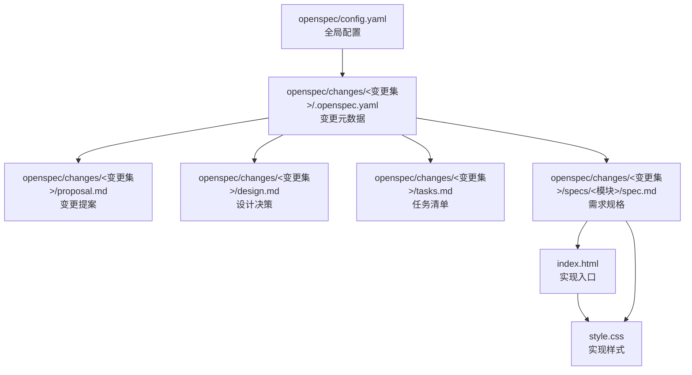
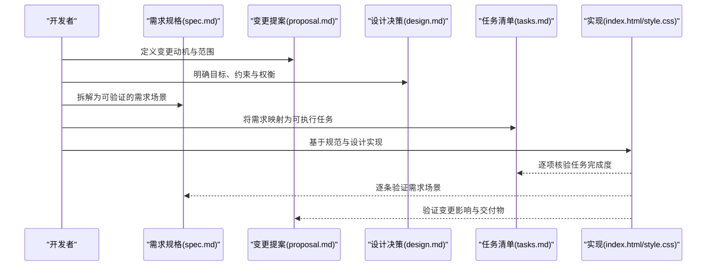
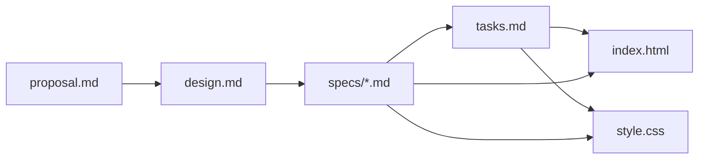
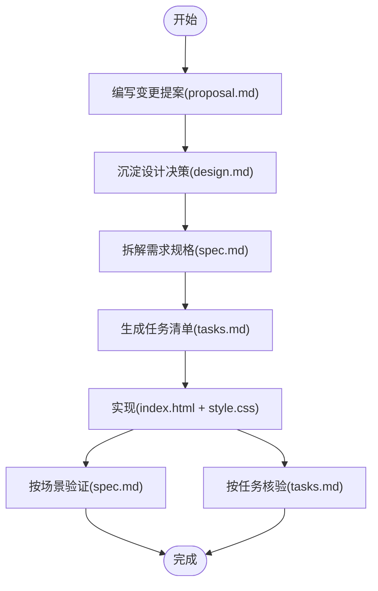

# 规范驱动开发

<cite>
**本文引用的文件**
- [openspec/config.yaml](file://openspec/config.yaml)
- [.openspec.yaml](file://openspec/changes/homepage-hero-footer/.openspec.yaml)
- [proposal.md](file://openspec/changes/homepage-hero-footer/proposal.md)
- [design.md](file://openspec/changes/homepage-hero-footer/design.md)
- [tasks.md](file://openspec/changes/homepage-hero-footer/tasks.md)
- [spec.md（Hero 区）](file://openspec/changes/homepage-hero-footer/specs/hero-section/spec.md)
- [spec.md（Footer 区）](file://openspec/changes/homepage-hero-footer/specs/footer-section/spec.md)
- [index.html](file://index.html)
- [style.css](file://style.css)
</cite>

## 目录
1. [简介](#简介)
2. [项目结构](#项目结构)
3. [核心组件](#核心组件)
4. [架构总览](#架构总览)
5. [详细组件分析](#详细组件分析)
6. [依赖关系分析](#依赖关系分析)
7. [性能考量](#性能考量)
8. [故障排查指南](#故障排查指南)
9. [结论](#结论)
10. [附录](#附录)

## 简介
本文件系统性阐述 openSpec 的“规范驱动开发”模式，围绕从需求到实现的完整闭环展开，重点说明：
- 如何通过规范文档驱动代码实现，包括需求规格定义、变更提案编写、验收标准制定等关键环节
- .openspec.yaml 配置文件的作用与格式
- proposal.md 的结构与编写规范
- 从规范到实现的落地流程与最佳实践
- 常见问题与解决方案

openSpec 项目以“纯静态网站”为例，展示了如何用最小化文件与克制设计，快速产出可直接部署的首页原型，同时确保实现与规范一致。

## 项目结构
该项目采用“变更集（Change Set）+ 规范（Spec）+ 实现（HTML/CSS）”的组织方式，便于追踪版本演进与回归验证。

图表来源
- [openspec/config.yaml:1-21](file://openspec/config.yaml#L1-L21)
- [.openspec.yaml:1-3](file://openspec/changes/homepage-hero-footer/.openspec.yaml#L1-L3)
- [proposal.md:1-26](file://openspec/changes/homepage-hero-footer/proposal.md#L1-L26)
- [design.md:1-84](file://openspec/changes/homepage-hero-footer/design.md#L1-L84)
- [tasks.md:1-35](file://openspec/changes/homepage-hero-footer/tasks.md#L1-L35)
- [spec.md（Hero 区）:1-49](file://openspec/changes/homepage-hero-footer/specs/hero-section/spec.md#L1-L49)
- [spec.md（Footer 区）:1-49](file://openspec/changes/homepage-hero-footer/specs/footer-section/spec.md#L1-L49)
- [index.html:1-44](file://index.html#L1-L44)
- [style.css:1-194](file://style.css#L1-L194)

章节来源
- [openspec/config.yaml:1-21](file://openspec/config.yaml#L1-L21)
- [.openspec.yaml:1-3](file://openspec/changes/homepage-hero-footer/.openspec.yaml#L1-L3)
- [proposal.md:1-26](file://openspec/changes/homepage-hero-footer/proposal.md#L1-L26)
- [design.md:1-84](file://openspec/changes/homepage-hero-footer/design.md#L1-L84)
- [tasks.md:1-35](file://openspec/changes/homepage-hero-footer/tasks.md#L1-L35)
- [spec.md（Hero 区）:1-49](file://openspec/changes/homepage-hero-footer/specs/hero-section/spec.md#L1-L49)
- [spec.md（Footer 区）:1-49](file://openspec/changes/homepage-hero-footer/specs/footer-section/spec.md#L1-L49)
- [index.html:1-44](file://index.html#L1-L44)
- [style.css:1-194](file://style.css#L1-L194)

## 核心组件
- 变更元数据：用于标识变更集的 schema、创建时间等元信息，保证变更可追溯与可审计
- 变更提案（proposal.md）：描述“为什么需要变更、变更内容、新增/修改的能力、影响范围”
- 设计决策（design.md）：记录设计目标、约束、权衡、选择与备选方案
- 需求规格（specs/*.md）：以“需求 + 场景”的形式明确功能与验收条件
- 任务清单（tasks.md）：将需求拆解为可执行的任务，形成“验收清单”
- 实现产物：index.html 与 style.css，严格遵循规范与设计决策

章节来源
- [.openspec.yaml:1-3](file://openspec/changes/homepage-hero-footer/.openspec.yaml#L1-L3)
- [proposal.md:1-26](file://openspec/changes/homepage-hero-footer/proposal.md#L1-L26)
- [design.md:1-84](file://openspec/changes/homepage-hero-footer/design.md#L1-L84)
- [tasks.md:1-35](file://openspec/changes/homepage-hero-footer/tasks.md#L1-L35)
- [spec.md（Hero 区）:1-49](file://openspec/changes/homepage-hero-footer/specs/hero-section/spec.md#L1-L49)
- [spec.md（Footer 区）:1-49](file://openspec/changes/homepage-hero-footer/specs/footer-section/spec.md#L1-L49)
- [index.html:1-44](file://index.html#L1-L44)
- [style.css:1-194](file://style.css#L1-L194)

## 架构总览
openSpec 的“规范驱动开发”以“变更集”为单位，形成“规范 -> 实现 -> 验收”的闭环。

图表来源
- [proposal.md:1-26](file://openspec/changes/homepage-hero-footer/proposal.md#L1-L26)
- [design.md:1-84](file://openspec/changes/homepage-hero-footer/design.md#L1-L84)
- [tasks.md:1-35](file://openspec/changes/homepage-hero-footer/tasks.md#L1-L35)
- [spec.md（Hero 区）:1-49](file://openspec/changes/homepage-hero-footer/specs/hero-section/spec.md#L1-L49)
- [spec.md（Footer 区）:1-49](file://openspec/changes/homepage-hero-footer/specs/footer-section/spec.md#L1-L49)
- [index.html:1-44](file://index.html#L1-L44)
- [style.css:1-194](file://style.css#L1-L194)

## 详细组件分析

### .openspec.yaml：变更集元数据
- 作用：标识变更集的 schema 类型与创建时间，统一变更管理入口
- 关键字段
  - schema：固定值，表明该变更集遵循“规范驱动”模式
  - created：变更集创建日期，便于版本与时间线管理
- 使用建议
  - 每个变更集均应包含该文件，保持一致性
  - 可扩展字段用于团队约定（如负责人、状态）

章节来源
- [.openspec.yaml:1-3](file://openspec/changes/homepage-hero-footer/.openspec.yaml#L1-L3)

### proposal.md：变更提案
- 目标：清晰说明“为什么需要变更、变更内容、新增/修改的能力、影响范围”
- 结构要点
  - Why：背景与动机，强调用户价值与业务目标
  - What Changes：具体改动项，尽量量化（文件数、能力数、依赖变化）
  - Capabilities：新增/修改的能力列表，便于后续能力矩阵管理
  - Impact：对技术栈、部署、测试、运维的影响评估
- 编写规范
  - 语言简洁、目标明确，避免模糊表述
  - 与 design.md 的设计目标保持一致
  - 与 tasks.md 的任务清单相互印证

章节来源
- [proposal.md:1-26](file://openspec/changes/homepage-hero-footer/proposal.md#L1-L26)

### design.md：设计决策
- 目标：沉淀设计目标、约束、权衡、选择与备选方案
- 结构要点
  - Context：项目背景与现状
  - Goals / Non-Goals：明确目标与边界
  - Decisions：列出关键设计决策及其理由与备选方案
  - Risks / Trade-offs：识别风险与权衡点
- 编写规范
  - 以“选择 + 理由 + 备选方案”的结构呈现
  - 与 proposal.md 的目标一致，避免设计漂移
  - 为后续评审与回溯提供依据

章节来源
- [design.md:1-84](file://openspec/changes/homepage-hero-footer/design.md#L1-L84)

### tasks.md：任务清单
- 目标：将需求拆解为可执行、可验证的任务，形成“验收清单”
- 结构要点
  - 分阶段（如初始化、模块实现、响应式、最终验证）
  - 每项任务包含“输入（HTML/CSS）+ 输出（行为/样式）+ 验证点”
  - 使用勾选项便于跟踪进度
- 编写规范
  - 与 spec.md 的场景一一对应
  - 优先覆盖关键路径与边界条件
  - 与实现文件（index.html/style.css）保持同步

章节来源
- [tasks.md:1-35](file://openspec/changes/homepage-hero-footer/tasks.md#L1-L35)

### 规格文档：spec.md（Hero 区）
- 目标：以“需求 + 场景”的形式定义可验证的行为与样式
- 结构要点
  - ADDED Requirements：新增需求
  - Requirement：每个需求下包含若干场景（When/Then）
  - 场景覆盖：桌面端、移动端、交互态、响应式断点
- 编写规范
  - 使用“ SHALL + 行为/样式 + 条件 + 验证点”的句式
  - 场景尽量覆盖断点、交互、可访问性等维度
  - 与 tasks.md 的任务项一一对应

章节来源
- [spec.md（Hero 区）:1-49](file://openspec/changes/homepage-hero-footer/specs/hero-section/spec.md#L1-L49)

### 规格文档：spec.md（Footer 区）
- 目标：定义 Footer 的布局、内容与交互要求
- 结构要点
  - 一行式布局与断点行为
  - 导航、社交、法律信息的展示与交互
  - 顶部分隔线与移动端堆叠
- 编写规范
  - 与 Hero 区保持一致的“需求 + 场景”风格
  - 明确颜色、字号、间距等可量化的样式指标

章节来源
- [spec.md（Footer 区）:1-49](file://openspec/changes/homepage-hero-footer/specs/footer-section/spec.md#L1-L49)

### 实现：index.html 与 style.css
- 实现原则
  - 严格遵循 spec.md 的需求与场景
  - 严格遵循 design.md 的设计目标与约束
  - 严格对照 tasks.md 的任务清单进行逐项核验
- 关键点
  - HTML 语义化标签使用恰当
  - CSS Reset 与系统字体栈确保跨平台一致性
  - 响应式断点与媒体查询覆盖所有场景
  - 无 JavaScript 依赖，纯静态可直接部署

章节来源
- [index.html:1-44](file://index.html#L1-L44)
- [style.css:1-194](file://style.css#L1-L194)

## 依赖关系分析
- 规范驱动实现的依赖链
  - proposal.md -> design.md -> spec.md -> tasks.md -> index.html + style.css
- 组件耦合与内聚
  - 各变更集内部高度内聚，跨变更集通过 schema 与 created 字段关联
  - spec.md 与 tasks.md 互为镜像，前者定义“做什么”，后者定义“怎么做”
  - 实现文件与规范文件一一对应，便于回归验证

图表来源
- [proposal.md:1-26](file://openspec/changes/homepage-hero-footer/proposal.md#L1-L26)
- [design.md:1-84](file://openspec/changes/homepage-hero-footer/design.md#L1-L84)
- [tasks.md:1-35](file://openspec/changes/homepage-hero-footer/tasks.md#L1-L35)
- [spec.md（Hero 区）:1-49](file://openspec/changes/homepage-hero-footer/specs/hero-section/spec.md#L1-L49)
- [spec.md（Footer 区）:1-49](file://openspec/changes/homepage-hero-footer/specs/footer-section/spec.md#L1-L49)
- [index.html:1-44](file://index.html#L1-L44)
- [style.css:1-194](file://style.css#L1-L194)

## 性能考量
- 静态部署优势
  - 无运行时依赖，可直接部署到任意静态托管服务
  - 无构建工具，减少开发与运维复杂度
- 样式与脚本
  - 采用 CSS Reset 与系统字体栈，避免额外资源请求
  - 无 JavaScript 依赖，首屏渲染无需等待脚本加载
- 响应式策略
  - 单一断点（768px）简化媒体查询，降低计算开销
  - Flexbox 布局在现代浏览器中性能优异

## 故障排查指南
- 规范与实现不一致
  - 逐条对照 spec.md 的场景与 tasks.md 的任务，确认实现是否覆盖
  - 使用浏览器开发者工具检查盒模型、字体大小、颜色与间距
- 响应式异常
  - 检查媒体查询断点与属性覆盖顺序
  - 确认移动端布局（按钮堆叠、Footer 垂直堆叠）是否生效
- 语义与可访问性
  - 确保 HTML 标签使用恰当（h1、p、a 等）
  - 确认链接可点击且 hover 状态符合预期
- 部署与兼容性
  - 确认 index.html 正确引入 style.css
  - 在禁用 JavaScript 的环境下验证页面渲染

章节来源
- [tasks.md:1-35](file://openspec/changes/homepage-hero-footer/tasks.md#L1-L35)
- [spec.md（Hero 区）:1-49](file://openspec/changes/homepage-hero-footer/specs/hero-section/spec.md#L1-L49)
- [spec.md（Footer 区）:1-49](file://openspec/changes/homepage-hero-footer/specs/footer-section/spec.md#L1-L49)
- [index.html:1-44](file://index.html#L1-L44)
- [style.css:1-194](file://style.css#L1-L194)

## 结论
openSpec 的“规范驱动开发”通过“变更集 + 规范 + 实现 + 验收”的闭环，实现了从需求到交付的高一致性与可追溯性。该模式特别适用于小型、纯静态项目，能够在最短时间内产出高质量的可部署原型，并为后续迭代提供清晰的基线与回归保障。

## 附录

### .openspec.yaml 配置文件格式说明
- schema：固定值，标识该变更集遵循“规范驱动”模式
- created：变更集创建日期（YYYY-MM-DD），便于版本与时间线管理
- 扩展字段：可根据团队约定扩展（如负责人、状态、标签）

章节来源
- [.openspec.yaml:1-3](file://openspec/changes/homepage-hero-footer/.openspec.yaml#L1-L3)

### proposal.md 结构与编写规范
- Why：说明变更动机与业务价值
- What Changes：列出具体改动项（文件、能力、依赖）
- Capabilities：新增/修改的能力清单
- Impact：对技术栈、部署、测试、运维的影响评估

章节来源
- [proposal.md:1-26](file://openspec/changes/homepage-hero-footer/proposal.md#L1-L26)

### 从规范到实现的完整流程图

图表来源
- [proposal.md:1-26](file://openspec/changes/homepage-hero-footer/proposal.md#L1-L26)
- [design.md:1-84](file://openspec/changes/homepage-hero-footer/design.md#L1-L84)
- [tasks.md:1-35](file://openspec/changes/homepage-hero-footer/tasks.md#L1-L35)
- [spec.md（Hero 区）:1-49](file://openspec/changes/homepage-hero-footer/specs/hero-section/spec.md#L1-L49)
- [spec.md（Footer 区）:1-49](file://openspec/changes/homepage-hero-footer/specs/footer-section/spec.md#L1-L49)
- [index.html:1-44](file://index.html#L1-L44)
- [style.css:1-194](file://style.css#L1-L194)