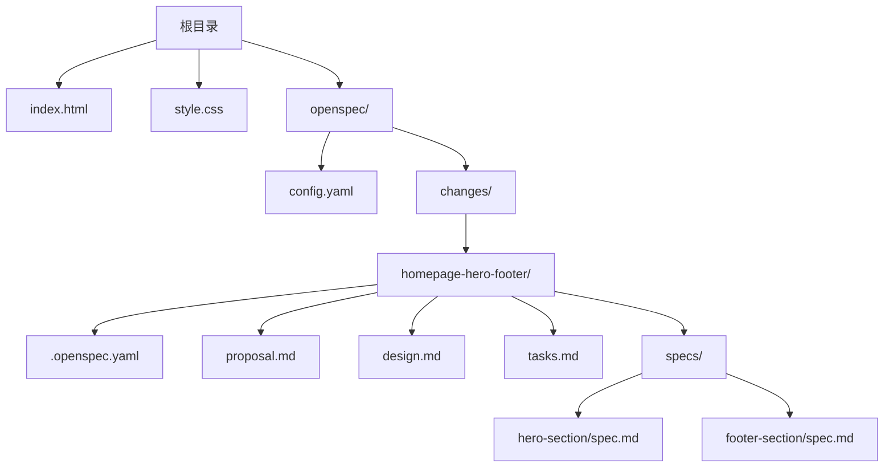
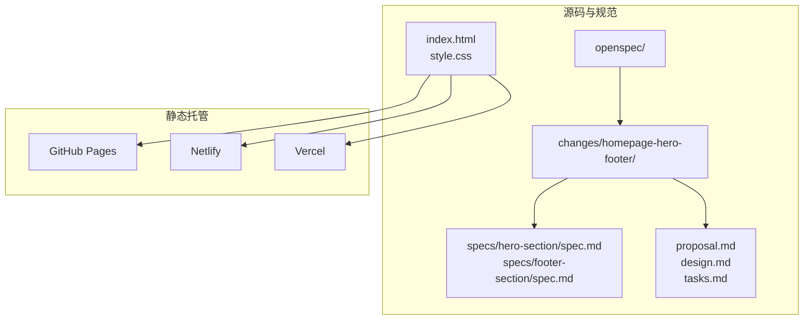
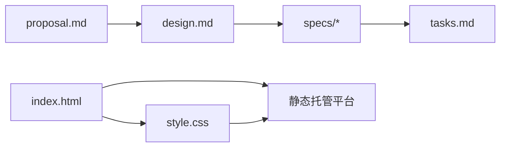

# 部署与维护

<cite>
**本文引用的文件**
- [index.html](file://index.html)
- [style.css](file://style.css)
- [openspec/config.yaml](file://openspec/config.yaml)
- [openspec/changes/homepage-hero-footer/.openspec.yaml](file://openspec/changes/homepage-hero-footer/.openspec.yaml)
- [openspec/changes/homepage-hero-footer/proposal.md](file://openspec/changes/homepage-hero-footer/proposal.md)
- [openspec/changes/homepage-hero-footer/design.md](file://openspec/changes/homepage-hero-footer/design.md)
- [openspec/changes/homepage-hero-footer/specs/hero-section/spec.md](file://openspec/changes/homepage-hero-footer/specs/hero-section/spec.md)
- [openspec/changes/homepage-hero-footer/specs/footer-section/spec.md](file://openspec/changes/homepage-hero-footer/specs/footer-section/spec.md)
- [openspec/changes/homepage-hero-footer/tasks.md](file://openspec/changes/homepage-hero-footer/tasks.md)
</cite>

## 目录
1. [简介](#简介)
2. [项目结构](#项目结构)
3. [核心组件](#核心组件)
4. [架构总览](#架构总览)
5. [详细组件分析](#详细组件分析)
6. [依赖关系分析](#依赖关系分析)
7. [性能考虑](#性能考虑)
8. [故障排查指南](#故障排查指南)
9. [结论](#结论)
10. [附录](#附录)

## 简介
本指南面向运维人员与项目经理，围绕 openSpec 项目的静态部署与维护提供系统化方法论。openSpec 是一个以“规范驱动”为核心的文档化项目，当前示例实现为纯静态网站（index.html + style.css）。本指南涵盖：
- 静态部署流程与目标平台（GitHub Pages、Netlify、Vercel）的操作步骤
- 自动化部署配置与 CI/CD 最佳实践
- 版本管理策略、变更管理流程与回滚机制
- 监控与日志、性能测试与安全检查
- 内容更新流程、用户反馈处理与持续改进机制

## 项目结构
该项目采用“规范驱动”的文档化方式组织内容，核心产物为一个纯静态站点（index.html + style.css），并通过 openspec 目录下的 YAML 与 Markdown 文件描述变更提案、设计决策、规格与任务清单。

图表来源
- [index.html](file://index.html)
- [style.css](file://style.css)
- [openspec/config.yaml](file://openspec/config.yaml)
- [openspec/changes/homepage-hero-footer/.openspec.yaml](file://openspec/changes/homepage-hero-footer/.openspec.yaml)
- [openspec/changes/homepage-hero-footer/proposal.md](file://openspec/changes/homepage-hero-footer/proposal.md)
- [openspec/changes/homepage-hero-footer/design.md](file://openspec/changes/homepage-hero-footer/design.md)
- [openspec/changes/homepage-hero-footer/specs/hero-section/spec.md](file://openspec/changes/homepage-hero-footer/specs/hero-section/spec.md)
- [openspec/changes/homepage-hero-footer/specs/footer-section/spec.md](file://openspec/changes/homepage-hero-footer/specs/footer-section/spec.md)
- [openspec/changes/homepage-hero-footer/tasks.md](file://openspec/changes/homepage-hero-footer/tasks.md)

章节来源
- [index.html](file://index.html)
- [style.css](file://style.css)
- [openspec/config.yaml](file://openspec/config.yaml)
- [openspec/changes/homepage-hero-footer/.openspec.yaml](file://openspec/changes/homepage-hero-footer/.openspec.yaml)
- [openspec/changes/homepage-hero-footer/proposal.md](file://openspec/changes/homepage-hero-footer/proposal.md)
- [openspec/changes/homepage-hero-footer/design.md](file://openspec/changes/homepage-hero-footer/design.md)
- [openspec/changes/homepage-hero-footer/specs/hero-section/spec.md](file://openspec/changes/homepage-hero-footer/specs/hero-section/spec.md)
- [openspec/changes/homepage-hero-footer/specs/footer-section/spec.md](file://openspec/changes/homepage-hero-footer/specs/footer-section/spec.md)
- [openspec/changes/homepage-hero-footer/tasks.md](file://openspec/changes/homepage-hero-footer/tasks.md)

## 核心组件
- 静态站点产物
  - index.html：页面结构与语义标记，包含 Hero 区与 Footer 区。
  - style.css：样式定义，包含 CSS Reset、系统字体栈、Hero 区布局、CTA 按钮样式、Footer 布局与响应式断点。
- 规范与变更管理
  - openspec/config.yaml：项目上下文与规则配置（可扩展）。
  - homepage-hero-footer 变更集：包含提案、设计、规格与任务清单，形成“需求—设计—实现—验证”的闭环。
- 规格文档
  - hero-section/spec.md：Hero 区的详细需求与场景。
  - footer-section/spec.md：Footer 区的详细需求与场景。

章节来源
- [index.html](file://index.html)
- [style.css](file://style.css)
- [openspec/config.yaml](file://openspec/config.yaml)
- [openspec/changes/homepage-hero-footer/proposal.md](file://openspec/changes/homepage-hero-footer/proposal.md)
- [openspec/changes/homepage-hero-footer/design.md](file://openspec/changes/homepage-hero-footer/design.md)
- [openspec/changes/homepage-hero-footer/specs/hero-section/spec.md](file://openspec/changes/homepage-hero-footer/specs/hero-section/spec.md)
- [openspec/changes/homepage-hero-footer/specs/footer-section/spec.md](file://openspec/changes/homepage-hero-footer/specs/footer-section/spec.md)

## 架构总览
openSpec 的静态部署架构由“源码与规范”和“静态托管”两部分组成。源码与规范通过规范驱动的文档化流程进行管理；静态托管负责将构建产物（index.html + style.css）发布到互联网。

图表来源
- [index.html](file://index.html)
- [style.css](file://style.css)
- [openspec/changes/homepage-hero-footer/specs/hero-section/spec.md](file://openspec/changes/homepage-hero-footer/specs/hero-section/spec.md)
- [openspec/changes/homepage-hero-footer/specs/footer-section/spec.md](file://openspec/changes/homepage-hero-footer/specs/footer-section/spec.md)
- [openspec/changes/homepage-hero-footer/proposal.md](file://openspec/changes/homepage-hero-footer/proposal.md)
- [openspec/changes/homepage-hero-footer/design.md](file://openspec/changes/homepage-hero-footer/design.md)
- [openspec/changes/homepage-hero-footer/tasks.md](file://openspec/changes/homepage-hero-footer/tasks.md)

## 详细组件分析

### 组件一：静态站点（index.html + style.css）
- 结构职责
  - index.html：承载页面语义结构，包含 Hero 区与 Footer 区，使用语义化标签确保可访问性与 SEO 基础能力。
  - style.css：提供样式与响应式布局，采用系统字体栈与极简配色，满足跨平台一致性与即时渲染。
- 关键实现要点
  - Hero 区：全屏高度、Flexbox 居中、主标题与副标题字号随断点变化、CTA 按钮在移动端堆叠。
  - Footer 区：单行水平布局（桌面端）、垂直堆叠（移动端）、分隔线与交互状态。
  - 响应式断点：以 768px 为单一断点，覆盖标题字号、按钮排列与内边距等关键样式。
- 复杂度与性能
  - 时间复杂度：页面渲染为 O(1)，样式计算与布局为 O(n)（n 为 DOM 节点数），极简结构下性能开销低。
  - 空间复杂度：CSS 与 HTML 体积小，无外部资源依赖，首屏渲染快。
- 错误处理与边界
  - 无 JS 依赖，禁用 JS 场景仍可正常渲染；断点覆盖全面，避免移动端布局异常。

章节来源
- [index.html](file://index.html)
- [style.css](file://style.css)

### 组件二：规范驱动的变更管理（homepage-hero-footer）
- 变更生命周期
  - 提案（proposal.md）：阐述动机、变更范围与新增能力，明确影响与依赖。
  - 设计（design.md）：定义目标、约束、决策与权衡，给出文件结构、字体策略、布局与颜色体系等设计选择。
  - 规格（specs/hero-section/spec.md、specs/footer-section/spec.md）：以场景化需求描述功能细节，便于验收与回归。
  - 任务（tasks.md）：将规格拆解为可执行的任务清单，用于开发与验证。
- 规范元数据（.openspec.yaml）
  - 标识规范版本与创建时间，便于追踪与审计。
- 与静态部署的关系
  - 规范文档为静态产物的实现提供依据，确保部署前的质量与一致性；变更评审通过后方可进入部署阶段。

章节来源
- [openspec/changes/homepage-hero-footer/proposal.md](file://openspec/changes/homepage-hero-footer/proposal.md)
- [openspec/changes/homepage-hero-footer/design.md](file://openspec/changes/homepage-hero-footer/design.md)
- [openspec/changes/homepage-hero-footer/specs/hero-section/spec.md](file://openspec/changes/homepage-hero-footer/specs/hero-section/spec.md)
- [openspec/changes/homepage-hero-footer/specs/footer-section/spec.md](file://openspec/changes/homepage-hero-footer/specs/footer-section/spec.md)
- [openspec/changes/homepage-hero-footer/tasks.md](file://openspec/changes/homepage-hero-footer/tasks.md)
- [openspec/changes/homepage-hero-footer/.openspec.yaml](file://openspec/changes/homepage-hero-footer/.openspec.yaml)

### 组件三：静态托管平台集成（GitHub Pages、Netlify、Vercel）
- 平台共性
  - 均支持直接托管静态文件（index.html + style.css），无需运行时环境。
  - 支持自定义域名、HTTPS、缓存与压缩等基础能力。
- GitHub Pages
  - 推荐使用仓库的 gh-pages 分支或根目录发布；可通过 Actions 自动化构建与部署。
- Netlify/Vercel
  - 提供拖拽式上传与 Git 集成；支持预览分支、环境变量与自动 HTTPS。
- 自动化部署建议
  - 使用 CI/CD 流水线在 PR 合并后触发构建与部署，结合规范文档的验收清单进行质量门禁。

章节来源
- [index.html](file://index.html)
- [style.css](file://style.css)

### 组件四：版本管理与回滚策略
- 版本标识
  - 使用规范元数据中的创建时间与 schema 标识版本，便于追踪变更批次。
- 回滚机制
  - 静态站点可基于文件哈希或版本号进行回滚；平台通常支持历史版本查看与一键回滚。
- 变更管理流程
  - 通过规范文档进行变更评审与验收，确保每次变更可追溯、可验证、可回滚。

章节来源
- [openspec/changes/homepage-hero-footer/.openspec.yaml](file://openspec/changes/homepage-hero-footer/.openspec.yaml)

## 依赖关系分析
- 源码依赖
  - index.html 依赖 style.css（通过 link 引入）。
- 规范依赖
  - 规格文档与设计文档共同指导实现；任务清单用于落地与验证。
- 平台依赖
  - 静态托管平台依赖于文件结构与路径；无需运行时依赖。

图表来源
- [index.html](file://index.html)
- [style.css](file://style.css)
- [openspec/changes/homepage-hero-footer/proposal.md](file://openspec/changes/homepage-hero-footer/proposal.md)
- [openspec/changes/homepage-hero-footer/design.md](file://openspec/changes/homepage-hero-footer/design.md)
- [openspec/changes/homepage-hero-footer/specs/hero-section/spec.md](file://openspec/changes/homepage-hero-footer/specs/hero-section/spec.md)
- [openspec/changes/homepage-hero-footer/specs/footer-section/spec.md](file://openspec/changes/homepage-hero-footer/specs/footer-section/spec.md)
- [openspec/changes/homepage-hero-footer/tasks.md](file://openspec/changes/homepage-hero-footer/tasks.md)

## 性能考虑
- 首屏渲染
  - 采用系统字体栈与内联样式（或最小化 CSS），减少网络请求与阻塞。
- 响应式与布局
  - 单一断点策略降低复杂度，提升渲染效率。
- 资源优化
  - 无图片与第三方脚本，静态资源体积小，CDN 加速显著。
- 监控指标
  - 关注首次内容绘制（FCP）、最大内容绘制（LCP）、交互时间（INP）等核心指标。

## 故障排查指南
- 常见问题
  - 样式未生效：检查 index.html 是否正确引入 style.css，确认路径与缓存。
  - 响应式异常：核对 768px 断点是否覆盖所有移动端样式，检查媒体查询优先级。
  - 链接不可点击：确认 Footer 导航与法律链接使用正确的语义标签与 href。
- 规范验证
  - 对照规格文档逐项验证，确保每个场景均满足要求。
- 回滚与恢复
  - 基于平台历史版本或文件哈希进行回滚；保留变更日志以便定位问题。

章节来源
- [style.css](file://style.css)
- [openspec/changes/homepage-hero-footer/specs/hero-section/spec.md](file://openspec/changes/homepage-hero-footer/specs/hero-section/spec.md)
- [openspec/changes/homepage-hero-footer/specs/footer-section/spec.md](file://openspec/changes/homepage-hero-footer/specs/footer-section/spec.md)

## 结论
openSpec 项目通过规范驱动的文档化流程，将静态站点的实现与部署标准化、可追溯化。运维人员可据此快速完成多平台部署与自动化集成；项目经理可基于规范文档推进版本管理与变更控制。建议在现有基础上逐步引入 CI/CD、监控与安全扫描，持续提升交付质量与稳定性。

## 附录

### A. 静态部署流程（平台指引）
- GitHub Pages
  - 方式一：仓库根目录发布（静态站点直接托管）
  - 方式二：gh-pages 分支发布（推荐配合 CI）
  - 自动化：通过 Actions 在合并到主分支后触发构建与部署
- Netlify
  - 方式一：拖拽上传 index.html 与 style.css
  - 方式二：Git 集成，设置构建命令与发布目录
  - 预览：启用预览分支，便于 PR 审查
- Vercel
  - 方式一：拖拽上传
  - 方式二：Git 集成，自动检测静态站点
  - 预览：支持预览部署与环境变量

章节来源
- [index.html](file://index.html)
- [style.css](file://style.css)

### B. CI/CD 流程与发布管理最佳实践
- 规范门禁
  - PR 合并前必须通过规范文档的验收清单（proposal/design/specs/tasks）。
- 构建与部署
  - 使用平台提供的构建命令与发布目录，确保产物包含 index.html 与 style.css。
- 发布策略
  - 灰度发布：先预览分支，再主分支；失败快速回滚。
  - 版本标签：以规范元数据中的创建时间作为版本标识。
- 监控与日志
  - 平台自带访问日志与错误日志；结合核心指标（LCP、INP、可用性）进行监控。

章节来源
- [openspec/changes/homepage-hero-footer/proposal.md](file://openspec/changes/homepage-hero-footer/proposal.md)
- [openspec/changes/homepage-hero-footer/design.md](file://openspec/changes/homepage-hero-footer/design.md)
- [openspec/changes/homepage-hero-footer/tasks.md](file://openspec/changes/homepage-hero-footer/tasks.md)
- [openspec/changes/homepage-hero-footer/.openspec.yaml](file://openspec/changes/homepage-hero-footer/.openspec.yaml)

### C. 变更管理流程与持续改进
- 变更流程
  - 提案 → 设计 → 规格 → 任务 → 实施 → 验收 → 部署 → 回归
- 持续改进
  - 基于用户反馈与监控指标，定期复盘并优化设计与规格。
- 回滚机制
  - 以文件哈希或版本号为基准进行回滚；保留变更日志与验收记录。

章节来源
- [openspec/changes/homepage-hero-footer/proposal.md](file://openspec/changes/homepage-hero-footer/proposal.md)
- [openspec/changes/homepage-hero-footer/design.md](file://openspec/changes/homepage-hero-footer/design.md)
- [openspec/changes/homepage-hero-footer/specs/hero-section/spec.md](file://openspec/changes/homepage-hero-footer/specs/hero-section/spec.md)
- [openspec/changes/homepage-hero-footer/specs/footer-section/spec.md](file://openspec/changes/homepage-hero-footer/specs/footer-section/spec.md)
- [openspec/changes/homepage-hero-footer/tasks.md](file://openspec/changes/homepage-hero-footer/tasks.md)