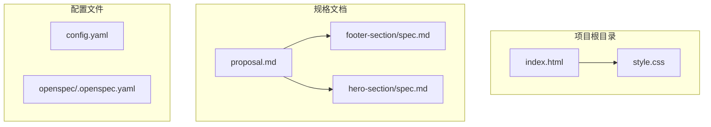
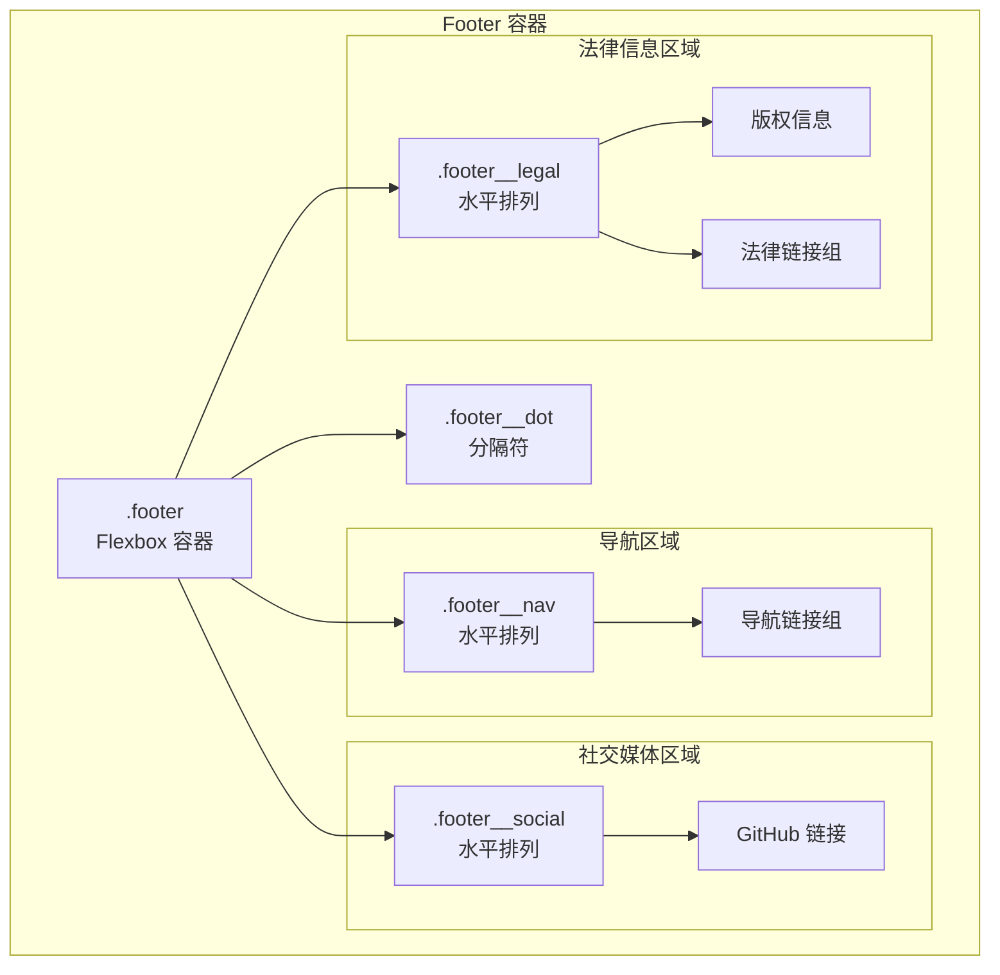
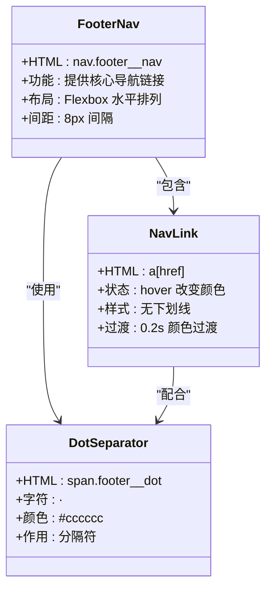
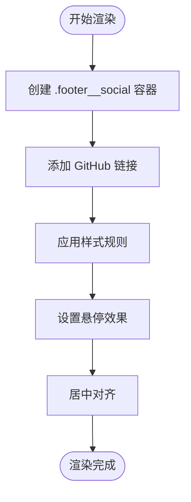
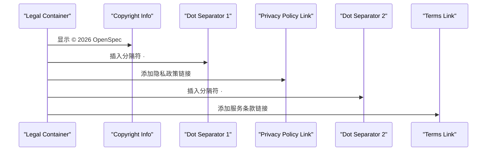
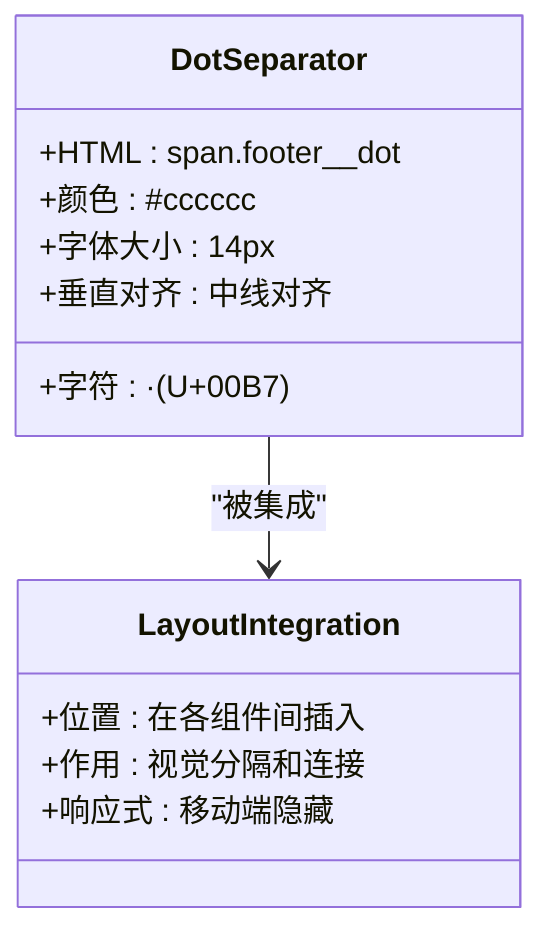
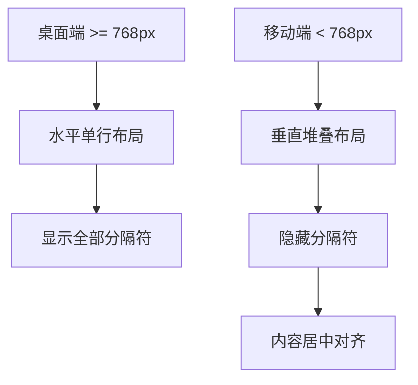
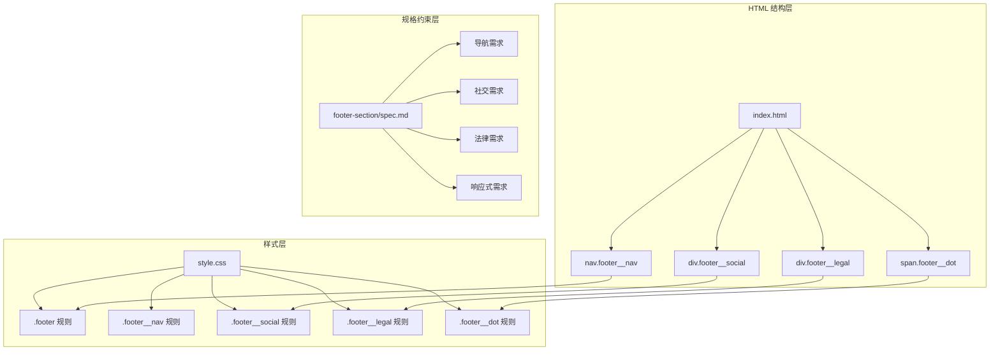

# Footer 区域结构

<cite>
**本文档引用的文件**
- [index.html](file://index.html)
- [style.css](file://style.css)
- [spec.md](file://openspec/changes/archive/2026-05-12-homepage-hero-footer/specs/footer-section/spec.md)
- [proposal.md](file://openspec/changes/archive/2026-05-12-homepage-hero-footer/proposal.md)
</cite>

## 目录
1. [简介](#简介)
2. [项目结构](#项目结构)
3. [核心组件](#核心组件)
4. [架构概览](#架构概览)
5. [详细组件分析](#详细组件分析)
6. [依赖关系分析](#依赖关系分析)
7. [性能考量](#性能考量)
8. [故障排除指南](#故障排除指南)
9. [结论](#结论)

## 简介

本文件专注于分析该开源项目中 Footer 区域的 HTML 结构设计。该项目采用一行式精简设计，通过语义化的 HTML 元素组织导航链接、社交媒体入口和法律信息，实现了良好的可访问性和 SEO 表现。本文档将深入解析每个元素的语义价值、结构组织方式以及响应式适配策略。

## 项目结构

该项目采用极简的单页应用架构，主要包含以下文件：

**图表来源**
- [index.html:1-44](file://index.html#L1-L44)
- [style.css:1-194](file://style.css#L1-L194)

**章节来源**
- [index.html:1-44](file://index.html#L1-L44)
- [proposal.md:1-26](file://openspec/changes/archive/2026-05-12-homepage-hero-footer/proposal.md#L1-L26)

## 核心组件

Footer 区域由三个主要功能模块组成，采用一行式精简设计：

### 导航链接区域 (footer__nav)
- **元素结构**: `<nav class="footer__nav">` 包含多个 `<a>` 链接
- **内容**: 产品、支持、关于 三个核心导航项
- **分隔符**: 使用 `·` 连接各链接

### 社交媒体区域 (footer__social)
- **元素结构**: `
` 包含社交平台链接
- **内容**: GitHub 平台入口
- **设计**: 文字标签形式，保持视觉一致性

### 法律信息区域 (footer__legal)
- **元素结构**: `
` 包含版权和法律链接
- **内容**: 版权信息 © 2026 OpenSpec + 隐私政策 + 服务条款
- **分隔符**: 使用 `·` 分隔符连接各项内容

**章节来源**
- [index.html:20-40](file://index.html#L20-L40)
- [spec.md:14-42](file://openspec/changes/archive/2026-05-12-homepage-hero-footer/specs/footer-section/spec.md#L14-L42)

## 架构概览

Footer 区域采用 Flexbox 布局实现响应式设计，整体架构如下：

**图表来源**
- [index.html:20-40](file://index.html#L20-L40)
- [style.css:105-149](file://style.css#L105-L149)

## 详细组件分析

### 导航链接组件 (footer__nav)

导航链接组件负责提供网站的核心导航功能，采用语义化的 `<nav>` 元素包裹，体现了良好的可访问性设计。

#### 结构设计

**图表来源**
- [index.html:21-27](file://index.html#L21-L27)
- [style.css:117-133](file://style.css#L117-L133)

#### 语义化价值
- 使用 `<nav>` 元素明确标识导航区域
- 每个链接使用标准 `<a>` 标签，提供语义化标记
- 符合 WCAG 可访问性标准，支持键盘导航

**章节来源**
- [index.html:21-27](file://index.html#L21-L27)
- [style.css:117-133](file://style.css#L117-L133)
- [spec.md:14-24](file://openspec/changes/archive/2026-05-12-homepage-hero-footer/specs/footer-section/spec.md#L14-L24)

### 社交媒体组件 (footer__social)

社交媒体组件提供外部平台的直接入口，采用简洁的文字链接形式。

#### 设计特点

**图表来源**
- [index.html:29-31](file://index.html#L29-L31)
- [style.css:135-139](file://style.css#L135-L139)

#### 功能特性
- **简洁设计**: 使用纯文字而非图标文件，减少 HTTP 请求
- **一致风格**: 与其他链接保持相同的视觉样式
- **可扩展性**: 易于添加更多社交媒体平台

**章节来源**
- [index.html:29-31](file://index.html#L29-L31)
- [style.css:135-139](file://style.css#L135-L139)
- [spec.md:25-31](file://openspec/changes/archive/2026-05-12-homepage-hero-footer/specs/footer-section/spec.md#L25-L31)

### 法律信息组件 (footer__legal)

法律信息组件包含版权和法律相关的必要链接，确保合规性要求。

#### 组织结构

**图表来源**
- [index.html:33-39](file://index.html#L33-L39)
- [style.css:141-145](file://style.css#L141-L145)

#### 合规性考虑
- **版权信息**: 明确标注版权年份和所有者
- **法律链接**: 提供隐私政策和服务条款的直接访问
- **无障碍设计**: 所有链接都具备可访问性属性

**章节来源**
- [index.html:33-39](file://index.html#L33-L39)
- [style.css:141-145](file://style.css#L141-L145)
- [spec.md:32-42](file://openspec/changes/archive/2026-05-12-homepage-hero-footer/specs/footer-section/spec.md#L32-L42)

### 分隔符组件 (footer__dot)

分隔符组件虽然简单，但在整体设计中起到关键的视觉连接作用。

#### 实现方式

**图表来源**
- [index.html:23-26](file://index.html#L23-L26)
- [index.html:28-32](file://index.html#L28-L32)
- [index.html:35-38](file://index.html#L35-L38)
- [style.css:147-149](file://style.css#L147-L149)
- [style.css:190-192](file://style.css#L190-L192)

#### 可访问性考虑
- **视觉设计**: 使用浅灰色 (#cccccc) 确保对比度
- **响应式适配**: 在移动端自动隐藏，避免不必要的视觉噪音
- **语义价值**: 虽为装饰性元素，但有助于内容分组的视觉识别

**章节来源**
- [index.html:23-26](file://index.html#L23-L26)
- [index.html:28-32](file://index.html#L28-L32)
- [index.html:35-38](file://index.html#L35-L38)
- [style.css:147-149](file://style.css#L147-L149)
- [style.css:190-192](file://style.css#L190-L192)

### 响应式设计策略

Footer 区域采用单一断点 (767px) 的响应式设计，确保在不同设备上的最佳体验。

#### 桌面端设计
- **布局**: Flexbox 水平单行排列
- **间距**: 8px 间隔，统一视觉节奏
- **分隔符**: 全部显示，维持清晰的视觉层次

#### 移动端适配

**图表来源**
- [style.css:155-193](file://style.css#L155-L193)

#### 设计原则
- **简化复杂度**: 使用单一断点减少维护成本
- **视觉优先**: 移动端隐藏分隔符，避免拥挤感
- **一致性**: 保持颜色、字体大小等设计元素的一致性

**章节来源**
- [style.css:155-193](file://style.css#L155-L193)
- [spec.md:6-12](file://openspec/changes/archive/2026-05-12-homepage-hero-footer/specs/footer-section/spec.md#L6-L12)

## 依赖关系分析

Footer 区域的实现涉及多个层面的依赖关系：

**图表来源**
- [index.html:20-40](file://index.html#L20-L40)
- [style.css:105-193](file://style.css#L105-L193)
- [spec.md:1-49](file://openspec/changes/archive/2026-05-12-homepage-hero-footer/specs/footer-section/spec.md#L1-L49)

### 关键依赖点

1. **HTML 结构依赖**: 所有样式规则都依赖于特定的类名选择器
2. **样式继承关系**: 子元素继承父容器的基本样式属性
3. **规格约束**: 设计实现必须满足规格文档中的具体要求
4. **响应式依赖**: 移动端样式完全依赖于 @media 查询

**章节来源**
- [index.html:20-40](file://index.html#L20-L40)
- [style.css:105-193](file://style.css#L105-L193)
- [spec.md:1-49](file://openspec/changes/archive/2026-05-12-homepage-hero-footer/specs/footer-section/spec.md#L1-L49)

## 性能考量

该 Footer 实现采用了多项性能优化策略：

### 代码优化
- **极简结构**: 使用最少的 HTML 元素实现功能
- **高效选择器**: 仅使用类名选择器，避免复杂的 CSS 选择器
- **单一断点**: 减少媒体查询数量，提高渲染效率

### 可访问性优化
- **语义化标记**: 正确使用语义化 HTML 元素
- **键盘导航**: 支持键盘操作的链接导航
- **颜色对比**: 确保足够的颜色对比度

### SEO 优化
- **语义化结构**: 为搜索引擎提供清晰的内容结构
- **链接有效性**: 所有链接都具有有效的 href 属性
- **内容组织**: 清晰的信息层次结构

## 故障排除指南

### 常见问题及解决方案

#### 问题 1: 分隔符在移动端显示异常
**症状**: 移动端仍有分隔符显示
**原因**: CSS 规则未正确应用
**解决**: 检查 @media 查询是否正确匹配断点

#### 问题 2: 导航链接无法点击
**症状**: 链接无任何交互效果
**原因**: CSS 样式覆盖了默认链接行为
**解决**: 确认 a 标签的样式规则正确应用

#### 问题 3: 响应式布局失效
**症状**: 移动端仍显示水平布局
**原因**: viewport meta 标签缺失或错误
**解决**: 确认 viewport 设置正确

**章节来源**
- [style.css:155-193](file://style.css#L155-L193)
- [index.html:4-6](file://index.html#L4-L6)

## 结论

该 Footer 区域设计体现了现代 Web 开发的最佳实践：

### 设计优势
- **语义化**: 使用正确的 HTML 语义元素，提升可访问性和 SEO
- **简洁性**: 采用一行式精简设计，符合现代设计理念
- **响应式**: 优秀的跨设备适配能力
- **可维护性**: 极简的代码结构便于长期维护

### 技术亮点
- **Flexbox 布局**: 现代化的布局解决方案
- **单一断点策略**: 简化响应式设计的决策
- **语义化链接**: 符合 WCAG 标准的可访问性设计
- **渐进增强**: 从基础样式开始，逐步增强交互效果

### 改进建议
- 可以考虑添加更多的社交媒体平台
- 增加链接的 aria-label 属性提升可访问性
- 考虑添加键盘导航的焦点管理

该实现为初学者提供了语义化 HTML 的优秀范例，为高级开发者展示了响应式设计和可访问性实现的最佳实践。