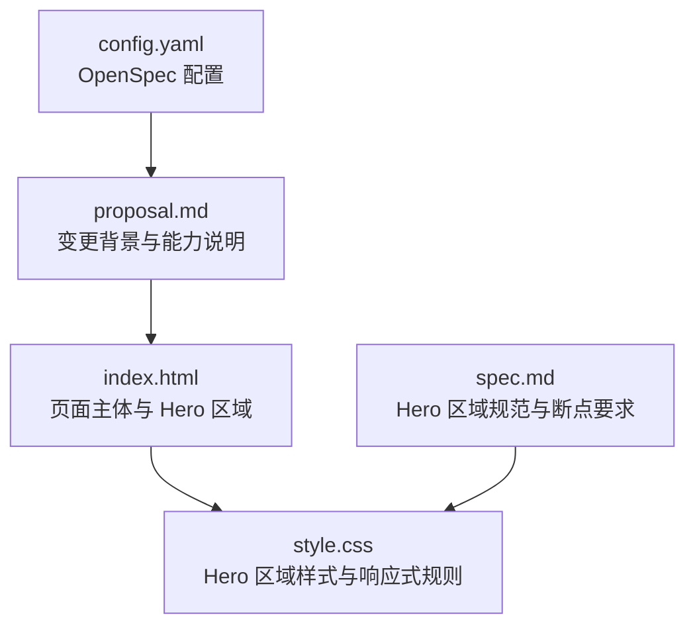
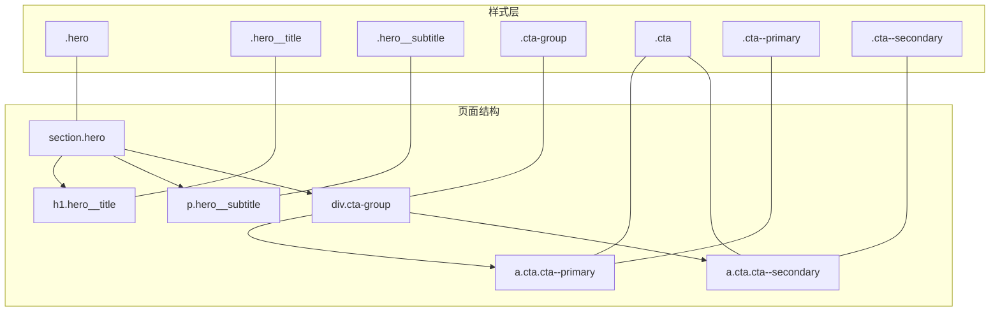
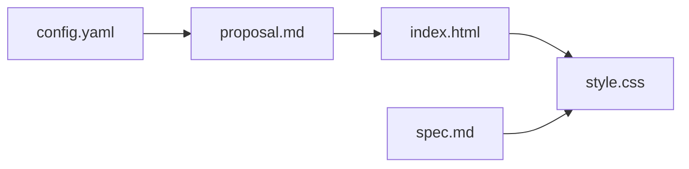

# Hero 区域结构

<cite>
**本文档引用的文件**
- [index.html](file://index.html)
- [style.css](file://style.css)
- [spec.md](file://openspec/changes/archive/2026-05-12-homepage-hero-footer/specs/hero-section/spec.md)
- [proposal.md](file://openspec/changes/archive/2026-05-12-homepage-hero-footer/proposal.md)
- [config.yaml](file://openspec/config.yaml)
</cite>

## 目录
1. [简介](#简介)
2. [项目结构](#项目结构)
3. [核心组件](#核心组件)
4. [架构总览](#架构总览)
5. [详细组件分析](#详细组件分析)
6. [依赖关系分析](#依赖关系分析)
7. [性能考量](#性能考量)
8. [故障排除指南](#故障排除指南)
9. [结论](#结论)
10. [附录](#附录)

## 简介
本文件围绕 Hero 区域的 HTML 结构进行系统化文档化，重点覆盖以下方面：
- 语义化标签的使用与设计动机（h1、p、section）
- 组件命名体系（hero__title、hero__subtitle、cta-group）的语义化与可访问性考虑
- 全屏布局的 HTML 实现方式与语义价值
- SEO 与可访问性最佳实践
- 响应式结构适配与跨浏览器兼容性建议
- 面向初学者的 HTML5 语义化标签重要性说明与面向高级开发者的可访问性深度实践

## 项目结构
该仓库采用“规范驱动”的结构组织，Hero 区域由单一 HTML 页面与独立样式表构成，配合 OpenSpec 规范文档描述具体要求。整体结构清晰、职责单一，便于维护与扩展。

图表来源
- [index.html:11-18](file://index.html#L11-L18)
- [style.css:39-63](file://style.css#L39-L63)
- [spec.md:36-48](file://openspec/changes/archive/2026-05-12-homepage-hero-footer/specs/hero-section/spec.md#L36-L48)
- [proposal.md:14-16](file://openspec/changes/archive/2026-05-12-homepage-hero-footer/proposal.md#L14-L16)
- [config.yaml:1-21](file://openspec/config.yaml#L1-L21)

章节来源
- [index.html:1-44](file://index.html#L1-L44)
- [style.css:1-194](file://style.css#L1-L194)
- [spec.md:1-49](file://openspec/changes/archive/2026-05-12-homepage-hero-footer/specs/hero-section/spec.md#L1-L49)
- [proposal.md:1-26](file://openspec/changes/archive/2026-05-12-homepage-hero-footer/proposal.md#L1-L26)
- [config.yaml:1-21](file://openspec/config.yaml#L1-L21)

## 核心组件
- Hero 容器（section.hero）：承载主标题、副标题与 CTA 按钮，负责全屏高度与居中布局。
- 主标题（h1.hero__title）：品牌首屏核心信息，强调语义重要性与 SEO 价值。
- 副标题（p.hero__subtitle）：对主标题的补充说明，提供产品价值信息。
- CTA 按钮组（div.cta-group）：包含主按钮与次按钮，用于引导用户操作。

章节来源
- [index.html:11-18](file://index.html#L11-L18)
- [style.css:39-63](file://style.css#L39-L63)
- [style.css:69-99](file://style.css#L69-L99)
- [spec.md:3-19](file://openspec/changes/archive/2026-05-12-homepage-hero-footer/specs/hero-section/spec.md#L3-L19)

## 架构总览
Hero 区域的 HTML 架构以语义化为中心，结合 Flexbox 实现全屏居中，配合媒体查询实现响应式断点适配。下图展示了页面结构与样式映射关系。

图表来源
- [index.html:11-18](file://index.html#L11-L18)
- [style.css:39-99](file://style.css#L39-L99)

## 详细组件分析

### 语义化标签与结构设计
- section.hero：使用 section 元素承载 Hero 区域，具备明确的页面分区语义，有利于 SEO 与可访问性工具识别页面结构。
- h1.hero__title：作为首屏主标题，承担最高级别的标题语义，有助于搜索引擎理解页面主题与层级。
- p.hero__subtitle：提供补充说明，增强内容可读性与上下文关联。
- div.cta-group：容器语义明确，便于无障碍技术识别交互元素集合。

章节来源
- [index.html:11-18](file://index.html#L11-L18)
- [spec.md:3-19](file://openspec/changes/archive/2026-05-12-homepage-hero-footer/specs/hero-section/spec.md#L3-L19)

### 命名体系与可访问性考虑
- hero__title、hero__subtitle：采用 BEM 风格命名，语义清晰，便于样式与脚本定位；同时保持与语义标签的强关联，利于可访问性工具解析。
- cta-group：命名直观表达交互意图，便于屏幕阅读器与键盘导航识别。
- 可访问性建议：
  - 为 h1 提供简洁明确的文本，避免冗余修饰词。
  - 为按钮提供明确的可读状态（如“立即购买”、“了解更多”）。
  - 使用语义化的链接与按钮，避免仅用 div 或 span 模拟交互。
  - 确保焦点可见性与键盘可达性（可在后续 JS 中补充）。

章节来源
- [index.html:11-18](file://index.html#L11-L18)
- [style.css:49-63](file://style.css#L49-L63)
- [style.css:69-99](file://style.css#L69-L99)

### 全屏布局的 HTML 实现
- 使用 section.hero 并配合 .hero 样式类，通过 min-height: 100vh 与 Flexbox 属性实现视口全高与内容居中。
- 语义价值：section 明确页面分区，使搜索引擎与可访问性工具能准确识别首屏核心内容区域。

章节来源
- [index.html:11-18](file://index.html#L11-L18)
- [style.css:39-47](file://style.css#L39-L47)
- [spec.md:36-41](file://openspec/changes/archive/2026-05-12-homepage-hero-footer/specs/hero-section/spec.md#L36-L41)

### 响应式结构适配
- 断点：768px（仅一个断点），桌面端与移动端的差异体现在字体大小、按钮排列与内边距。
- 桌面端：按钮水平排列，标题字号较大，整体布局强调视觉冲击力。
- 移动端：按钮垂直堆叠，宽度 100%，字号与间距适度收缩，确保可读性与可触达性。

章节来源
- [style.css:155-176](file://style.css#L155-L176)
- [spec.md:43-48](file://openspec/changes/archive/2026-05-12-homepage-hero-footer/specs/hero-section/spec.md#L43-L48)

### 跨浏览器兼容性考虑
- 字体与排版：使用系统字体栈与基础字号设置，减少跨平台差异。
- Flexbox：现代浏览器广泛支持，建议在旧版浏览器中提供降级方案（如使用传统布局或 polyfill）。
- 媒体查询：统一断点策略，简化维护成本。
- 链接样式：统一去除默认下划线并继承颜色，避免各浏览器默认样式差异。

章节来源
- [style.css:17-28](file://style.css#L17-L28)
- [style.css:30-33](file://style.css#L30-L33)
- [style.css:155-193](file://style.css#L155-L193)

### SEO 与可访问性最佳实践
- SEO：
  - 仅保留一个 h1，确保其与品牌/产品核心信息一致。
  - 副标题 p 提供上下文补充，但避免过度关键词堆砌。
  - 语义化结构（section、h1、p、a）提升页面主题理解度。
- 可访问性：
  - 为按钮提供明确的可读文本与状态。
  - 确保键盘可达与焦点可见性（可在后续 JS 中完善）。
  - 使用语义化标签而非装饰性元素模拟交互。

章节来源
- [index.html:11-18](file://index.html#L11-L18)
- [spec.md:3-19](file://openspec/changes/archive/2026-05-12-homepage-hero-footer/specs/hero-section/spec.md#L3-L19)

## 依赖关系分析
- HTML 依赖样式表：index.html 引入 style.css，所有 Hero 区域样式均来自该文件。
- 规范驱动：spec.md 描述了 Hero 区域的尺寸、颜色、断点等要求，指导样式实现。
- 变更背景：proposal.md 说明了新增 Hero 区域的目的与能力边界，体现设计目标。

图表来源
- [index.html:7](file://index.html#L7)
- [style.css:39-99](file://style.css#L39-L99)
- [spec.md:3-48](file://openspec/changes/archive/2026-05-12-homepage-hero-footer/specs/hero-section/spec.md#L3-L48)
- [proposal.md:14-16](file://openspec/changes/archive/2026-05-12-homepage-hero-footer/proposal.md#L14-L16)
- [config.yaml:1-21](file://openspec/config.yaml#L1-L21)

章节来源
- [index.html:7](file://index.html#L7)
- [style.css:39-99](file://style.css#L39-L99)
- [spec.md:3-48](file://openspec/changes/archive/2026-05-12-homepage-hero-footer/specs/hero-section/spec.md#L3-L48)
- [proposal.md:14-16](file://openspec/changes/archive/2026-05-12-homepage-hero-footer/proposal.md#L14-L16)
- [config.yaml:1-21](file://openspec/config.yaml#L1-L21)

## 性能考量
- 静态页面：无外部依赖，加载速度快，适合静态托管。
- 样式体积：CSS 体量较小，无复杂动画，首屏渲染友好。
- 响应式：单断点策略降低复杂度，减少媒体查询计算开销。

## 故障排除指南
- 首屏未占满视口
  - 检查 .hero 是否应用到正确的容器（section.hero）。
  - 确认 min-height: 100vh 生效，且父元素无额外内边距影响。
- 文字未居中
  - 确认 Flexbox 属性（flex-direction、justify-content、align-items）已正确应用。
- 移动端按钮未堆叠
  - 检查媒体查询断点是否匹配（768px）。
  - 确认 .cta-group 在移动端设置了垂直方向与宽度 100%。
- 链接样式异常
  - 检查 a 标签的默认样式是否被覆盖，确保继承颜色与去下划线。

章节来源
- [style.css:39-47](file://style.css#L39-L47)
- [style.css:69-73](file://style.css#L69-L73)
- [style.css:155-176](file://style.css#L155-L176)
- [style.css:30-33](file://style.css#L30-L33)

## 结论
Hero 区域通过简洁的语义化结构与明确的命名体系，实现了高可读性、可访问性与良好的 SEO 表现。配合单断点响应式策略，兼顾了开发效率与用户体验。建议在后续迭代中补充可访问性键盘导航与焦点管理，进一步提升无障碍体验。

## 附录

### 初学者指南：HTML5 语义化标签的重要性
- 语义化标签（如 section、h1、p、a）帮助搜索引擎与辅助技术理解页面结构与内容层次。
- 合理使用语义标签可提升 SEO 排名与可访问性评分。
- 建议遵循“一个页面一个 h1”的原则，确保内容主题清晰。

### 高级实践：可访问性最佳实践
- 键盘可达性：确保所有可交互元素可通过 Tab 键聚焦，Enter/Space 触发。
- 焦点可见性：为聚焦状态提供清晰的视觉反馈。
- 屏幕阅读器友好：为按钮与链接提供明确的可读文本，避免仅用图片或图标表达意图。
- 对比度与可读性：确保文本与背景对比度满足 WCAG 2.1 AA 标准。