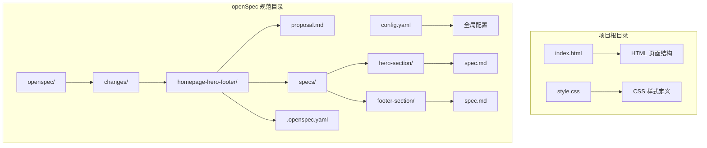
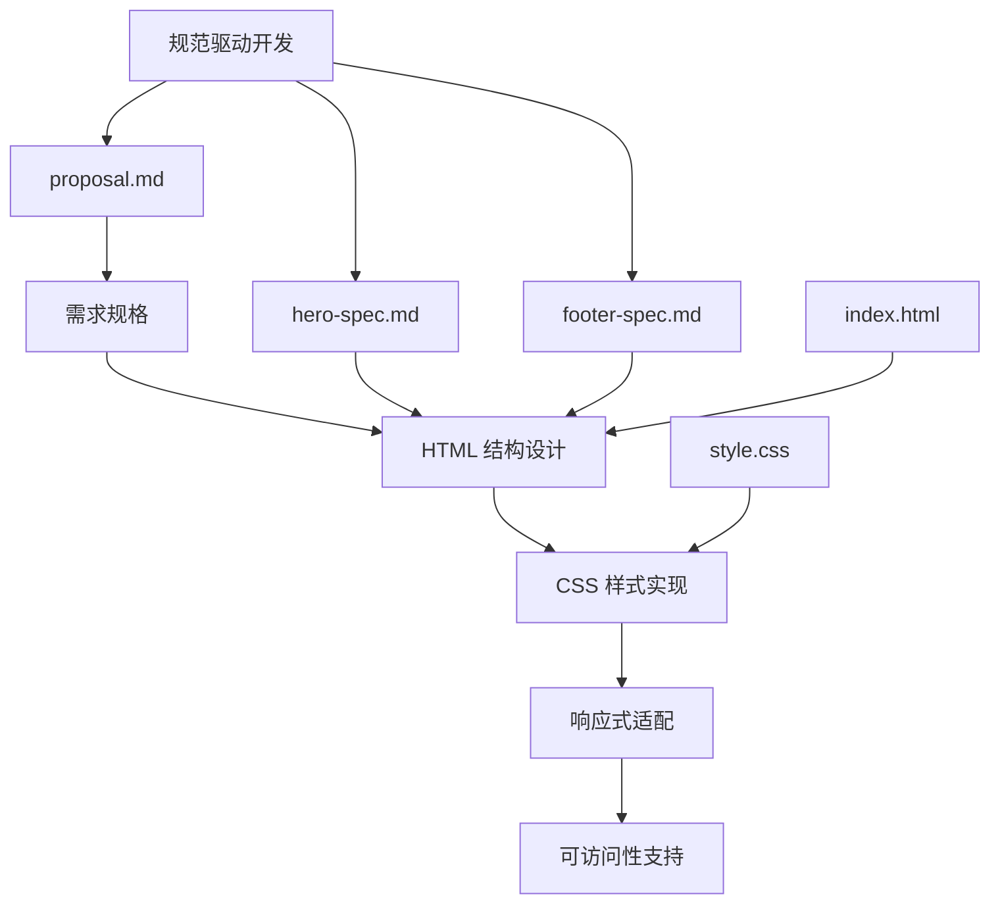
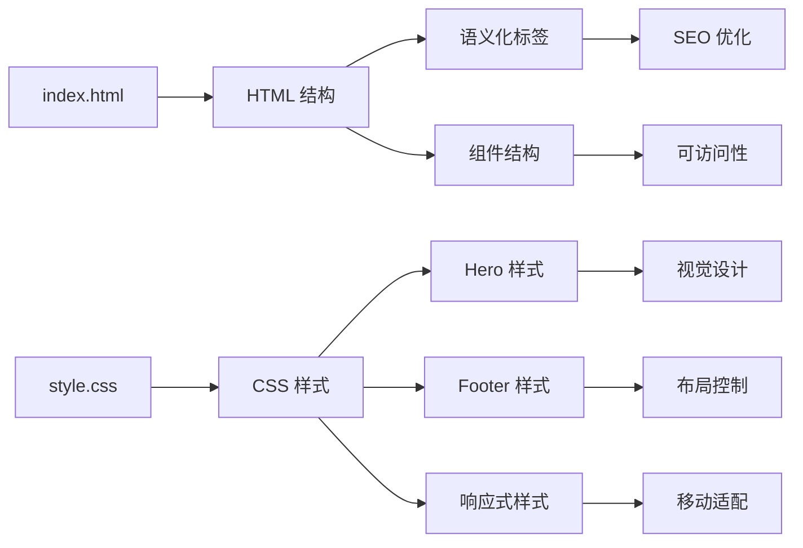
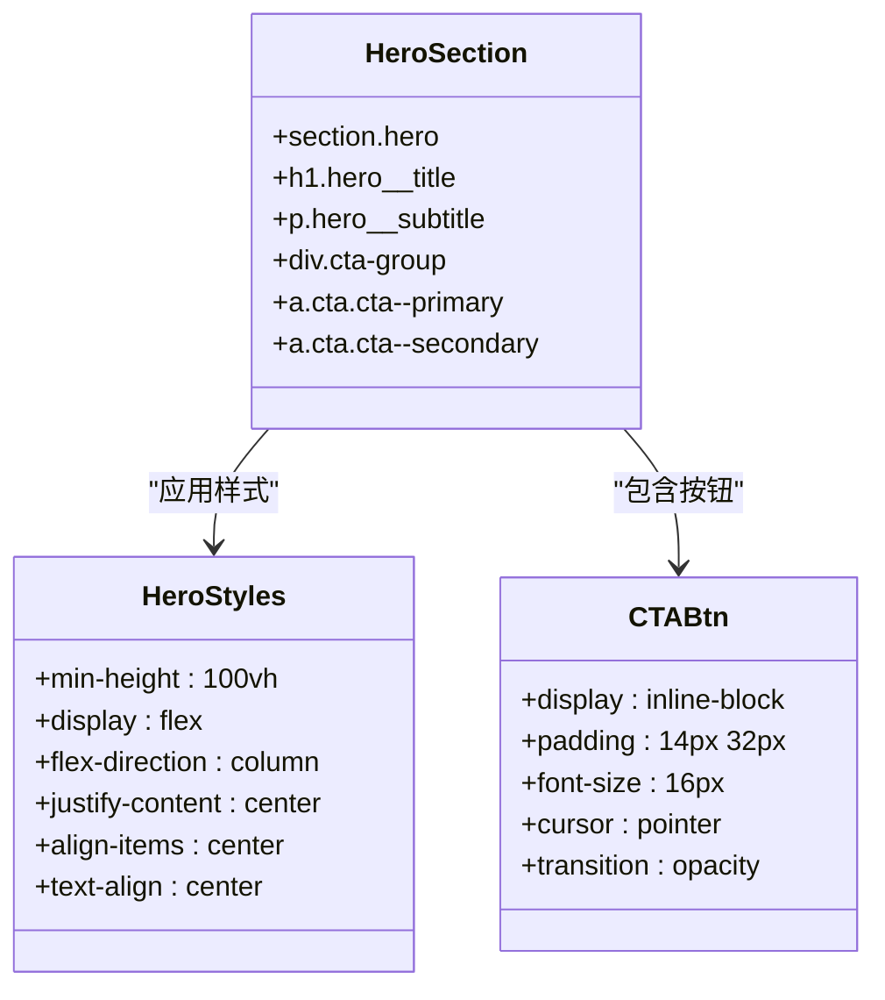
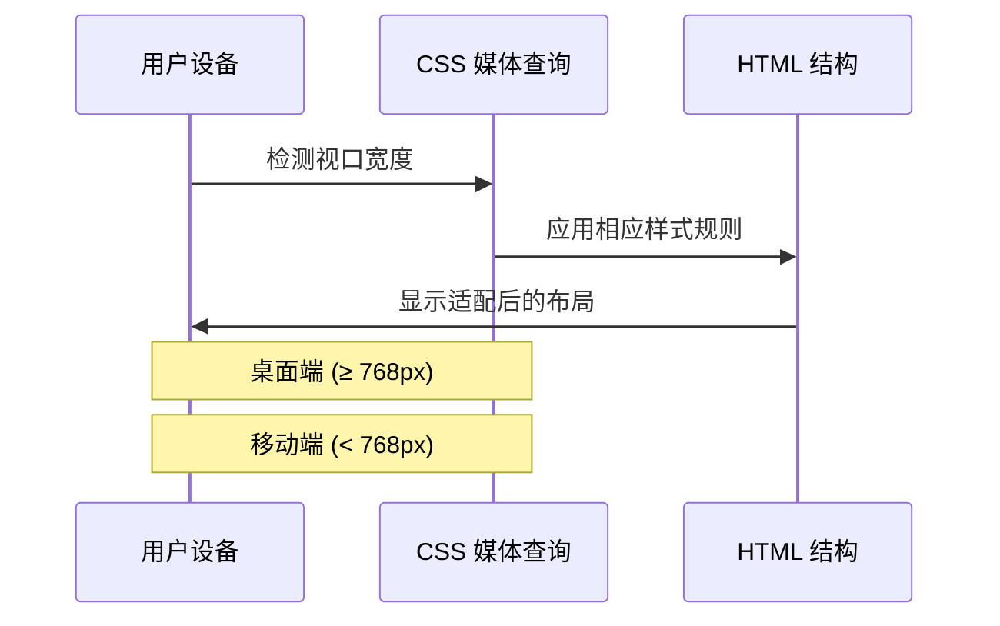
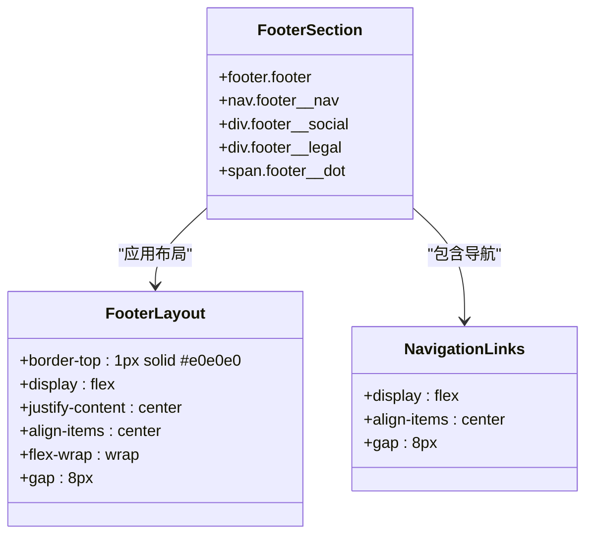
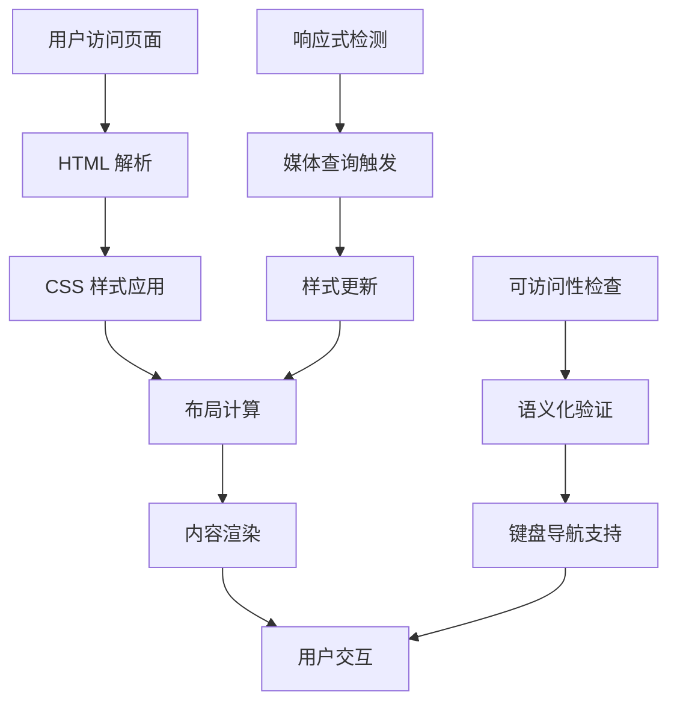
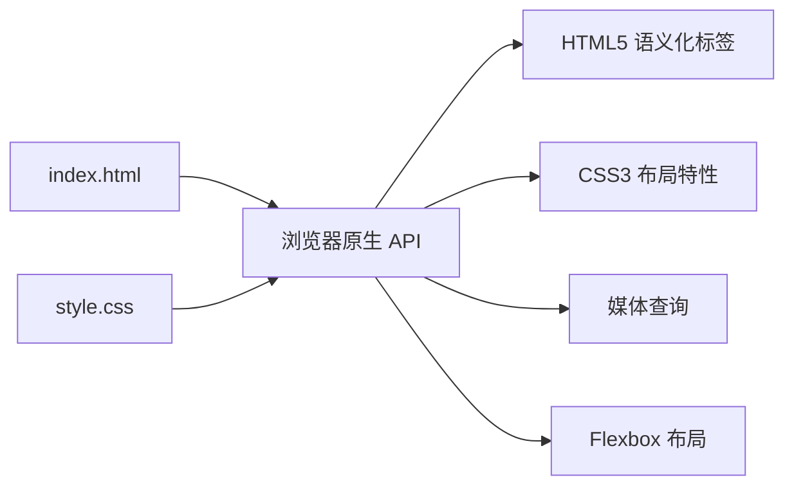
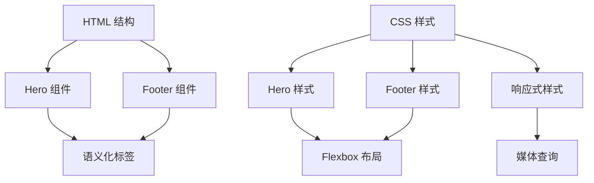

# 页面结构详解

<cite>
**本文档引用的文件**
- [index.html](file://index.html)
- [style.css](file://style.css)
- [proposal.md](file://openspec/changes/homepage-hero-footer/proposal.md)
- [hero-spec.md](file://openspec/changes/homepage-hero-footer/specs/hero-section/spec.md)
- [footer-spec.md](file://openspec/changes/homepage-hero-footer/specs/footer-section/spec.md)
- [.openspec.yaml](file://openspec/changes/homepage-hero-footer/.openspec.yaml)
- [config.yaml](file://openspec/config.yaml)
</cite>

## 目录
1. [简介](#简介)
2. [项目结构](#项目结构)
3. [核心组件](#核心组件)
4. [架构概览](#架构概览)
5. [详细组件分析](#详细组件分析)
6. [依赖关系分析](#依赖关系分析)
7. [性能考量](#性能考量)
8. [故障排除指南](#故障排除指南)
9. [结论](#结论)

## 简介

openSpec 项目是一个基于 HTML5 语义化标签构建的静态页面结构示例，专注于手机产品官网首页的设计与实现。该项目采用规范驱动开发（Spec-Driven Development）方法论，通过明确的需求规格和测试场景来指导页面结构的设计与实现。

本项目的核心目标是创建一个极简、理性的首屏体验，让用户在3秒内理解产品的定位与核心价值，并引导用户采取下一步行动。整个页面采用纯静态实现，不依赖任何 JavaScript 框架，确保了最佳的性能表现和可访问性支持。

## 项目结构

项目采用简洁的文件组织方式，主要包含以下核心文件：

**图表来源**
- [index.html:1-44](file://index.html#L1-L44)
- [style.css:1-194](file://style.css#L1-L194)
- [proposal.md:1-26](file://openspec/changes/homepage-hero-footer/proposal.md#L1-L26)

**章节来源**
- [index.html:1-44](file://index.html#L1-L44)
- [style.css:1-194](file://style.css#L1-L194)
- [proposal.md:1-26](file://openspec/changes/homepage-hero-footer/proposal.md#L1-L26)

## 核心组件

### Hero 区域组件

Hero 区域是页面的首屏展示区域，采用全屏居中布局，突出品牌主标题和产品核心价值。该组件包含三个主要元素：

1. **主标题**：使用大字号（桌面端64px，移动端40px）和粗体字重，传达产品的技术属性
2. **副标题**：提供产品价值的补充说明，使用辅助色彩和适中的字号
3. **CTA 按钮组**：包含主按钮和次按钮，引导用户采取行动

### Footer 区域组件

Footer 区域采用一行式精简布局，包含三个功能模块：

1. **链接导航**：产品、支持、关于等关键导航链接
2. **社交媒体入口**：GitHub 等平台的链接
3. **版权与法律信息**：版权年份和隐私政策、服务条款链接

**章节来源**
- [hero-spec.md:1-49](file://openspec/changes/homepage-hero-footer/specs/hero-section/spec.md#L1-L49)
- [footer-spec.md:1-49](file://openspec/changes/homepage-hero-footer/specs/footer-section/spec.md#L1-L49)

## 架构概览

项目采用规范驱动的开发架构，通过明确的需求规格指导页面结构的设计与实现：

**图表来源**
- [proposal.md:1-26](file://openspec/changes/homepage-hero-footer/proposal.md#L1-L26)
- [hero-spec.md:1-49](file://openspec/changes/homepage-hero-footer/specs/hero-section/spec.md#L1-L49)
- [footer-spec.md:1-49](file://openspec/changes/homepage-hero-footer/specs/footer-section/spec.md#L1-L49)

### 组件间依赖关系

**图表来源**
- [index.html:11-40](file://index.html#L11-L40)
- [style.css:35-194](file://style.css#L35-L194)

## 详细组件分析

### Hero 区域详细分析

Hero 区域采用 Flexbox 布局实现全屏居中效果，通过语义化标签确保内容的可读性和可访问性。

#### HTML 结构设计

**图表来源**
- [index.html:11-18](file://index.html#L11-L18)
- [style.css:39-100](file://style.css#L39-L100)

#### 语义化标签选择原因

1. **`<section>` 标签**：用于标识页面的主要内容区域，提供清晰的文档结构
2. **`<h1>` 标签**：使用页面主标题，确保正确的层级结构
3. **`
` 标签**：用于段落文本，提供适当的语义标记
4. **`<a>` 标签**：用于所有链接元素，确保可访问性支持

#### 响应式设计实现

**图表来源**
- [style.css:155-193](file://style.css#L155-L193)

**章节来源**
- [index.html:11-18](file://index.html#L11-L18)
- [style.css:39-100](file://style.css#L39-L100)
- [hero-spec.md:3-49](file://openspec/changes/homepage-hero-footer/specs/hero-section/spec.md#L3-L49)

### Footer 区域详细分析

Footer 区域采用一行式精简布局，通过 Flexbox 实现灵活的响应式排列。

#### HTML 结构设计

**图表来源**
- [index.html:20-40](file://index.html#L20-L40)
- [style.css:105-149](file://style.css#L105-L149)

#### 组件化设计思路

1. **模块化结构**：每个功能区域独立封装，便于维护和扩展
2. **BEM 命名约定**：使用块-元素-修饰符模式，确保样式命名的一致性
3. **语义化标记**：使用适当的 HTML5 语义标签，提升可访问性
4. **响应式适配**：通过媒体查询实现多设备兼容

**章节来源**
- [index.html:20-40](file://index.html#L20-L40)
- [style.css:105-149](file://style.css#L105-L149)
- [footer-spec.md:3-49](file://openspec/changes/homepage-hero-footer/specs/footer-section/spec.md#L3-L49)

### 数据流分析

## 依赖关系分析

### 外部依赖关系

项目采用纯静态实现，不依赖任何外部框架或库：

**图表来源**
- [index.html:1-44](file://index.html#L1-L44)
- [style.css:1-194](file://style.css#L1-L194)

### 内部组件依赖

**图表来源**
- [index.html:11-40](file://index.html#L11-L40)
- [style.css:35-194](file://style.css#L35-L194)

**章节来源**
- [proposal.md:10-26](file://openspec/changes/homepage-hero-footer/proposal.md#L10-L26)

## 性能考量

### 加载性能优化

1. **纯静态文件**：无需服务器端处理，减少请求延迟
2. **最小化 CSS**：仅包含必要的样式规则，避免冗余代码
3. **高效的布局**：使用 Flexbox 替代复杂的定位方案
4. **响应式图片**：虽然当前未使用图片，但预留了响应式适配空间

### 可访问性优化

1. **语义化标签**：使用正确的 HTML5 语义标签
2. **键盘导航**：链接元素支持键盘操作
3. **色彩对比度**：确保足够的色彩对比度
4. **响应式适配**：支持不同设备的访问需求

## 故障排除指南

### 常见问题及解决方案

#### Hero 区域布局问题

**问题**：内容未垂直居中
**解决方案**：
- 检查 `min-height: 100vh` 样式的应用
- 确认 Flexbox 容器的 `display: flex` 设置
- 验证 `justify-content: center` 和 `align-items: center` 的正确性

#### 响应式适配问题

**问题**：移动端按钮布局异常
**解决方案**：
- 检查媒体查询断点设置（768px）
- 确认按钮容器的 `flex-direction: column` 应用
- 验证按钮的 `width: 100%` 设置

#### 可访问性问题

**问题**：屏幕阅读器无法正确识别内容
**解决方案**：
- 确保使用正确的语义化标签
- 检查链接的 `href` 属性设置
- 验证色彩对比度是否符合标准

**章节来源**
- [style.css:155-193](file://style.css#L155-L193)
- [hero-spec.md:36-49](file://openspec/changes/homepage-hero-footer/specs/hero-section/spec.md#L36-L49)
- [footer-spec.md:6-12](file://openspec/changes/homepage-hero-footer/specs/footer-section/spec.md#L6-L12)

## 结论

openSpec 项目的页面结构设计体现了现代 Web 开发的最佳实践，通过规范驱动的方法论确保了代码的质量和可维护性。项目成功实现了以下目标：

1. **语义化结构**：使用正确的 HTML5 语义标签，提升了内容的可读性和可访问性
2. **响应式设计**：通过媒体查询实现多设备兼容，确保了良好的用户体验
3. **性能优化**：采用纯静态实现，减少了不必要的复杂性
4. **可维护性**：清晰的文件组织和模块化的组件设计

这个项目为初学者提供了学习 HTML5 语义化标签和 CSS 布局技术的优秀示例，同时为高级开发者展示了规范驱动开发的实际应用场景。通过遵循项目中的设计原则和最佳实践，开发者可以创建出既美观又实用的网页界面。