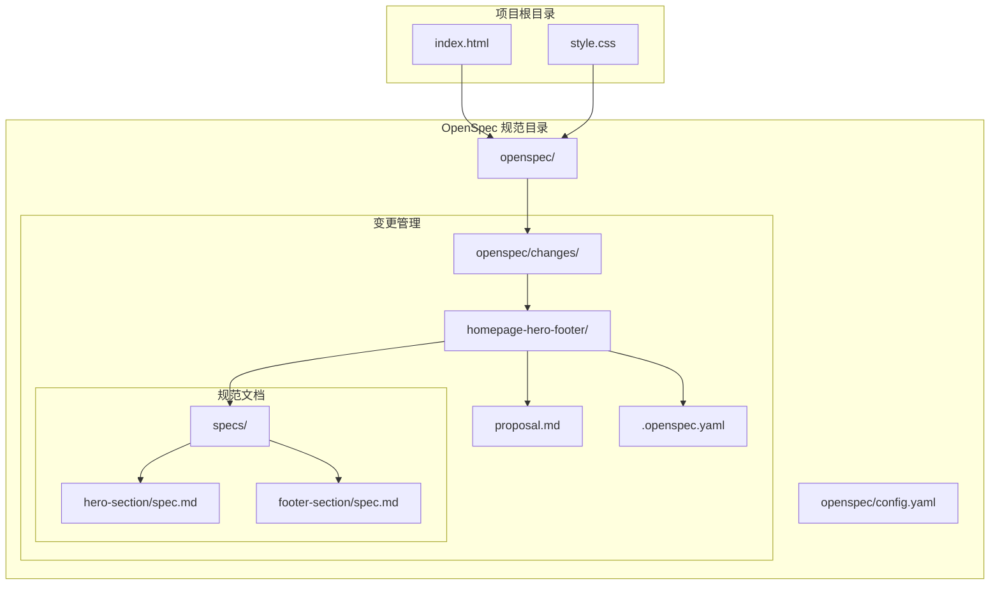
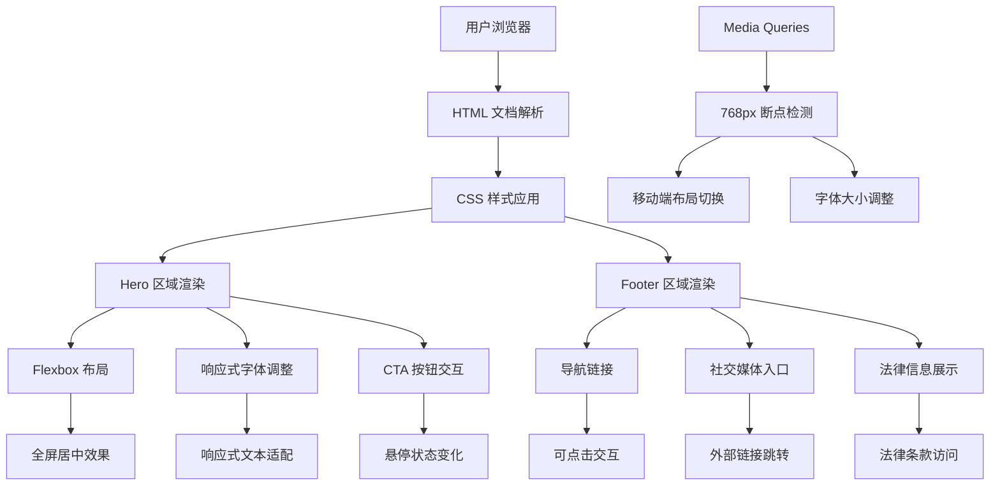
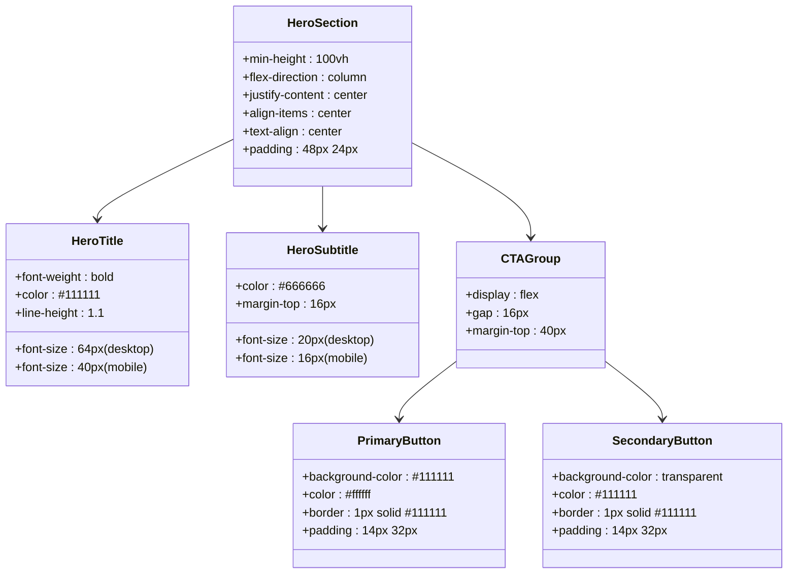
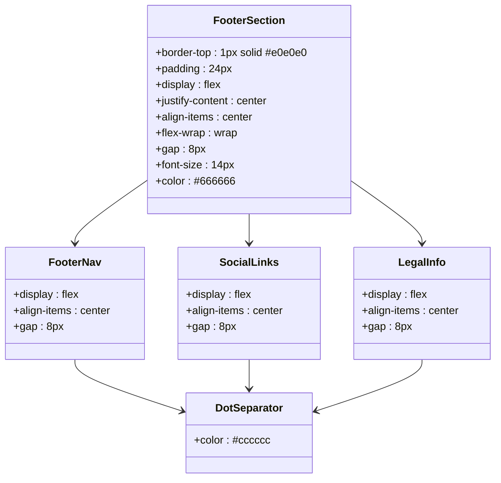
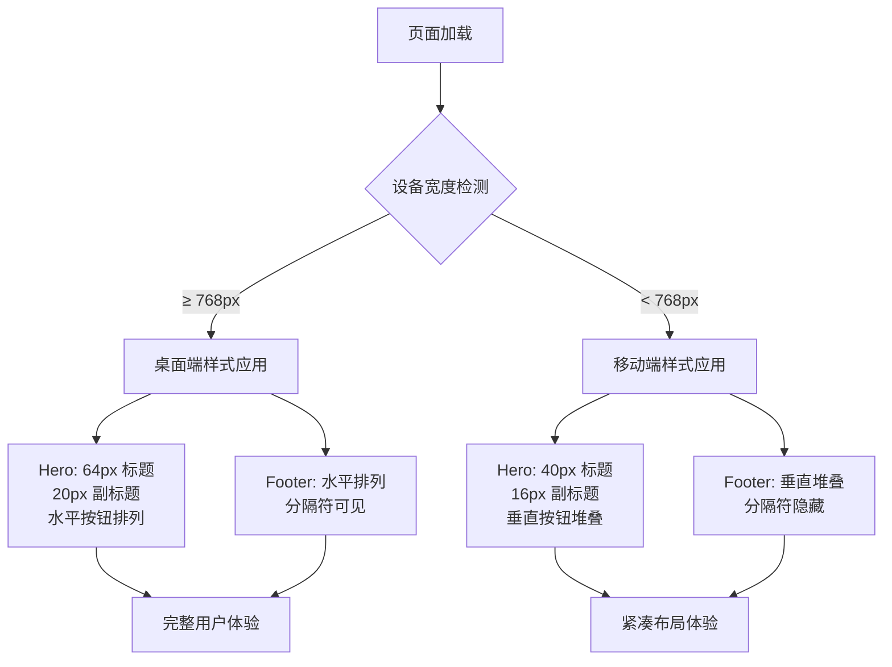
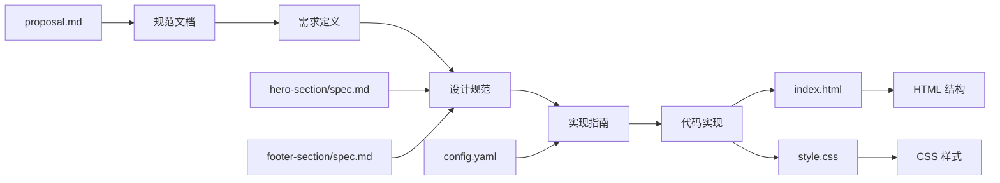

# 项目概述

<cite>
**本文档引用的文件**
- [index.html](file://index.html)
- [style.css](file://style.css)
- [config.yaml](file://openspec/config.yaml)
- [proposal.md](file://openspec/changes/homepage-hero-footer/proposal.md)
- [.openspec.yaml](file://openspec/changes/homepage-hero-footer/.openspec.yaml)
- [hero-section/spec.md](file://openspec/changes/homepage-hero-footer/specs/hero-section/spec.md)
- [footer-section/spec.md](file://openspec/changes/homepage-hero-footer/specs/footer-section/spec.md)
</cite>

## 目录
1. [项目简介](#项目简介)
2. [项目结构](#项目结构)
3. [核心组件](#核心组件)
4. [架构概览](#架构概览)
5. [详细组件分析](#详细组件分析)
6. [依赖关系分析](#依赖关系分析)
7. [性能考虑](#性能考虑)
8. [故障排除指南](#故障排除指南)
9. [结论](#结论)

## 项目简介

openSpec 项目是一个基于 OpenSpec 规范驱动开发的手机产品官网示例。该项目展示了如何通过规范文档驱动代码实现，采用纯静态技术栈（HTML5 + CSS3）构建了一个简洁、理性的手机产品官网首页。

### 项目核心价值主张

- **规范驱动开发**：通过详细的规范文档定义功能需求和实现细节，确保开发过程的可追溯性和一致性
- **文字驱动设计**：强调内容优先的设计理念，通过精心策划的文字内容传达产品价值和品牌定位
- **纯静态实现**：无需任何 JavaScript 框架依赖，降低复杂度和维护成本
- **响应式设计**：针对不同设备尺寸提供优化的用户体验

### 技术架构

项目采用极简的技术栈：
- **前端技术**：HTML5 + CSS3（无 JavaScript 依赖）
- **设计理念**：文字驱动设计，强调内容表达和信息架构
- **响应式特性**：使用 768px 作为断点，提供桌面端和移动端的差异化体验

## 项目结构

**图表来源**
- [index.html:1-44](file://index.html#L1-L44)
- [style.css:1-194](file://style.css#L1-L194)
- [config.yaml:1-21](file://openspec/config.yaml#L1-L21)

**章节来源**
- [index.html:1-44](file://index.html#L1-L44)
- [style.css:1-194](file://style.css#L1-L194)
- [config.yaml:1-21](file://openspec/config.yaml#L1-L21)

## 核心组件

### Hero 区域组件

Hero 区域是整个页面的核心视觉焦点，采用全屏居中布局设计：

- **主标题**：使用 64px（桌面端）和 40px（移动端）的字号，体现品牌的专业性和技术感
- **副标题**：提供产品价值的补充说明，使用辅助色彩增强可读性
- **CTA 按钮组**：包含主按钮和次按钮，支持水平和垂直两种布局模式

### Footer 组件

Footer 采用一行式精简设计，包含三个核心功能区域：

- **导航链接**：产品、支持、关于等关键页面入口
- **社交媒体**：GitHub 等平台的链接入口
- **法律信息**：版权信息和隐私政策、服务条款

**章节来源**
- [hero-section/spec.md:1-49](file://openspec/changes/homepage-hero-footer/specs/hero-section/spec.md#L1-L49)
- [footer-section/spec.md:1-49](file://openspec/changes/homepage-hero-footer/specs/footer-section/spec.md#L1-L49)

## 架构概览

**图表来源**
- [index.html:11-40](file://index.html#L11-L40)
- [style.css:39-193](file://style.css#L39-L193)

## 详细组件分析

### Hero 区域详细分析

Hero 区域实现了完整的规范要求，包括响应式设计和交互效果：

**图表来源**
- [hero-section/spec.md:3-48](file://openspec/changes/homepage-hero-footer/specs/hero-section/spec.md#L3-L48)
- [style.css:39-99](file://style.css#L39-L99)

### Footer 区域详细分析

Footer 区域实现了规范要求的所有功能特性：

**图表来源**
- [footer-section/spec.md:3-48](file://openspec/changes/homepage-hero-footer/specs/footer-section/spec.md#L3-L48)
- [style.css:105-149](file://style.css#L105-L149)

### 响应式设计流程

**图表来源**
- [style.css:155-193](file://style.css#L155-L193)
- [hero-section/spec.md:43-48](file://openspec/changes/homepage-hero-footer/specs/hero-section/spec.md#L43-L48)
- [footer-section/spec.md:10-12](file://openspec/changes/homepage-hero-footer/specs/footer-section/spec.md#L10-L12)

**章节来源**
- [index.html:11-40](file://index.html#L11-L40)
- [style.css:39-193](file://style.css#L39-L193)

## 依赖关系分析

### 规范驱动开发关系

**图表来源**
- [proposal.md:1-26](file://openspec/changes/homepage-hero-footer/proposal.md#L1-L26)
- [hero-section/spec.md:1-49](file://openspec/changes/homepage-hero-footer/specs/hero-section/spec.md#L1-L49)
- [footer-section/spec.md:1-49](file://openspec/changes/homepage-hero-footer/specs/footer-section/spec.md#L1-L49)

### 技术依赖关系

项目采用极简的依赖策略：

- **无外部框架依赖**：完全基于原生 HTML5 和 CSS3
- **无 JavaScript 依赖**：所有交互通过 CSS 实现
- **无构建工具依赖**：直接编译为静态文件

**章节来源**
- [proposal.md:9-10](file://openspec/changes/homepage-hero-footer/proposal.md#L9-L10)
- [proposal.md:24-25](file://openspec/changes/homepage-hero-footer/proposal.md#L24-L25)

## 性能考虑

### 加载性能优化

由于采用纯静态实现，项目具有以下性能优势：

- **零运行时开销**：无需 JavaScript 解析和执行
- **快速首屏渲染**：CSS 和 HTML 可以并行加载
- **低服务器负载**：静态文件易于缓存和分发

### 响应式性能

- **媒体查询优化**：仅在必要时触发样式切换
- **Flexbox 性能**：现代浏览器对 Flexbox 有良好优化
- **CSS 选择器简单**：避免复杂的样式计算

## 故障排除指南

### 常见问题及解决方案

#### 字体显示问题
- **症状**：文字显示异常或字体不匹配
- **原因**：系统字体回退机制
- **解决**：检查字体栈配置，确认系统字体可用性

#### 响应式布局异常
- **症状**：移动端布局错乱
- **原因**：viewport 设置或媒体查询问题
- **解决**：验证 viewport meta 标签和媒体查询断点

#### 颜色对比度问题
- **症状**：文字可读性差
- **原因**：颜色方案不符合对比度标准
- **解决**：调整颜色值或添加颜色对比度测试

**章节来源**
- [style.css:17-28](file://style.css#L17-L28)
- [style.css:155-193](file://style.css#L155-L193)

## 结论

openSpec 项目成功展示了规范驱动开发的实践价值。通过详细的规范文档，项目实现了：

1. **明确的功能边界**：每个组件都有清晰的需求定义和实现标准
2. **一致的用户体验**：规范确保了跨设备的一致性
3. **简洁的实现方案**：纯静态技术栈降低了复杂度
4. **良好的可维护性**：规范文档为后续扩展提供了基础

这个项目为其他基于 OpenSpec 的项目提供了优秀的参考模板，展示了如何通过规范驱动实现高质量的前端开发。