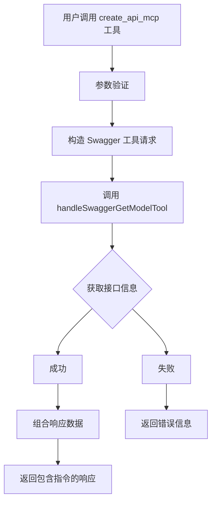

# createApi MCP 工具设计文档

## 概述

创建一个新的 MCP 工具 `create_api_mcp`，其功能是通过调用现有的 Swagger MCP 工具获取接口信息，然后通知当前模型在项目中的指定 API 文件中创建接口函数以及对应的 TypeScript 类型。

## 功能需求

1. **输入参数**：
   - 顶层必须是对象，这是 MCP 工具 schema 的要求
   - 仅支持通过 `requests` 字段传入对象数组进行批量处理
   - `requests[].source` (可选): Swagger/OpenAPI 文档 URL 或本地文件路径，默认使用现有 Swagger 工具的默认值 (`https://apit-dsb.dingtax.cn/dsb/yqarw/api/doc.html#/`)
   - `requests[].name` (可选): 接口名称或操作关键字
   - `requests[].targetPath` (可选): 目标 API 文件路径，用于提示模型生成代码的位置
   - `requests[].resolveRefs` (可选): 是否解析 $ref，默认 true
   - `requests[].maxDepth` (可选): 解析深度，默认 6
   - `requests[].document` (可选): 直接传入 Swagger/OpenAPI 文档对象
   - `requests` (必填): 批量请求数组

2. **处理流程**：
   - 工具接收调用请求，验证必要参数
   - 调用现有的 `get_swagger_mcp` 工具（通过其处理函数）获取接口的详细信息
   - 将 Swagger 工具的响应与一条生成指令组合
   - 返回组合后的 JSON 数据给模型，其中包含接口详情和生成代码的提示

3. **输出格式**：
   ```json
   {
       "swaggerData": {
          "operation": {...},
          "request": {...},
          "response": {...}
       },
     "instruction": "请在文件 /path/to/api.ts 中创建对应的 TypeScript 函数和类型定义。",
     "targetPath": "/path/to/api.ts",
     "_note": "使用上述信息生成 API 代码，并写入指定文件（如果提供了 targetPath）。"
   }
   ```
   返回上述结构组成的数组。Swagger 工具返回模型定义时，`swaggerData` 结构相应变化。

4. **不写入文件系统**：工具本身不执行文件写入操作，仅提供信息并通知模型。

## 数据流



## 文件结构

新工具将位于 `ai/mcp/src/server/feature/createApi/` 目录下：

- `index.ts`: 工具定义和处理函数
- `README.md`: 使用说明（可选）
- `types.ts`: 类型定义（可选）

## 集成步骤

1. 创建 `index.ts` 文件，实现工具定义和处理函数
2. 在 `ai/mcp/src/server/index.ts` 中注册新工具：
   - 将 `createApiTool` 添加到 `tools` 数组
   - 在 `dispatchTool` 函数中添加对应的 case 分支
3. 确保 TypeScript 编译通过
4. 测试工具功能：通过 MCP 客户端调用，验证返回的数据格式和指令

## 注意事项

- 工具依赖现有的 Swagger 工具，需确保 Swagger 工具能正常工作
- 返回的指令文本应清晰明确，便于模型理解
- 目标路径可选，若无则指令中不指定具体文件
- 错误处理应友好，传递 Swagger 工具的错误信息

## 使用示例

以下是一个调用 `create_api_mcp` 工具的示例，用于生成“一起安-AI”创建预案接口的 TypeScript 代码：

```json
调用 `create_api_mcp` 工具
{
   "requests": [
      {
         "source": "https://apit-dsb.dingtax.cn/dsb/yqarw/api/doc.html#/%E4%BB%BB%E5%8A%A1%E7%AE%A1%E7%90%86/%E4%B8%80%E8%B5%B7%E5%AE%89-AI/createYlfaByAiUsingPOST",
         "targetPath": "doc/test/api.ts"
      }
   ]
}
```

调用该工具后，将返回 Swagger 接口的详细信息数组以及生成指令，指示模型在指定文件中创建对应的 TypeScript 函数和类型定义。

## 后续优化建议

1. 支持为数组输入追加聚合级别的错误汇总
2. 提供代码生成模板配置
3. 支持自动检测项目中的 API 文件结构
4. 添加生成代码的预览功能

## 待办事项

- [x] 分析现有项目结构和 MCP 服务器架构
- [x] 明确 createApi 工具的功能需求和输入输出
- [x] 设计 createApi 工具的数据流和组件
- [ ] 创建工具定义文件（index.ts）
- [ ] 实现工具处理函数逻辑
- [ ] 在服务器中注册新工具
- [ ] 测试工具功能并验证生成的代码
- [x] 编写文档和使用示例
