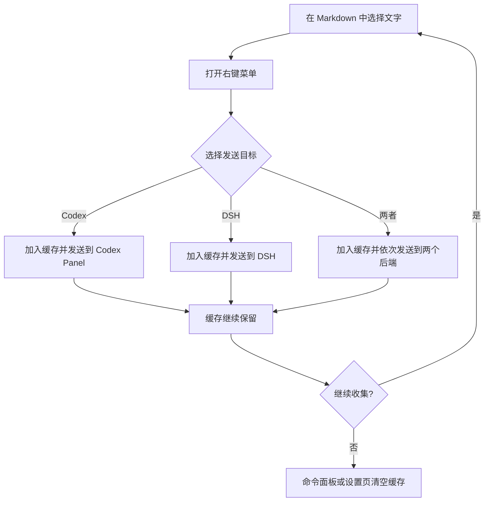
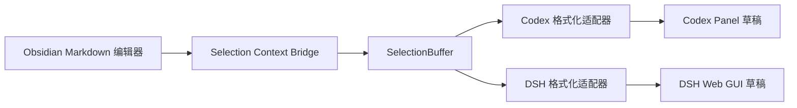

# Selection Context Bridge

| 项目 | 内容 |
| --- | --- |
| 插件 ID | `selection-context-bridge` |
| 当前版本 | `0.1.0` |
| 最低 Obsidian 版本 | `1.7.2` |
| 运行环境 | Obsidian 桌面端 |
| 最后更新时间 | 2026-09-30 |

Selection Context Bridge 是一个独立的 Obsidian 插件。在 Markdown 笔记中选择文字后，可以通过右键菜单收集选区，并将累计选区发送到 Codex Panel、DeepSeek Harness（DSH），或同时发送到两者。

插件用于替代直接修改 `codex-panel` 或 `dsh-harness` 源码的旧方案：选区缓存、去重、格式转换和发送适配全部位于本插件中，第三方插件升级时不需要重新合并选区功能。

## 功能

- 支持在 Markdown 编辑模式和阅读模式中通过右键菜单收集选区。
- 支持跨多个 Markdown 文件累计多个选区。
- 支持发送到 Codex Panel、DSH 或两者。
- 支持命令面板发送全部已收集选区。
- 支持通过右键菜单、命令面板或设置页清空缓存。
- 按“文件路径 + 行列范围 + 选中文本”去重。
- 不修改笔记内容，不需要构建步骤，也不直接修改后端插件源码。
- 后端未启用、面板未就绪或版本不兼容时显示明确提示，不阻止 Obsidian 加载。

## 安装

1. 将本目录复制到 Vault 的插件目录：

	```text
	<Vault>/.obsidian/plugins/selection-context-bridge/
	```

2. 确认目录中至少包含：

	```text
	selection-context-bridge/
	├── manifest.json
	├── main.js
	└── README.md
	```

3. 在 Obsidian 的“设置 → 第三方插件”中启用 `Selection Context Bridge`。
4. 根据使用目标启用 `codex-panel`、`dsh-harness`，或同时启用两者。

插件为单文件 JavaScript 实现，无需安装 npm 依赖或执行构建命令。

## 使用

### 收集并发送选区

1. 在 Markdown 笔记中选择一段文字。
2. 打开右键菜单并选择目标：
	- `选区桥接：添加到 Codex 聊天`
	- `选区桥接：添加到 DSH 聊天`
	- `选区桥接：添加到 Codex + DSH`
3. 插件将选区加入内存缓存，并立即把当前缓存中的全部选区发送到所选目标。
4. 切换到其他笔记后可继续选择和发送；旧选区会保留在缓存中，直到手动清空或 Obsidian 重载插件。

相同笔记、相同行列范围、相同文本不会重复加入缓存。发送成功后缓存不会自动清空，便于把同一批上下文继续发送到另一个目标。

### 命令面板

| 命令 | 行为 |
| --- | --- |
| `发送已收集选区` | 按设置中的默认目标发送缓存中的全部选区 |
| `清空已收集选区` | 清空当前插件实例中的选区缓存 |

命令面板中的发送命令不会自动读取当前编辑器选区。需要先通过右键菜单将选区加入缓存。

### 设置

在插件设置页可以：

- 将命令面板的默认发送目标设置为 `Codex Panel`、`DSH` 或 `Codex + DSH`。
- 查看当前缓存的选区数量。
- 清空当前缓存。

## 工作流程



## 架构设计



核心职责如下：

| 模块 | 职责 |
| --- | --- |
| 选区采集 | 获取 Vault 相对路径、选中文本和编辑模式下的精确行列范围 |
| `SelectionBuffer` | 在内存中保存选区、执行去重、生成目标草稿 |
| Codex 适配器 | 优先调用公开的 `selectionContext` API，必要时回退到运行时草稿控制器 |
| DSH 适配器 | 优先调用公开的 `selectionContext` API，必要时回退到 DSH 桥接和草稿填充能力 |
| 设置页 | 保存默认发送目标，并展示或清空缓存 |

## 数据格式

### 选区数据

每条选区在内存中的主要字段为：

```typescript
interface CollectedSelection {
  path: string;
  linktext: string;
  range: {
	 from: { line: number; ch: number };
	 to: { line: number; ch: number };
  } | null;
  text: string;
  marker: string;
  key: string;
}
```

| 字段 | 说明 |
| --- | --- |
| `path` | Vault 内的 Markdown 相对路径 |
| `linktext` | 去除 `.md` 扩展名后的笔记链接文本 |
| `range` | 编辑模式中的 0 基行列范围；阅读模式下为 `null` |
| `text` | 用户主动选择的原文 |
| `marker` | 用于 Codex 的笔记链接和位置标记 |
| `key` | 由路径、范围和文本组成的去重键 |

缓存只存在于当前插件实例的内存中，不写入笔记或插件配置；重载插件或重启 Obsidian 后不会保留。

### Codex 消息

编辑模式下，Codex 使用笔记链接和精确行列位置，例如：

```text
[[文档/示例]] (L10:C3-L12:C8)
```

如果 Codex Panel 暴露选区上下文 API，插件会提交结构化选区；否则回退到聊天草稿和选区快照能力。阅读模式无法稳定取得源码行列，因此回退为笔记链接加选中文本。

### DSH 消息

编辑模式下，每条选区包含一行 BRIDGES 位置标记和对应选中文本：

```text
[ BRIDGES is delivering packages for you…… · 12 words · L10:C3-L12:C8 · /absolute/path/to/note.md · ]
选中的文本
```

多条选区使用相同格式依次拼接。DSH 可从标记中获得绝对路径、行列范围和字数，同时也能直接读取随消息发送的选中文本。

> 旧的 B 方案只发送路径、行列范围和字数，由 DSH 再读取文件。本独立插件为兼容不同 DSH 版本，会同时发送位置标记和用户已选择的文本。

## 交互与异常处理

| 场景 | 处理方式 |
| --- | --- |
| 当前没有选中文本 | 不显示编辑器右键入口，或提示先选择笔记中的文字 |
| 选区已存在 | 不重复加入，提示“该选区已在缓存中” |
| 缓存为空时发送 | 提示先在笔记中选择文字并通过右键菜单添加 |
| Codex Panel 未启用 | 显示未检测到 Codex Panel 的提示 |
| Codex 聊天面板未就绪 | 显示面板尚未准备好的提示 |
| DSH Harness 未启用 | 显示未检测到 DSH Harness 的提示 |
| DSH 桥接未就绪 | 提示稍候重试，不清空已收集选区 |
| 某个目标发送失败 | 显示对应错误；选择双目标时继续尝试另一个目标 |

## 兼容说明

- 插件仅支持 Obsidian 桌面端。
- 编辑模式支持精确行列位置；阅读模式只能可靠获取笔记路径和选中文本。
- 插件通过运行时能力探测连接 Codex Panel 和 DSH。优先使用后端公开 API，并保留针对旧版本的兼容回退。
- 第三方后端若修改内部接口，插件会提示“面板尚未准备好”或“不支持”，不会阻止 Obsidian 加载。
- DSH 使用绝对路径定位文件，目标 DSH 进程必须能够访问当前 Vault。
- Windows 与 macOS 的路径格式和启动命令不同，不能直接复制包含本机绝对路径的后端配置。

## 跨设备同步

### 通用步骤

1. 在目标设备安装 Obsidian，并打开需要使用的 Vault。
2. 将整个 `selection-context-bridge` 目录复制到目标 Vault 的 `.obsidian/plugins/` 下。
3. 在 Obsidian 中启用 Selection Context Bridge。
4. 安装并启用 Codex Panel、DSH Harness，或所需的其中一个后端。
5. 在两个 Markdown 文件中分别选择文字并执行右键发送。
6. 确认目标聊天草稿包含两个文件的选区上下文。
7. 执行 `清空已收集选区`，确认后续发送不再携带旧选区。

### Windows 注意事项

- 不要复制 macOS 的 Node.js、NVM、DSH CLI 或 Vault 绝对路径配置。
- 如果 DSH Harness 需要启动命令，应填写 Windows 上实际存在的 `node.exe` 或 `dsh` 路径。
- DSH 服务启动后，如后端提供“重新写入”或“重启服务”操作，应在目标设备重新执行，让运行时桥接文件使用 Windows 路径生成。
- 验收时检查 BRIDGES 标记中的文件路径是否为 Windows 可访问的绝对路径。

## 验收清单

### 基础功能

- [ ] 插件可在 Obsidian 第三方插件列表中启用。
- [ ] 编辑模式选中文字后，右键菜单显示三个发送目标和清空缓存入口。
- [ ] 阅读模式选中文字后，右键菜单显示相同入口。
- [ ] 同一选区重复添加时不会产生重复记录。
- [ ] 命令面板可以发送和清空已收集选区。
- [ ] 设置页可以切换默认发送目标并显示缓存数量。

### Codex Panel

- [ ] 单个编辑模式选区包含笔记链接和精确行列范围。
- [ ] 两个不同 Markdown 文件的选区可以累计发送。
- [ ] Codex Panel 未启用或面板未就绪时显示明确提示。

### DSH

- [ ] 单个编辑模式选区包含 BRIDGES 标记、绝对路径和选中文本。
- [ ] 同一 Markdown 文件中的两个选区可以一起发送。
- [ ] 两个不同 Markdown 文件中的选区可以一起发送。
- [ ] DSH Harness 未启用、桥接未就绪或版本不兼容时显示明确提示。

### 缓存与迁移

- [ ] 发送后缓存仍然保留。
- [ ] 清空缓存后，后续发送不再包含旧选区。
- [ ] 重载插件或重启 Obsidian 后缓存为空。
- [ ] macOS 和 Windows 分别完成一次真实路径下的多文件发送验证。

## 风险与限制

| 风险或限制 | 影响 | 应对方式 |
| --- | --- | --- |
| 选区加入缓存后原文件发生修改 | 已记录的行列范围可能漂移 | 收集后尽快发送，必要时重新选择 |
| 缓存发送后不会自动清空 | 后续消息可能携带旧上下文 | 发送新任务前检查缓存数量并主动清空 |
| 第三方插件内部接口变化 | 兼容回退可能失效 | 优先推动后端提供稳定的 `selectionContext` API |
| DSH 进程无法访问 Vault 路径 | DSH 无法按标记重新读取文件 | 确保 DSH 与 Vault 位于同一可访问环境 |
| 阅读模式没有精确源码位置 | 只能发送链接和选中文本 | 需要精确范围时在编辑模式中选择 |

## 后续扩展

新增后端时，实现对应发送适配器并加入目标解析和右键菜单即可；选区采集、缓存、去重和格式化基础能力可以继续复用。
