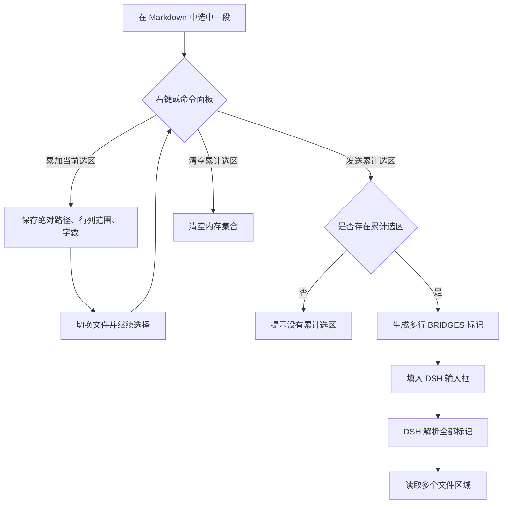
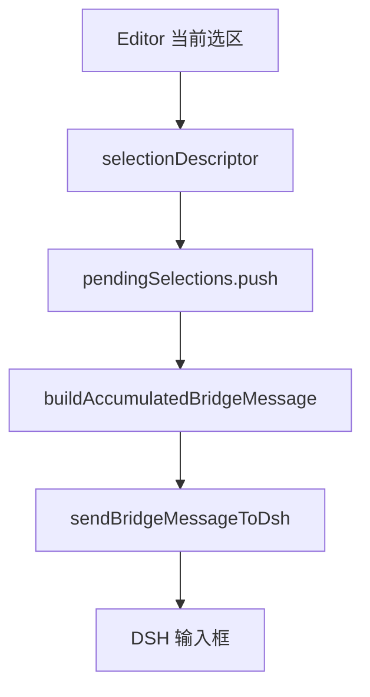

| **文档编号**：     | DSH-OBSIDIAN-PLUGIN-20260908                  |
| ------------- | --------------------------------------------- |
| **需求名称**：     | Obsidian / DeepSeek Harness 多 Markdown 选区累加发送 |
| **需求ID**：     | DSH-OBSIDIAN-MULTI-SELECTION                  |
| **前端 Owner**： | 李明                                            |
| **文档状态**：     | 已定稿                                           |
| **最后更新时间**：   | 2026-09-08                                    |

# 1. 需求概述

## 背景

原有 Obsidian 到 DeepSeek Harness（DSH）的桥接能力只能发送当前一次选区。跨多个 Markdown 文件收集内容时，需要反复发送，无法一次性让 DSH 读取多个文件的多个位置。

本次改动采用 B 方案：只累加文件绝对路径、行列范围和字数，不保存或发送选区原文；DSH 收到后自行读取这些区域。

## 需求和任务

- Obsidian / DeepSeek Harness 桥接
  - 增加“累加当前选区”命令（P0）
  - 增加“发送累计选区”命令（P0）
  - 增加“清空累计选区”命令（P1）
  - 增加右键菜单入口（P0）
- DSH 桥接解析
  - 支持一条消息中包含多个选区标记行（P0）
  - 将多个文件和位置转换为 DSH 可理解的读取目标（P0）
- 跨设备同步
  - 记录插件文件、配置文件、运行环境和验证流程（P1）

# 2. 技术选型

| 维度 | 方案 | 版本 | 是否新增 | 说明 |
| ---- | ---- | :------: | :------: | ---- |
| 宿主应用 | Obsidian | 1.13.7 | ✗ | 负责 Markdown 编辑、选区和命令注册 |
| 桥接插件 | DeepSeek Harness | 2.3.3 | ✗ | 负责 Obsidian 与 DSH Web GUI 通信 |
| DSH CLI | `@deepseek-ai/dsh` | 0.1.1-rc.2 | ✗ | 启动 DSH Web 服务 |
| 运行时 | Node.js | 22.22.2 | ✗ | 当前 Mac 上通过 NVM 安装 |
| 传输格式 | 多行隐式选区标记 | 内部格式 | ✗ | 只传路径、行列和字数，不传原文 |

# 3. 架构设计

## 架构图


## 流程图



## 目录结构

```text
agent/docs/update-plugin-workflow/index.md       # 本次变更记录和迁移说明
.obsidian/plugins/dsh-harness/main.js             # 插件逻辑及内嵌桥接脚本
.obsidian/plugins/dsh-harness/data.json           # DSH 启动命令和 Vault 配置
~/.dsh/profiles/web/dsh-obsidian-bridge.mjs       # 当前 Mac 的运行时桥接脚本
```

# 4. 核心技术设计

## 多 Markdown 选区累加与解析

### 技术方案

Obsidian 插件在内存中维护 `pendingSelections` 数组。每条记录包含：

- `filePath`：Markdown 文件绝对路径
- `pos.fromLine` / `pos.fromCh`：起始行列
- `pos.toLine` / `pos.toCh`：结束行列
- `wordCount`：选区字数

累加操作不保存选区原文。发送时，每条记录生成一行原有 BRIDGES 标记，并用换行拼接成一条消息。DSH 解析器由单次正则匹配改为全局 `matchAll`，将所有标记转换为多个读取目标。

### 兼容策略

- 原有“发送当前选区”逻辑继续保留。
- 单个选区和多个选区使用相同的标记格式。
- 未包含 BRIDGES 标记的普通 DSH 消息不受影响。
- 累加集合只存在当前插件实例内，重启 Obsidian 后不会保留。

# 5. 核心功能模块

## 模块概览

| 模块 | 页面 | 路由 | 负责人 | 说明 |
|------|------|------|--------|------|
| Obsidian 桥接 | Markdown 编辑器 | 不适用 | 李明 | 记录和发送多个 Markdown 选区 |
| DSH 桥接解析 | DSH Web GUI | `127.0.0.1:3080/?ob=1` | 李明 | 解析多条文件位置标记 |

---

## Obsidian Markdown 选区桥接

| 属性 | 内容 |
|------|------|
| 路由 | 不适用，Obsidian 插件命令 |
| 目标用户 | 使用 Obsidian 和 DSH 的本地用户 |
| 功能概述 | 跨多个 Markdown 文件累加选区，并一次性填入 DSH |
| 需求文档 | 本文 |
| 设计稿 | 不适用 |
| 接口文档 | 不适用 |
| 相关方案 | B 方案：发送选区元数据 |

### 页面架构

```text
Obsidian
├── Markdown 编辑区
│   └── 当前选区
├── 右键菜单
│   ├── 累加当前选区到 DSH
│   └── 发送累计选区到 DSH
└── 命令面板
    ├── 累加当前选区
    ├── 发送累计选区
    └── 清空累计选区
```

### 流程图和数据流



### 字段规格

**表单字段**

| 字段名称 | 字段类型 | 是否必填 | 交互规则 |
| -------- | -------- | :------: | -------- |
| 文件路径 | `string` | ✓ | 使用当前 Vault 文件的绝对路径 |
| 起始位置 | `{ line: number, ch: number }` | ✓ | 1 基行号、0 基列号转换为展示格式 |
| 结束位置 | `{ line: number, ch: number }` | ✓ | 记录当前编辑器选区终点 |
| 字数 | `number` | ✓ | 由当前选区计算，仅用于提示和可观测性 |

**列表字段**

| 字段名称 | 字段类型 | 说明 |
| -------------- | -------- | ------ |
| `pendingSelections` | `SelectionDescriptor[]` | 当前插件实例中待发送的选区集合 |

**筛选字段**

| 字段名称 | 字段类型 | 默认值 | 说明 |
| -------------- | -------- | ------ | ------ |
| 不适用 | - | - | 本功能没有筛选条件 |

### 交互规则

| 序号 | 操作 | 行为 |
| :--: | ------ | ---------- |
| 1 | 选中文本后执行“累加当前选区” | 记录文件路径和位置，提示当前累计数量 |
| 2 | 切换到其他 Markdown 文件并重复操作 | 新选区追加到集合，不覆盖旧选区 |
| 3 | 执行“发送累计选区” | 生成多行 BRIDGES 标记并填入 DSH |
| 4 | 执行“清空累计选区” | 丢弃当前未发送集合 |
| 5 | 未选择文本时执行累加 | 不追加并提示需要先选择内容 |

### 异常逻辑

| 异常场景 | 处理逻辑 |
| -------- | ---------- |
| 没有活动 Markdown 文件 | 不追加并提示无法获取当前文件 |
| 当前没有选区 | 不追加并提示需要先选择文本 |
| 没有累计选区就发送 | 提示没有累计选区，不调用 DSH |
| DSH 服务不可用 | 沿用原有桥接失败提示和备用发送逻辑 |
| DSH 解析普通文本 | 不匹配 BRIDGES 标记，按普通消息处理 |

### 组件

**使用矩阵**

| 组件 / 页面 | Markdown 编辑器 | DSH Web GUI | 类型 | 用途 |
| ----------------- | :-----: | :-----: | -------- | ---------- |
| Obsidian Editor | ✅ | - | 宿主编辑器 | 提供选区和文件上下文 |
| DSH Composer | - | ✅ | 外部 Web UI | 接收拼装后的多选区消息 |

**业务组件明细**

| 组件 | 用途 | 关联状态 |
| ----------------- | ---------- | ------------ |
| `pendingSelections` | 保存待发送选区元数据 | `pendingSelections` |

### hooks

**使用矩阵**

| Hook / 页面 | Markdown 编辑器 | DSH Web GUI | 来源 | 用途 |
| ----------------- | :-----: | :-----: | ------ | ---------- |
| 不适用 | - | - | - | 本功能是 Obsidian 插件类，不使用 React hooks |

**内部 hooks 明细**

| Hook | 用途 | 依赖 |
| -------------- | ------ | --------------- |
| 不适用 | - | - |

### utils

**使用矩阵**

| 函数 / 页面 | Markdown 编辑器 | DSH Web GUI | 来源 | 用途 |
| ----------------- | :-----: | :-----: | ------ | ---------- |
| `buildAccumulatedBridgeMessage()` | ✅ | - | 内部 | 拼接多条选区标记 |
| `selectionDescriptor()` | ✅ | - | 内部 | 提取当前编辑器选区元数据 |

**内部 utils 明细**

| 函数 | 用途 |
| -------------- | ------ |
| `buildAccumulatedBridgeMessage()` | 将累计选区转换为多行桥接消息 |
| `selectionDescriptor()` | 将当前选区转换为路径、位置和字数记录 |

### constants

**使用矩阵**

| 常量 / 页面 | Markdown 编辑器 | DSH Web GUI | 来源 | 用途 |
| ------------------ | :-----: | :-----: | ------ | ---------- |
| `BRIDGE_LINE_RE` | - | ✅ | 桥接脚本 | 识别单条 BRIDGES 标记 |
| `BRIDGE_LINE_RE_GLOBAL` | - | ✅ | 桥接脚本 | 识别多条 BRIDGES 标记 |

**内部 constants 明细**

| 常量 | 值 | 说明 |
| -------------- | --------- | ------ |
| `BRIDGE_LINE_RE_GLOBAL` | `new RegExp(BRIDGE_LINE_RE.source, 'g')` | 让解析器处理同一消息中的全部选区标记 |

### enums

**使用矩阵**

| 枚举 / 页面 | Markdown 编辑器 | DSH Web GUI | 来源 | 用途 |
| ------------------ | :-----: | :-----: | ------ | ---------- |
| 不适用 | - | - | - | 本功能没有新增枚举 |

**内部 enums 明细**

| 枚举 | 值 | 说明 |
| -------------- | --------- | ------ |
| 不适用 | - | - |

# 6. 公共依赖

## 公共 store

| Store | 关键字段 | 使用页面 | 依赖 Store | 说明 |
| -------------------- | ----------------- | ---------- | -------------- | ------------ |
| 不适用 | - | - | - | 本功能不使用 Store |

## 公共 hooks

| Hook | 用途 | 使用页面 | 依赖 |
| ----------------- | ---------- | ---------- | --------------- |
| 不适用 | - | - | - |

## 公共 utils

| 函数 | 用途 | 使用页面 |
| ---------------- | ---------- | ---------- |
| Obsidian Vault API | 获取当前文件和 Vault 根目录 | Markdown 编辑器 |

## 公共 constants

| 常量 | 值 | 用途 | 使用页面 |
| ------------------ | --------- | ---------- | ---------- |
| DSH 服务端口 | `3080` | DSH Web GUI 默认端口 | DSH Web GUI |

## 公共 enums

| 枚举 | 值 | 用途 | 使用页面 |
| ----------------- | --------- | ---------- | ---------- |
| 不适用 | - | - | - |

## 公共 UI 样式

| 样式模块 | 用途 | 使用页面 |
| -------------------- | ---------- | ---------- |
| 不适用 | - | - |

# 7. 公共组件设计

## 组件树

```text
Obsidian Editor
└── DeepSeek Harness Bridge
    ├── Selection Collection
    ├── Bridge Message Builder
    └── DSH Composer Filler
```

## 使用矩阵

| 页面/功能 | Selection Collection | Bridge Message Builder | DSH Composer Filler |
| --------- | :-----: | :-----: | :-----: |
| Markdown 选区桥接 | ✅ | ✅ | ✅ |

## DeepSeek Harness Bridge

### 组件职责

连接 Obsidian 编辑器与 DSH Web GUI，负责收集多个选区、生成桥接消息，并将消息填入 DSH 输入框。

### 组件 Props

本功能不是 React 组件，不使用 Props。

```typescript
interface DeepSeekHarnessBridgeProps {
  // 不适用：Obsidian 插件通过 Editor 和 Vault API 获取上下文
}
```

| Props | 类型 | 默认值 | 必填 | 说明 |
| -------------- | -------- | ---------- | :--: | ---------- |
| 不适用 | - | - | - | 本功能不是 React 组件 |

# 8. 接口与数据定义

## 接口概览

| 模块 | 接口路径 | 方法 | swagger 地址 | 使用页面 | 说明 |
| -------- | ------------------------ | ---- | ------------ | ---------- | ------------ |
| Obsidian 桥接 | `127.0.0.1:3080` | Web GUI | 不适用 | Markdown 编辑器 | 接收桥接消息 |

---

## BRIDGES 多选区消息

| 属性 | 内容 |
| ------------ | ------------------------ |
| 接口路径 | DSH Web GUI 输入框 |
| 方法 | 浏览器端填充 |
| 所属模块 | Obsidian / DSH 桥接 |
| swagger 地址 | 不适用 |

### 请求参数

| 参数名称 | 参数类型 | 是否必填 | 说明 |
| -------- | -------- | :------: | ------ |
| `filePath` | `string` | ✓ | Markdown 文件绝对路径 |
| `fromLine` / `fromCh` | `number` | ✓ | 选区起点 |
| `toLine` / `toCh` | `number` | ✓ | 选区终点 |
| `wordCount` | `number` | ✓ | 选区字数 |

### 响应数据

```typescript
interface CollectedSelection {
  filePath: string;
  pos: {
    fromLine: number;
    fromCh: number;
    toLine: number;
    toCh: number;
  };
  wordCount: number;
}
```

| 字段名称 | 字段类型 | 说明 |
| -------------- | -------- | ------ |
| `filePath` | `string` | DSH 读取目标文件 |
| `pos` | `object` | DSH 读取目标的行列范围 |
| `wordCount` | `number` | 选区字数提示 |

# 9. 非功能性需求（NFR）

## 性能

| 指标 | 目标值 | 说明 |
| ---------------- | -------- | -------------------- |
| 选区累加 | 即时 | 只保存元数据，不复制原文 |
| 消息拼装 | 与选区数量线性相关 | 每条选区生成一行标记 |
| DSH 服务启动 | 当前配置最长 300 秒 | 首次启动可能需要更长时间 |

## 兼容性

| 维度 | 要求 | 说明 |
| -------------- | ------------------ | ------------------------ |
| macOS | 当前已验证 | Obsidian 1.13.7 + Node 22.22.2 |
| Windows | 待同步验证 | 不可直接复用 Mac 的绝对路径和 NVM 路径 |
| Markdown 文件 | Vault 内文件 | 需要 DSH 进程可读取目标路径 |

## 安全性

| 场景 | 措施 |
| -------------- | ------------------ |
| 选区内容 | 默认不把原文放入桥接消息 |
| 文件访问 | DSH 仅按用户主动选择的路径和位置读取 |
| 路径迁移 | Windows 上重新配置本机路径，不能照搬 Mac 路径 |

## 用户体验

| 场景 | 要求 |
| -------------- | ------------------ |
| 累加成功 | Toast 提示累计数量 |
| 发送成功 | DSH 输入框显示多行目标标记 |
| 清空成功 | Toast 提示集合已清空 |
| 空集合发送 | 明确提示没有累计选区 |

# 10. 测试用例与验收清单

### 单元测试

- [x] 检查插件源码包含 `pendingSelections`、`buildAccumulatedBridgeMessage` 和三个命令。
- [x] 检查 DSH 解析器使用全局正则和 `matchAll` 处理多个标记。
- [x] `node --check .obsidian/plugins/dsh-harness/main.js` 通过。
- [x] `node --check /Users/zm/.dsh/profiles/web/dsh-obsidian-bridge.mjs` 通过。

### 组件测试

- [x] Obsidian 重启后命令面板能搜索到“发送累计选区”和“清空累计选区”。
- [x] DSH 插件设置页显示“服务运行中”。
- [x] 桥接状态显示“文件已安装；已加载且生效”。

### E2E 测试

- [ ] 在同一 Markdown 文件中累加两段选区后发送，并确认 DSH 输入框包含两条目标。
- [ ] 在两个不同 Markdown 文件中分别累加选区后发送，并确认 DSH 能读取两个文件。
- [ ] 发送后执行“清空累计选区”，确认后续发送不会携带旧选区。
- [ ] Windows 端完成一次完整迁移验证。

### UI / 交互验收

- [x] 命令面板中出现累计选区相关命令。
- [ ] 右键菜单中出现“累加当前选区到 DSH”和“发送累计选区到 DSH”。
- [x] DSH 服务重启后桥接状态正常。
- [ ] Windows Obsidian UI 验收。

### 验收方式

当前 Mac 已完成源码、语法、插件命令注册和服务重启验证。多文件实际端到端选取操作及 Windows 迁移验收保留到下一台设备执行。

# 11. 风险评估与应对

## 技术风险

| 风险项 | 影响 | 概率 | 应对策略 |
| -------------------------------- | ---------- | :------: | ---------- |
| Obsidian 或 DSH 插件更新覆盖手工修改 | 多选区功能消失 | 中 | 更新后重新应用本文档记录的源码变更，并重新执行验证 |
| DSH 运行时未重启 | 新解析逻辑未生效 | 中 | 修改后在插件设置中点击“重启服务” |
| Windows 路径格式不同 | DSH 无法读取文件 | 高 | 在 Windows 上重新生成或配置绝对路径，不复制 Mac 路径 |

## 业务风险

| 风险项 | 影响 | 概率 | 应对策略 |
| ---------------------------- | ---------- | :------: | ---------- |
| 用户误把多个选区发送给同一修改任务 | DSH 修改范围过大 | 中 | 发送前检查 DSH 输入框中的文件和行列目标 |
| 选区对应内容在发送前发生变化 | 行列位置可能漂移 | 中 | 尽量先收集后立即发送，或发送前重新确认文件内容 |

## 依赖风险

| 风险项 | 影响 | 概率 | 应对策略 |
| --------------------------------- | ---------- | :------: | ---------- |
| Windows 未安装 Node.js / DSH CLI | 服务无法启动 | 中 | 安装 Node.js 和 DSH CLI，或在插件设置中填写 Windows 启动命令 |
| DSH 服务端口被占用 | 面板无法连接 | 中 | 使用插件“重启服务”，必要时更换端口 |

# 附录：变更记录

| 版本 | 日期 | 修改人 | 修改内容 |
| ---- | ---- | ------ | -------- |
| v1.0 | 2026-09-08 | 李明 | 增加 Obsidian 多 Markdown 选区累加发送；DSH 解析器支持多条 BRIDGES 标记；补充 Mac 验证和 Windows 同步流程 |

## Windows 同步操作清单

1. 在 Windows 上安装 Obsidian，并打开同一 Vault。
2. 安装 DeepSeek Harness 插件，确认插件目录中的 `main.js` 与本次修改版本一致。
3. 将本文件和修改后的 `.obsidian/plugins/dsh-harness/main.js` 同步到 Windows Vault 对应位置。
4. 不要直接复制 Mac 的 `data.json` 启动命令；将启动命令改成 Windows 可执行路径，例如 Node.js 或 `dsh` 的实际路径。
5. 启动 DSH 服务后，在 DeepSeek Harness 设置中点击“重新写入”，再点击“重启服务”，让内嵌桥接脚本生成 Windows 端运行时文件。
6. 在 Obsidian 命令面板搜索并确认以下命令存在：
   - `累加当前选区`
   - `发送累计选区`
   - `清空累计选区`
7. 在两个 Markdown 文件中各选择一段，分别执行“累加当前选区”，最后执行“发送累计选区”。
8. 检查 DSH 输入框中是否出现多个文件和行列范围；确认无误后再点击发送。

## 当前 Mac 配置参考

以下路径只用于理解当前 Mac 配置，不能原样复制到 Windows：

```text
Vault：/Users/zm/lm/lm-document
Obsidian 插件：/Users/zm/lm/lm-document/.obsidian/plugins/dsh-harness/main.js
DSH 运行时桥接：/Users/zm/.dsh/profiles/web/dsh-obsidian-bridge.mjs
Node.js：/Users/zm/.nvm/versions/node/v22.22.2/bin/node
DSH CLI：/Users/zm/.nvm/versions/node/v22.22.2/lib/node_modules/@deepseek-ai/dsh/lib/bin.js
服务端口：3080
```
