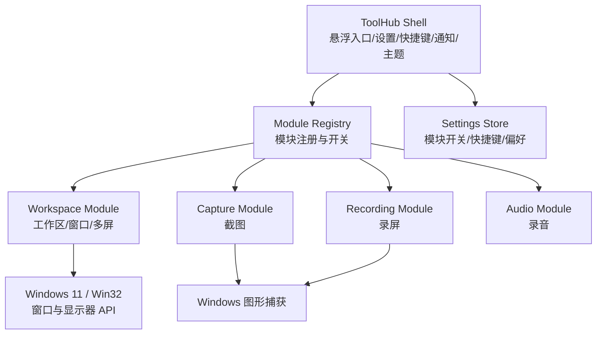
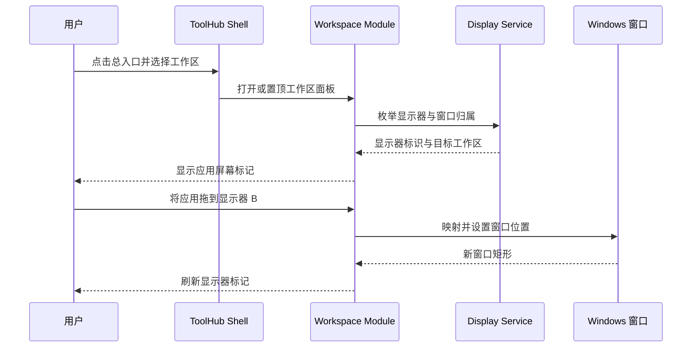

| **文档编号**：     | WS-20260913-01 |
| ------------------ | --------------------------- |
| **方案名称**：     | Windows 11 桌面工具中心与工作区多屏优化方案 |
| **方案 Owner**：   | 待指定 |
| **关联需求**：     | WorkspaceSwitcher 工具中心化、多屏窗口管理与首次点击可靠性 |
| **文档状态**：     | 已定稿（工作区多屏 v1.7.1） |
| **最后更新时间**： | 2026-09-13 |

# 1. 方案概述

## 背景与问题

现有 WorkspaceSwitcher 是 C# WinForms 单窗体应用，已具备工作区切换、窗口归类、全局快捷键、置顶面板、卡片拖拽与多显示器 DPI 适配。当前不保存窗口所在显示器，面板只根据自身句柄选择所在屏幕，因此无法明确标记每个应用位于哪块屏幕，也不能从工作区内快速跨屏移动应用。

后续会增加截图、录屏、录音等桌面能力。若为每项功能单独建设常驻程序，会重复占用内存、快捷键与样式资源。用户要求一个类似悬浮快捷框的独立总入口，工作区、截图和录屏在其中集成，但各能力仍可单独启用或关闭。

“首次点击工作区偶发不切换”尚未形成稳定复现。当前切换挂在 WinForms `MouseClick`，而浮动面板为“不激活窗口”，同时订阅系统前台窗口事件；两类事件的时序需要在实施前用最小诊断和回归用例确认，不能将推测当作根因。

## 目标

- 在 Windows 11 上提供轻量的单进程桌面工具中心，统一承载入口、设置、快捷键、通知和主题。
- 将工作区、截图、录屏、录音拆为可独立启停的模块；关闭模块后不保留其快捷键、悬浮窗或设备资源。
- 为每个已管理应用显示当前显示器标识，并支持将单个窗口从屏幕 A 快速移到屏幕 B。
- 通过诊断、失败用例和最小修复解决首次点击工作区偶发不切换，且不影响拖拽、缩放、删除与应用条目点击。

## 非目标

- 本期不支持 Windows 10 或更早版本。
- 本期不引入 Electron、WebView 常驻界面或多个常驻 EXE。
- 本期不实现云盘、AI 问答、录音转写的外部服务集成；仅保留模块边界。
- 不改变既有工作区删除时应用移动到默认工作区的规则。

## 术语表

| 术语 | 说明 |
| ---- | ---- |
| ToolHub Shell | 唯一常驻的 WinForms 宿主，负责总入口和公共能力。 |
| 模块 | 通过统一生命周期接口注册到 ToolHub Shell 的独立功能单元。 |
| 显示器标识 | Windows 当前枚举到的显示器名称、主屏状态和工作区坐标信息。 |
| 跨屏移动 | 将一个窗口的矩形位置按相对比例映射到目标显示器工作区，并限制在可见范围内。 |
| 首次点击可靠性 | 第一次完成有效点击时，工作区切换必须恰好执行一次。 |

# 2. 方案选型

## 候选方案对比

| 方案 | 思路 | 优点 | 缺点 | 适用场景 |
| ---- | ---- | ---- | ---- | -------- |
| 方案A：单进程模块化 WinForms（推荐） | 保留 C# WinForms 与 Win32，新增 Shell、Core、Modules 和 Tests 边界。 | 常驻内存低；复用已有窗口控制和 DPI 代码；设置与样式统一；模块可按需启动。 | 需逐步拆分现有单文件应用。 | Windows 11 本地桌面工具中心。 |
| 方案B：多个独立 EXE | 工作区、截图、录屏分别作为独立进程，入口仅启动它们。 | 故障隔离较强。 | 多个常驻进程；快捷键、主题、设置和更新重复；跨模块通信复杂。 | 互不相关、独立发布的大型工具。 |
| 方案C：外部插件 DLL | Shell 从插件目录动态发现、加载第三方模块。 | 扩展性最高。 | 生命周期、版本兼容与异常隔离复杂，首期投入偏高。 | 已有稳定模块生态后的二期扩展。 |

## 选型结论

**最终选择：方案A：单进程模块化 WinForms。**

- 当前应用已是 C# WinForms + Win32；保留现有技术路径可最小化功能回退与内存增加。
- Windows 11 是唯一目标，可使用现代显示器与图形捕获能力，不必维护旧系统降级分支。
- 通过模块开关只初始化启用能力；录屏编码和截图预览只在用户操作时占用资源。

# 3. 架构设计

## 架构图



## 时序图



## 数据流

Windows 显示器枚举 → 显示器标识服务 → 窗口矩形查询 → 应用条目显示器标记 → 用户点击/拖放目标显示器 → 目标工作区矩形映射 → Windows 设置窗口位置 → 刷新状态与面板。

# 4. 核心设计

## 4.1 工具中心与模块生命周期

ToolHub Shell 是唯一常驻窗体。每个模块声明唯一 ID、菜单项、设置项、启用状态、启动与停止生命周期。设置改变时，Shell 先注销该模块快捷键和事件钩子，再停止模块；启用时才创建对应资源。工作区模块的当前状态文件需要迁移兼容，不能因拆分丢失工作区、窗口归类、排序或面板尺寸。

| 决策点 | 结论 | 说明 |
| ------ | ---- | ---- |
| 宿主进程 | 单一 WinForms EXE | 避免多进程常驻内存与跨进程状态同步。 |
| 模块加载 | 内置模块按设置启用 | 首期不加载外部 DLL，降低兼容与安全风险。 |
| 公共样式 | Shell 集中维护颜色、圆角、字体、DPI 绘制 | 所有模块复用 Fluent 风格，避免样式漂移。 |
| 模块开关 | 停止后释放模块资源 | 关闭模块不应继续监听快捷键或设备。 |

## 4.2 多屏窗口标记与跨屏移动

显示器服务基于当前 Windows 11 显示器枚举生成名称、主屏标记、工作区矩形和颜色。应用条目基于窗口矩形归属到显示器；条目显示对应色点。顶部使用“全部 / 显示器 N”标签筛选，所有工作区始终展示，未命中标签的应用仅降低视觉强调。

跨屏移动的第一期单位是“单个应用窗口”：右键应用条目，在菜单中选择目标显示器。移动时按源屏工作区内的相对位置映射到目标工作区，再做边界夹取；窗口大小保留，但目标屏幕放不下时缩小到可见上限。工作区级“全部应用移屏”不包含在首期，后续可在同一命令模型上扩展。

| 配置项 | 值 | 说明 |
| ------ | --- | ---- |
| 显示器标记 | 应用级 | 同一工作区的应用允许分布在不同显示器。 |
| 快速切屏 | 顶部显示器标签 | 点击标签只改变应用的强调状态，不隐藏工作区。 |
| 快速移窗 | 应用右键菜单 | 把单个窗口移到指定目标屏幕。 |
| 显示器失联 | 自动回退主屏 | 若目标屏幕被拔出，应用仍保持工作区归类。 |

## 4.3 首次点击可靠性

WinForms 的标准顺序是 `MouseDown → Click → MouseClick → MouseUp`。原实现只在 `MouseClick` 按释放位置切换，未使用已记录的按下工作区。现已建立失败用例，并改为只有“同一次按下与点击命中同一工作区”才切换；应用条目、缩放、面板拖动、排序和删除先清除卡片按下状态并保持更高优先级。

# 5. 接口与数据定义

## 接口概览

| 接口路径 | 方法 | 用途 | swagger 地址 |
| -------- | ---- | ---- | ------------ |
| 不适用 | 不适用 | 本方案为本地 Windows 桌面应用，不调用 HTTP API。 | |

## 模块与显示器本地接口

### 请求参数

| 参数名称 | 参数类型 | 是否必填 | 说明 |
| -------- | -------- | :------: | ---- |
| `windowHandle` | `IntPtr` | ✓ | 要查询或移动的顶层窗口句柄。 |
| `targetDisplayId` | `string` | ✓ | 当前枚举出的目标显示器标识。 |
| `enabled` | `bool` | ✓ | 模块是否启用。 |

### 响应数据

```csharp
public sealed class DisplayDescriptor
{
    public string Id { get; set; }
    public string Name { get; set; }
    public bool IsPrimary { get; set; }
    public Rectangle WorkingArea { get; set; }
    public int AccentColorArgb { get; set; }
}
```

## 关键配置项

| 配置项 | 值 | 说明 |
| ------ | --- | ---- |
| `modules.workspace.enabled` | `true` | 工作区模块默认启用。 |
| `modules.capture.enabled` | `false` | 截图模块在实现后由设置启用。 |
| `modules.recording.enabled` | `false` | 录屏模块在实现后由设置启用。 |
| `modules.audio.enabled` | `false` | 录音模块在实现后由设置启用。 |
| `display.panelTarget` | 当前显示器 ID | 面板最后停留的显示器。 |

# 6. 关键实现

```csharp
// 单窗口跨屏移动：仅在目标显示器可用时执行。
bool MoveWindowToDisplay(IntPtr windowHandle, DisplayDescriptor source, DisplayDescriptor target)
{
    Rectangle sourceBounds = GetWindowBounds(windowHandle);
    Rectangle mapped = MapRelativeBounds(sourceBounds, source.WorkingArea, target.WorkingArea);
    Rectangle visible = ClampToWorkingArea(mapped, target.WorkingArea);
    return SetWindowBounds(windowHandle, visible);
}
```

| 实现要点 | 说明 |
| -------- | ---- |
| 命中优先级 | 删除、缩放、面板拖动、工作区排序、应用按钮均先于工作区切换。 |
| 显示器刷新 | 显示面板、切换工作区、拖放结束和显示器配置变化时重新计算窗口归属。 |
| 状态兼容 | 继续读取现有 `%LOCALAPPDATA%\WorkspaceSwitcher\state.xml`；新增字段缺失时使用默认值。 |
| 样式兼容 | 继续用 `TextRenderer`、像素字体、ClearType 和 per-monitor DPI，不引入 Web 渲染。 |

# 7. 异常与边界处理

| 异常场景 | 处理方式 | 用户感知 |
| -------- | -------- | -------- |
| 目标显示器已拔出 | 取消移动，回退主屏标记并刷新面板。 | 不丢失工作区归类，显示简短提示。 |
| 目标窗口已关闭 | 移除失效窗口记录，不执行跨屏移动。 | 条目在刷新后消失。 |
| 目标窗口权限更高 | 不执行控制操作，保留工作区记录。 | 提示“无法控制该窗口”。 |
| 录屏/截图模块未启用 | Shell 不初始化模块。 | 菜单隐藏或置为不可用，并在设置中可启用。 |
| 首次点击诊断未复现 | 保留最小可观测日志，不直接改动事件逻辑。 | 不引入猜测式修复。 |

# 8. 性能优化

| 优化项 | 措施 | 目标 |
| ------ | ---- | ---- |
| 常驻内存 | 单进程 Shell，未启用模块不加载资源。 | 不因增加入口而启动多个常驻进程。 |
| 显示器查询 | 仅在面板打开、窗口操作完成或显示器配置变化时刷新。 | 不在鼠标移动时枚举所有窗口。 |
| 截图/录屏 | 仅用户触发时创建捕获和编码资源。 | 空闲时不保留帧缓冲或编码器。 |
| 绘制 | 复用现有双缓冲、DPI 与 TextRenderer 绘制策略。 | 保持卡片滚动与拖放流畅。 |

# 9. 安全与合规

| 场景 | 措施 |
| ---- | ---- |
| 截图与录屏 | 操作仅在用户显式触发后开始；保存路径由本地设置控制。 |
| 麦克风 | 模块默认关闭；首次启用时依赖 Windows 11 权限状态。 |
| 窗口控制 | 不尝试绕过管理员权限或安全桌面限制。 |

# 10. 测试策略

## 自动化测试

| 测试类型 | 覆盖范围 | 工具 |
| -------- | -------- | ---- |
| 单元测试 | 显示器矩形映射、窗口可见边界夹取、模块开关和工作区切换命中策略。 | 现有 C# 控制台测试程序集。 |
| 集成测试 | Shell 注册模块、工作区状态迁移、Windows 窗口控制抽象。 | Windows 11 本机构建与测试程序集。 |

## 测试用例清单

- [ ] 给定不同分辨率和缩放的双屏工作区，窗口相对位置映射与边界夹取正确。
- [ ] 关闭模块后其快捷键、事件钩子和入口不再有效；重新启用后可恢复。
- [ ] 工作区卡片第一次有效点击恰好调用一次切换，拖拽和缩放不触发切换。
- [ ] 显示器拔出、窗口关闭与权限不足时不损坏已保存工作区状态。

## 手动验收

- [ ] 双显示器上，应用条目展示正确的显示器名称和颜色标记。
- [ ] 拖放单个应用到另一显示器后，窗口在目标屏幕可见且尺寸合理。
- [ ] 点击顶部显示器标签后，所有工作区仍展示，仅目标屏幕的应用被强调。
- [ ] 录屏、截图、录音模块关闭时不显示入口；打开后仅对应模块可用。

# 11. 风险与落地

## 风险与应对

| 风险 | 影响 | 概率 | 应对 |
| ---- | ---- | ---- | ---- |
| 现有单文件 WinForms 逻辑拆分造成回归 | 工作区功能不可用或状态丢失 | 中 | 先提取无状态 Core 策略和测试，再按模块迁移；每步构建、回归和安装验证。 |
| 首次点击问题无法稳定复现 | 修复无效或引入误触发 | 中 | 先添加最小诊断与失败用例，达到根因证据门槛后再修改生产事件链。 |
| 显示器设备名变化 | 保存的屏幕偏好失效 | 中 | 运行时重新枚举，找不到时安全回退当前主屏。 |
| 图形捕获权限或目标窗口限制 | 截图、录屏范围受限 | 低 | 在模块入口和设置中显示可用状态，不影响工作区模块。 |

## 依赖清单

| 依赖 | 用途 | 版本 |
| ---- | ---- | ---- |
| .NET Framework / C# WinForms | Shell、现有工作区界面与测试。 | 沿用当前环境 |
| Windows 11 Win32 API | 窗口、显示器、置顶、快捷键与窗口位置。 | Windows 11 |
| Windows 11 图形捕获能力 | 截图与录屏模块后续实现。 | Windows 11 |

## 工作量评估

| 任务 | 人天 | 说明 |
| ---- | ---- | ---- |
| 首次点击问题诊断与最小修复 | 待根因确认 | 先完成失败复现与影响面分析。 |
| 工作区多屏标记与单窗口移屏 | 待评审确认 | 依赖显示器服务和 UI 交互定稿。 |
| ToolHub Shell 与模块注册 | 待评审确认 | 需渐进迁移现有工作区模块。 |
| 截图、录屏、录音模块 | 后续规划 | 按模块逐项设计、实现和验收。 |
